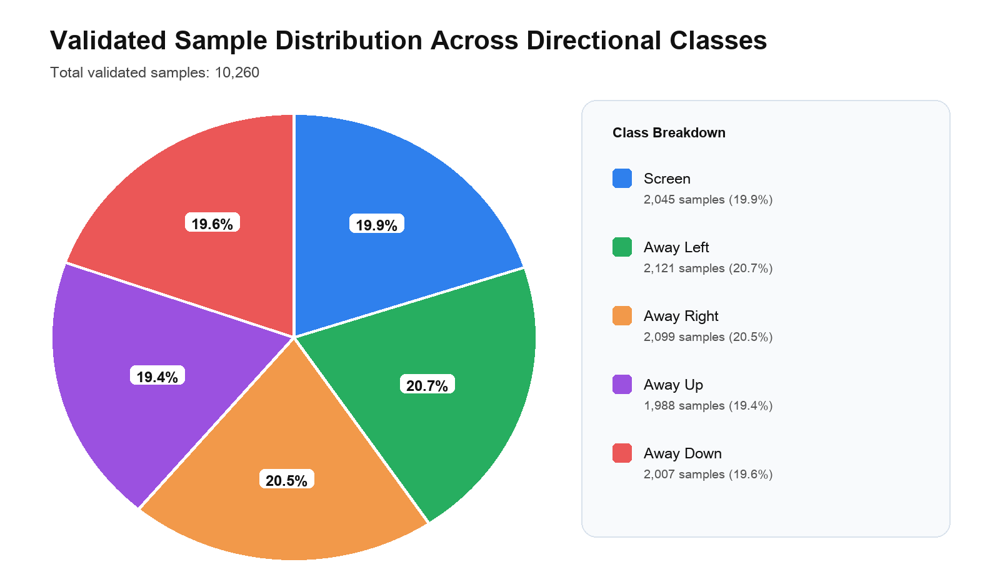
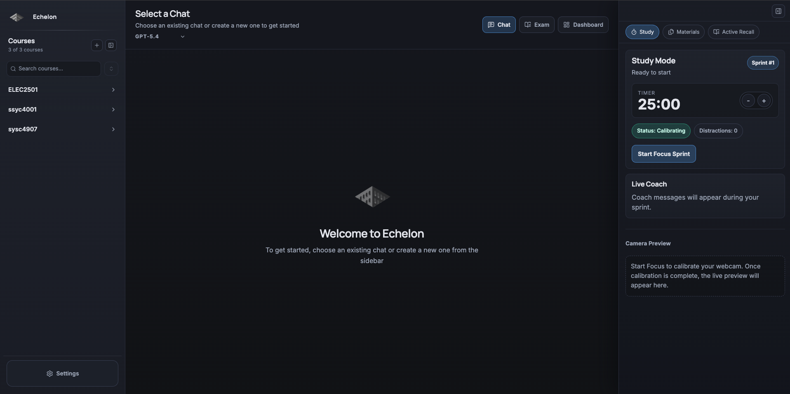
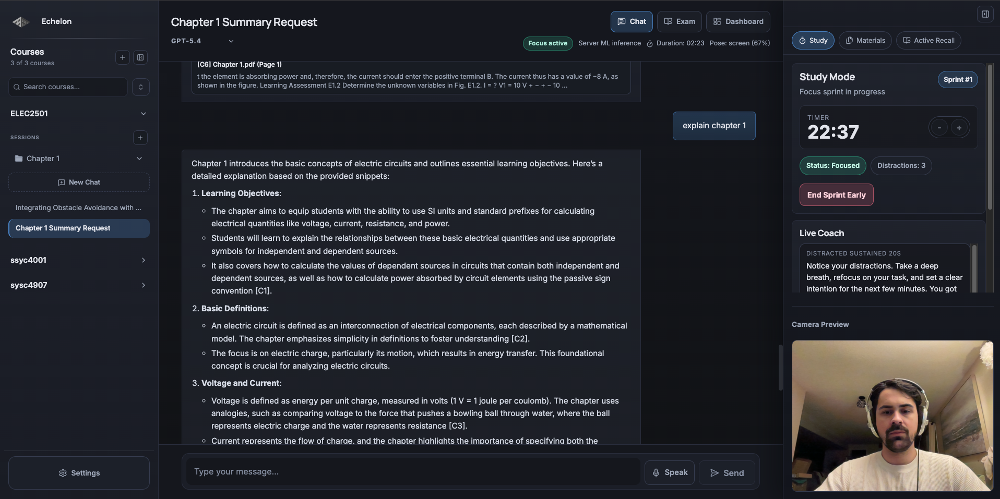
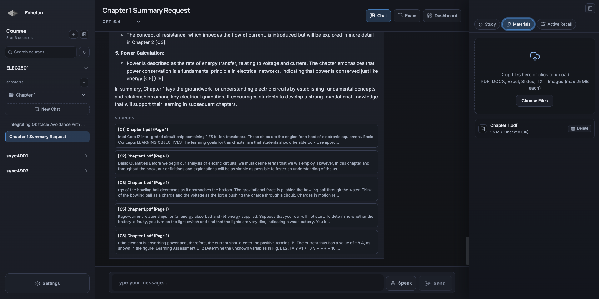
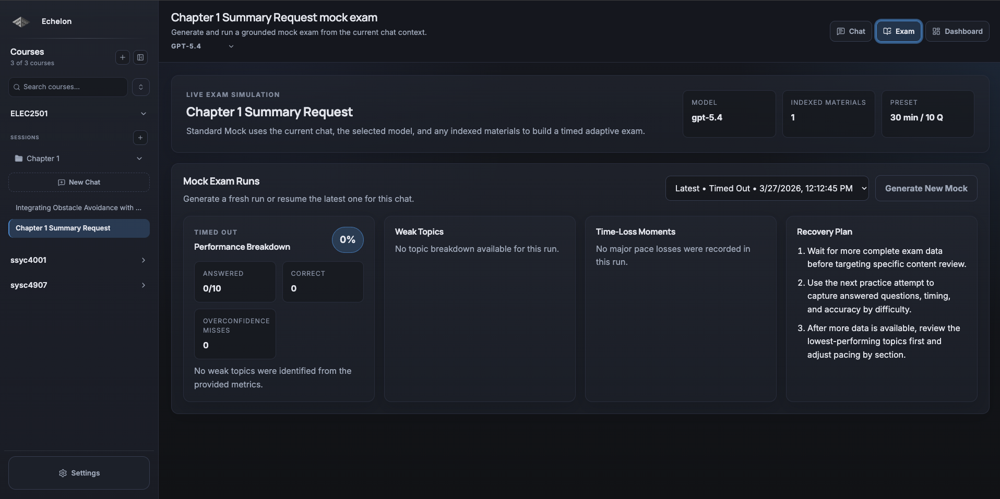
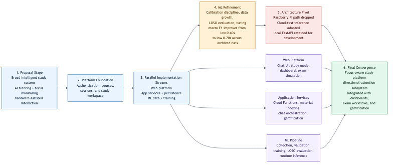
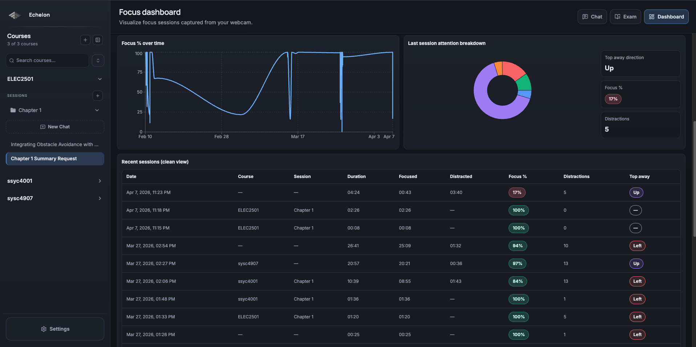

# Abstract

Echelon is a focus-aware study platform that combines webcam-based directional attention estimation with AI-assisted study workflows. The system addresses a gap in conventional study tools: they record activity such as time spent, materials opened, and chat history, but they do not directly indicate whether a learner remained visually engaged with the study task. To address that gap, Echelon integrates a React and Firebase study workspace with a separate Python machine-learning pipeline, a FastAPI inference service, and persistent focus summaries tied to course materials, chat activity, dashboards, mock exams, and gamified progress feedback.

The machine-learning subsystem includes structured data collection, dataset validation, leave-one-subject-out evaluation, and temporal smoothing at inference time. The final validated dataset contains 10,260 usable samples from eight participants across five directional classes, and the final aggregate evaluation reached 76.73% mean held-out accuracy and 74.04% mean macro F1. Production inference is routed through Firebase Hosting rewrites to a Cloud Run service, while a local inference path is retained for development and experimentation. The final system is an end-to-end capstone prototype and still leaves remaining work in API hardening, observability, privacy governance for remote inference, and full-system automated testing.

# 1. Introduction

Students increasingly study in digital environments, yet those same environments make sustained attention harder to maintain. OECD reporting based on PISA 2022 found that nearly one in three students across OECD countries reported being distracted by their own digital devices in most or every mathematics lesson, and students who reported more frequent distraction tended to perform worse academically [1]. Similar patterns appear in higher education. A University of Waterloo survey reported that 49% of undergraduate students found off-task technology use distracting in class [2]. Repeated classroom surveys also found that students spent about 20.9% of class time using digital devices for non-class purposes and that frequent off-task device use increased between 2013 and 2015 [3]. Together, these findings support the broader problem addressed by this project: many students struggle to maintain consistent focus during academic work in technology-rich settings.

Conventional study tools only address part of this environment. They can track time spent, materials opened, chat history, or completed review tasks, but they generally do not capture whether a learner remained visually engaged with the study task itself. In practice, time-on-task is therefore an incomplete proxy for focus. At the same time, many digital study workflows remain fragmented across separate tools for AI assistance, uploaded materials, flashcards, dashboards, and session tracking. This fragmentation makes it harder to connect attention patterns to actual learning activity over time.

Recent work in e-learning has explored machine-learning approaches to student attentiveness detection from emotional and non-emotional behavioral cues, but those systems are often studied as analytic classifiers rather than as integrated study platforms [10].

Echelon was developed as a response to that gap. It is a focus-aware study platform centered on a webcam-based directional-attention subsystem that produces session-level focus summaries and embeds them into a broader study workflow. The platform combines focus monitoring with uploaded course materials, document-aware AI chat, generated study artifacts, flashcard support, dashboards, and gamified progress feedback so that attention signals can be interpreted in context rather than as isolated telemetry.

The final implementation reflects a progression from a broad intelligent study concept to a more focused software-first system centered on gaze-aware, head-pose-derived attention analysis. Earlier iterations considered Raspberry Pi-based deployment, but that path was later dropped because security concerns and the cost of portable high-performance inference made it less practical than a cloud-oriented architecture. The resulting system is a centralized study platform whose main technical contribution is the integration of webcam-based directional attention analysis into a broader learning workflow.

# 2. Problem Statement and Goals

## 2.1 Problem Context

The core problem addressed by Echelon is that students have poor visibility into the quality of their attention during self-directed study. Existing educational platforms can record activity such as time spent, materials accessed, prompts submitted, or review tasks completed, but those signals do not directly indicate whether the student remained focused on the study material. A learner may sit in front of a screen for a long period while repeatedly looking away, multitasking, or disengaging without that behavior being represented meaningfully by the system.

A second problem is that attention-related behavior is difficult to interpret when study activity is distributed across disconnected tools. If study content, AI assistance, review artifacts, and progress tracking all exist in separate workflows, then even a useful focus signal becomes harder to contextualize. For Echelon, the engineering problem was therefore not only to estimate observable attention-related behavior, but to embed that estimate into the same workflow in which studying actually occurs.

## 2.2 Core Technical Objective

Echelon addresses this problem by treating directional attention estimation as the primary system function. The goal is not to detect cognition directly, nor to claim precise pupil-level eye tracking. In the implemented system, webcam frames are classified into directional attention states from cropped face imagery and face-orientation cues, and those predictions are aggregated into study-session summaries. This framing keeps the problem measurable: the model estimates observable attention-related behavior and the application interprets that signal over time.

This framing is consistent with head-pose-estimation literature, where head orientation is often used as a practical coarse proxy for gaze direction and attention in real-world monitoring tasks [11], [12].

This is why the project models multiple directional classes such as `screen`, `away_left`, `away_right`, `away_up`, and `away_down` instead of reducing behavior to a binary focused or unfocused label. A directional representation preserves more information about how attention shifts during a session, while downstream temporal smoothing and state-transition logic reduce sensitivity to blinks, posture changes, and short-lived frame noise. Together, these design choices allow the system to convert noisy per-frame predictions into more stable session-level summaries that can be stored, visualized, and used for feedback.

## 2.3 User and Functional Goals

The main users are students engaged in independent study with digital course materials. A secondary audience includes instructors and evaluators assessing whether the project demonstrates a serious engineering solution rather than a user-interface concept. The system therefore has both product and technical goals. On the product side, it must support a realistic study workflow in which focus summaries are tied to actual materials, sessions, and review activity. On the technical side, it must show that webcam-based directional attention estimation can be implemented, validated, and integrated into a usable platform.

The primary goals are as follows. First, build a machine-learning pipeline that can collect labeled directional-attention data, train a multi-class model, and run inference during study sessions. Second, convert noisy frame-level predictions into stable summaries through temporal smoothing and aggregation. Third, persist those summaries and connect them to study context such as course materials, sessions, and AI-assisted interactions. Fourth, present the resulting information through dashboards, study-mode support, exam workflows, and progress feedback so that the focus signal has practical value to the user.

## 2.4 Non-Functional Goals

Several non-functional goals are equally important. Privacy matters because the subsystem depends on webcam access and sensitive behavioral data. Generalization matters because the model must perform across multiple users rather than only on a single subject. Latency matters because delayed focus updates weaken the usefulness of session monitoring. Operational simplicity matters because the project needed a deployment model that remained feasible within capstone constraints.

# 3. Scope and Requirements

## 3.1 System Boundary and Stakeholders

The final system boundary is narrower than the original proposal and is defined by the implemented architecture rather than by the earliest concept stage. Echelon is a browser-based study platform for students using webcam-equipped laptops or desktops. Its primary stakeholder is the student running self-directed study sessions. Secondary stakeholders include instructors, evaluators, and potential institutional adopters who may review study behavior, deployment feasibility, and educational value.

Within that boundary, the system includes authenticated study workflows, course and session persistence, material upload and indexing, material-grounded AI chat, study-set generation, flashcard review, exam simulation, dashboard views, gamified progress tracking, a dedicated data-collection workflow for directional-attention images, a separate machine-learning training pipeline, and a runtime inference service for live focus tracking. The final implementation does not include hardware-dependent deployment, production-scale privacy compliance programs, voice-first interaction, or a full semantic/vector retrieval stack. The broader project evolution that led to this boundary is discussed in Section 4.

## 3.2 Functional Requirements

The functional requirements were prioritized to prove two points within capstone scope: first, that directional-attention estimation could be implemented and evaluated as a real subsystem; second, that the resulting signal could be integrated into a usable study platform rather than remaining an isolated model demo.

**Table 1. Functional requirements and implementation status**

| ID | Requirement | Priority | Acceptance criterion | Final status and evidence |
| --- | --- | --- | --- | --- |
| FR-1 | The system shall authenticate users and isolate user-owned study data. | High | Signed-in users can access only their own courses, sessions, chats, materials, and related study artifacts. | Delivered; Sections 5.6, 5.7, 7.6, 11.1. |
| FR-2 | The system shall support creation and persistence of course context and study sessions. | High | Users can create, resume, and store study activity tied to a course or session context. | Delivered; Sections 5.3, 7.6, 11.1. |
| FR-3 | The system shall allow users to upload study materials and index them for later retrieval. | High | Supported files can be uploaded, processed, chunked, and stored for grounded study workflows. | Delivered; Sections 5.5, 5.7, 7.6, 11.1. |
| FR-4 | The system shall provide AI-assisted chat grounded in uploaded materials with citation metadata. | High | Chat responses can incorporate retrieved material context and return citation-linked support. | Delivered; Sections 6.2, 7.6, 11.1. |
| FR-5 | The system shall generate study artifacts such as quizzes, flashcards, and exam-style content. | Medium | Users can trigger study-set or exam generation from active study context and indexed material. | Delivered; Sections 7.6, 11.1. |
| FR-6 | The system shall collect calibrated, labeled directional-attention image data for model development. | High | The `/collect` workflow captures labeled images with structured metadata after alignment and pose calibration. | Delivered; Sections 7.1, 7.2. |
| FR-7 | The system shall train and evaluate a multi-class directional-attention model using subject-wise validation. | High | The ML pipeline produces leave-one-subject-out results across participants and reports aggregate metrics. | Delivered; Sections 7.3, 7.4, 9.1. |
| FR-8 | The system shall perform live focus tracking during active study sessions. | High | The client can send frames to the inference service, receive directional predictions, and apply temporal smoothing during a live session. | Delivered; Sections 5.2, 5.5, 5.8, 7.5, 11.3. |
| FR-9 | The system shall persist and surface session-level focus summaries in the study platform. | High | Focus summaries are stored and later presented through dashboards, study mode, and progress feedback. | Delivered; Sections 7.7, 11.1, 11.3. |
| FR-10 | The system shall preserve basic session functionality if the preferred inference path is unavailable. | Medium | The study-session flow can continue with a simpler browser-side fallback tracker when the full ML path is unavailable. | Delivered; Section 7.5. |

## 3.3 Non-Functional Requirements and Constraints

The non-functional requirements are driven by the fact that Echelon is not only a web application, but a behavioral-sensing system. Privacy, generalization, reliability, maintainability, and deployment feasibility therefore matter alongside feature completeness. Some of these requirements are fully met in the prototype; others are only partially satisfied and remain explicit limitations.

**Table 2. Non-functional requirements, constraints, and current status**

| ID | Requirement or constraint | Why it matters | Final status and evidence |
| --- | --- | --- | --- |
| NFR-1 | The system should minimize retention of raw webcam data and persist derived summaries instead. | Webcam-derived input is sensitive and should be handled with data minimization where possible. | Partially satisfied; focus summaries are persisted while raw video is not archived by design, but formal retention and logging policy remains incomplete. Sections 10.2, 13.3. |
| NFR-2 | The directional-attention model must be evaluated across multiple participants rather than a single-user split. | The main technical claim depends on cross-subject generalization rather than subject leakage. | Delivered, with remaining variability; LOSO evaluation was completed across eight participants, but fold-level variance remains. Sections 7.4, 9.1, 13.1. |
| NFR-3 | Focus updates should remain timely enough for live study-session feedback. | Delayed focus updates weaken session coaching and summary accuracy. | Partially satisfied; the runtime path is designed for active sessions and processes frames at about 5 FPS, but no formal latency benchmark is reported. Sections 5.8, 7.5, 13.2. |
| NFR-4 | The runtime system should tolerate noisy predictions and preferred-path failure. | Webcam inference is inherently unstable and should not cause frequent false transitions or total session failure. | Partially satisfied; temporal smoothing, hysteresis, dwell-time logic, and fallback behavior are implemented, but broader operational reliability remains limited. Sections 7.5, 10.3. |
| NFR-5 | The application stack and ML stack should remain separable and maintainable. | Training, experiment tracking, and inference have different lifecycle and tooling needs than the study platform. | Delivered in architecture, partial in service modularity; the Python ML stack is separated from the web stack, but Cloud Functions logic remains concentrated. Sections 5.4-5.8, 6.1-6.5, 12.2. |
| NFR-6 | User identity and data access should be enforced consistently across data and service layers. | Educational data and behavioral summaries require stronger protection than UI-only state. | Partially satisfied; datastore rules are stronger than API-boundary authentication, which still needs token-based enforcement. Sections 5.6, 10.1, 13.3. |
| NFR-7 | The final deployment model must remain feasible within capstone time, budget, and operations limits. | The project needed a working deployment path without taking on custom hardware management or excessive DevOps overhead. | Delivered; the final system uses managed Firebase services, Cloud Run, and a local development path instead of embedded hardware. Sections 5.4, 6.5. |
| C-1 | The final implementation is constrained to standard webcam-equipped laptops or desktops rather than dedicated hardware. | This keeps deployment practical and avoids the cost and security burden of Raspberry Pi-style device management. | Enforced; the Raspberry Pi path was dropped from the final architecture. Sections 4.3, 5.4. |
| C-2 | The final implementation prioritizes the directional-attention pipeline over advanced retrieval, voice interaction, or broader smart-campus features. | Capstone scope could not support maximal depth across all originally proposed subsystems. | Enforced; retrieval remains lexical and several earlier concept features were deferred. Sections 3.1, 7.6, 13.3. |
| C-3 | Production hardening, observability, and formal compliance governance are outside the final capstone scope. | These are important, but they are downstream hardening tasks rather than the core prototype deliverable. | Enforced as a known limit; these gaps are documented rather than treated as completed work. Sections 9.2, 10, 13.2, 14.2. |

## 3.4 Requirements Traceability

Tables 1 and 2 are intended to function as a compact traceability view for the project. Each requirement is tied to a later implementation, evaluation, or limitation section so that the final report shows not only what the system was intended to do, but also whether that requirement was delivered, partially satisfied, or intentionally left outside the final capstone boundary. This matters because the final implementation is narrower than the original proposal and should be assessed against the delivered system rather than against the earliest concept-stage scope.

# 4. Project Evolution

## 4.1 Proposal Stage

Echelon evolved in three distinct stages: broad conceptual design in the proposal, prototype convergence in the progress report, and implementation-driven consolidation in the final system. The transition across these stages is central to the project’s engineering story because the final system is not simply a direct translation of the proposal into code. It is the result of repeated scope correction around the component that proved most technically significant.

In the proposal stage, the project was framed as an intelligent study ecosystem. That version emphasized breadth: AI tutoring, learning assistance, focus monitoring, and hardware-assisted interaction. This framing was useful early on because it defined the full design space and established that the project aimed to combine educational software with behavioral sensing. However, it also placed equal weight on too many technically expensive components.

## 4.2 Progress-Report Stage

The progress report shows the first major architectural refinement. The system moved toward a web-based stack and a more concrete cloud-backed application layer. This was a practical correction. A managed platform reduced backend operational overhead and made it easier to focus on the novel part of the project. At that stage, the Raspberry Pi was still present because embedded sensing and portability had not yet been ruled out.

## 4.3 Final Convergence

The final implementation shows the second and more decisive refinement. The Raspberry Pi path was dropped, and the project became software-first. This was driven by security and cost constraints. A portable embedded device with sufficient inference performance would have increased complexity at the exact point where the project needed architectural focus. Moving toward cloud-hosted inference was therefore a rational engineering pivot. The repository still includes a local inference path because it supports rapid experimentation and development, but production deployment no longer depends on that local-only workflow.

The ML experiment history reinforces this progression. Early LOSO runs were substantially weaker, with mean test macro F1 in the low 0.40 range. Later runs improved into the high 0.50 and low 0.60 range, and the stronger February 13 runs reached the low 0.70 range. This progression shows that the project matured through tuning, data growth, and methodological refinement rather than through a one-off successful run.

*Figure 1. Final full-system architecture after the project converged on a software-first, focus-aware study platform.*

Several implementation decisions became clearer during this evolution. Managed cloud services replaced more ambitious backend options because they reduced operational overhead. Retrieval was simplified so chat and study-generation features could remain grounded in uploaded material without expanding into a more complex retrieval stack. The directional-attention subsystem was treated as a standalone engineering concern with its own data, training, validation, and inference lifecycle. The result is a system that is narrower than the original proposal but more focused technically.

# 5. System Architecture

## 5.1 Architectural Overview

Echelon uses a layered architecture built around one primary subsystem: webcam-based directional attention estimation. The rest of the platform exists to contextualize, persist, and operationalize the focus signal produced by that subsystem. At a high level, the architecture consists of a client layer, an inference layer, an application-services layer, a persistence layer, and a model-development layer.

*Figure 2. Backend and application-services architecture supporting persistence, AI workflows, session management, and data coordination.*

The client layer is a React and Vite web application responsible for authentication, study-session control, webcam access, chat interaction, material management, exam-simulation workflows, and dashboard rendering. It also exposes a dedicated `/collect` mode for gathering labeled training data. During a focus-aware study session, the client initializes the session lifecycle, captures visual input, coordinates inference requests, and later renders the resulting focus summaries alongside study content and engagement metrics. This keeps data collection, live inference, and educational workflows inside the same user-facing workspace rather than splitting them across separate tools.

## 5.2 Directional Attention and Inference Layer

The inference layer is the architectural center of the project. Its purpose is to transform webcam-derived face crops into directional attention-state predictions. Methodologically, the subsystem is closer to head-pose-based directional attention classification than to precise eye-tracking, and describing it in those terms makes the report more accurate. Head-pose-estimation research commonly treats head orientation as a useful coarse signal for gaze and attention analysis, even when it is not equivalent to direct eye-tracking [11], [12]. The implemented model does not reduce attention to a binary focused versus unfocused label. Instead, it predicts a structured set of states such as `screen`, `away_left`, `away_right`, `away_up`, and `away_down`. This preserves more information at the frame level and allows the system to reason about attention over time rather than collapsing behavior into an overly simplistic label too early in the pipeline.

Between raw predictions and user-facing output, the system applies temporal smoothing and state aggregation. The inference service exposes explicit session endpoints for start, repeated frame ingestion, and stop, which allows the platform to maintain a coherent session boundary rather than sending disconnected one-off classifications. This layer is necessary because frame-level predictions are inherently noisy. Small head movements, blinks, posture shifts, and momentary glances should not cause unstable focus-state transitions. The temporal component therefore acts as a stabilizing layer that converts short-term predictions into session-level behavioral summaries. Architecturally, this is what turns the model from an isolated classifier into a usable focus-monitoring subsystem.

*Figure 3. Sequence view of the focus-session workflow from session start, through repeated inference, to session termination and summary persistence.*

## 5.3 Application and Persistence Layers

The application-services layer supports the broader study workflow through Firebase Cloud Functions. Concretely, it exposes endpoints for chat orchestration, focus-session lifecycle management, material indexing and deletion, study-set generation, flashcard review updates, exam simulation, coaching prompts, and gamification state transitions. These services are not the main novelty of the project, but they are necessary to give the attention-estimation subsystem a meaningful operational context. Focus metrics are more valuable when tied to the topic being studied, the materials consulted, the questions answered, and the user’s ongoing progress.

The persistence layer is built primarily on Firestore, with Firebase Storage used for uploaded course materials. Owner-scoped domain data is stored in collections such as `courses`, `sessions`, `chats`, `messages`, `courseMaterials`, `studySets`, `focusSessions`, `focusSummaries`, and `examSimulations`. Backend-only collections such as `material_chunks`, `genkit_sessions`, and gamification ledgers support retrieval, chat history, and idempotent state updates without exposing internal indexes directly to clients. This persistence model is critical because attention analytics are most useful longitudinally. A single session-level focus summary has limited value in isolation. Repeated summaries tied to real study context make it possible to visualize trends, evaluate consistency, and support behavioral feedback.

## 5.4 Deployment Evolution

A key architectural evolution in the project was the move away from Raspberry Pi-based deployment. Earlier iterations explored embedded-device execution for portability and dedicated sensing. That direction was later abandoned because it introduced unfavorable tradeoffs in security, device management, and hardware cost for sufficiently performant inference. The current repository now reflects the cloud-first direction directly: Firebase Hosting serves the SPA and rewrites inference traffic to the `studybuddy-inference` Cloud Run service in `us-central1`, while the local FastAPI path is retained for rapid experimentation and integration.

Deployment automation remains intentionally lightweight. A GitHub Actions workflow builds the frontend on pushes to `main` and deploys it to Firebase Hosting, while Cloud Functions are built through Firebase predeploy hooks. This is not a production-grade multi-environment DevOps system, but it is a real, repeatable deployment path rather than an aspirational diagram.

*Figure 4. Machine-learning pipeline overview covering data preparation, training, evaluation, and inference support.*

This final architecture is narrower than the original proposal but more coherent. It deliberately concentrates complexity in the directional-attention pipeline while keeping surrounding infrastructure pragmatic wherever possible.

## 5.5 API Surface and Request Contracts

The backend is not a single opaque service. It is split between HTTP Cloud Functions for application workflows and a separate FastAPI inference service for directional-attention prediction. Table-style specification is useful here because much of the system behavior depends on explicit request and response contracts rather than on internal method calls.

**Application and inference API summary**

| Interface | Endpoint | Request contract | Response contract | Ownership and access model |
| --- | --- | --- | --- | --- |
| Cloud Functions | `POST /chat` | `{ sessionId, message, userId, model? }` | Server-sent event stream with incremental text chunks and final metadata including citations. | Client supplies `userId`; backend retrieves grounded context and persists session state in backend-managed chat history. |
| Cloud Functions | `POST /focusStart` | `{ userId, courseId?, sessionId?, mode?, chatId?, examSimulationId? }` | `{ ok, focusSessionId }` | Creates an active `focusSessions` record tied to the requesting user context. |
| Cloud Functions | `POST /focusStop` | `{ userId, focusSessionId }` | `{ ok }` | Validates that the referenced focus session belongs to the supplied user before ending it. |
| Cloud Functions | `POST /materialIndex` | `{ userId, materialId }` | `{ ok, materialId, chunkCount, fileType }` | Validates material ownership, extracts text, writes lexical retrieval chunks, and updates indexing status. |
| Cloud Functions | `POST /materialDelete` | `{ userId, materialId }` | `{ ok, materialId }` | Validates ownership before deleting metadata, storage content, and retrieval index entries. |
| Cloud Functions | `POST /studyGenerate` | `{ userId, chatId, quizCount?, flashcardCount?, examCount?, model? }` | `{ ok, studySetId, quizCount, flashcardCount, examCount }` | Validates chat ownership, retrieves recent chat and material context, and persists a generated `studySets` document. |
| Cloud Functions | `POST /examSimulationCreate` | `{ userId, chatId, model? }` | `{ ok, examSimulationId }` | Validates chat ownership, generates a source-grounded question bank, and initializes public and private exam documents. |
| Cloud Functions | `POST /examSimulationStart` | `{ userId, examSimulationId }` | `{ ok, examSimulationId, status, currentQuestion, startedAt, endsAt }` | Transactionally verifies ownership and transitions a ready exam into `in_progress`. |
| Cloud Functions | `POST /examSimulationAnswer` | `{ userId, examSimulationId, questionId, selectedOptionIndex, confidence, elapsedSec }` | `{ ok, examSimulationId, status, done, currentQuestion }` | Validates ownership and active-question state before advancing the adaptive exam flow. |
| Cloud Functions | `POST /examSimulationFinish` | `{ userId, examSimulationId, completionReason, focusSessionId? }` | `{ ok, examSimulationId, status, recap }` | Validates ownership, finalizes the run, and stores a generated recap. |
| Cloud Functions | `POST /flashcardReview` | `{ userId, studySetId, cardId, rating }` | `{ ok, cardId, nextReviewAt, intervalDays, easeFactor, repetitions }` | Validates study-set ownership and persists a review event plus updated spaced-repetition fields. |
| Cloud Functions | `POST /studyCoach` | `{ userId, mode, phase, eventType, sprintIndex, elapsedSec, remainingSec, focusPercent?, distractionCount?, firstDriftSec? }` | `{ ok, message }` | Returns short AI-generated coaching feedback for study-mode events. |
| FastAPI inference service | `GET /health`, `GET /model-info`, `POST /predict` | Health and model-info take no body; `/predict` accepts one uploaded image file. | Health and model metadata JSON; `/predict` returns top label, confidence, and per-class probabilities. | Served through Firebase Hosting rewrites to Cloud Run in production or directly from local FastAPI during development. |
| FastAPI inference service | `POST /session/start`, `POST /session/{session_id}/frame`, `POST /session/{session_id}/stop` | Session start accepts optional metadata; frame ingestion accepts one JPEG image file; stop requires the path session ID. | Start returns `{ session_id, created_at_ms }`; frame returns raw and smoothed prediction payload; stop returns `{ session_id, summary }`. | Used by the live focus-tracking path; session state is maintained in memory inside the inference service. |

This API surface is intentionally small, but it is not ad hoc. Most endpoints are task-oriented workflow endpoints rather than generic CRUD routes, and each one encapsulates ownership checks and domain-specific state transitions.

## 5.6 Authentication and Authorization Flow

Authentication and authorization occur in two layers, and the distinction matters. The first layer is direct client access to Firebase resources. The second layer is server-side workflow execution through Cloud Functions and the inference API.

1. The web client initializes Firebase Auth and loads the active user through `onAuthStateChanged`.
2. Once authenticated, the client subscribes to owner-scoped Firestore queries such as `courses`, `sessions`, `chats`, `messages`, `courseMaterials`, `studySets`, and `focusSummaries`, each filtered by `userId == auth.uid`.
3. Firestore rules and Storage rules enforce direct owner access by checking `request.auth.uid == userId` on user-facing documents and storage paths.
4. For application workflows that require server-side logic, the client sends JSON requests to HTTPS Cloud Functions. These requests currently include `userId` in the body together with the relevant domain identifiers.
5. The Cloud Functions layer validates required fields and then re-checks ownership against the referenced Firestore documents before mutating state, for example when ending focus sessions, indexing materials, generating study sets, or progressing exams.
6. The inference path is separate. Firebase Hosting rewrites `/health`, `/model-info`, `/predict`, and `/session/**` to the Cloud Run inference service, where the FastAPI layer manages short-lived inference sessions and receives JPEG frame uploads.

This architecture provides strong owner isolation at the Firestore and Storage boundary, but only partial authentication enforcement at the HTTP workflow boundary. That limitation is important: the current Cloud Functions layer generally trusts body-level `userId` values and then validates ownership indirectly through stored documents, rather than deriving user identity from a verified Firebase ID token at request entry. The report therefore describes the current model as functional but not yet fully hardened.

## 5.7 Firestore and Storage Schema Summary

The persistence model is document oriented, but it is still structured. Collections are split into user-facing operational records, backend-managed workflow state, and backend-only internal indexes.

**Persistence schema summary**

| Store or collection | Representative fields | Primary writer | Access pattern |
| --- | --- | --- | --- |
| `courses`, `sessions`, `chats`, `messages` | `id`, `userId`, names, foreign keys, timestamps, optional citations on AI messages | Client writes and reads directly | Owner-scoped operational study workspace data. |
| `courseMaterials` | `id`, `userId`, `courseId`, `sessionId`, `chatId`, file metadata, `status`, `chunkCount`, `processingMs`, `storagePath` | Client creates; backend updates indexing status | Owner-readable metadata for uploaded materials and indexing lifecycle. |
| Firebase Storage path `users/{userId}/courseMaterials/{materialId}/...` | Uploaded file bytes plus content type | Client upload, backend delete/index lookup | Owner-scoped raw material storage. |
| `material_chunks` | `id`, `materialId`, `userId`, `chatId`, extracted text, location metadata | Backend only | Backend-only lexical retrieval index; never exposed directly to clients. |
| `focusSessions` | `id`, `userId`, `status`, `courseId`, `sessionId`, `mode`, `chatId`, `examSimulationId`, `startedAt`, `endedAt` | Backend functions | Owner-readable session-lifecycle record created on focus start and updated on focus stop. |
| `focusSummaries` | `focusSessionId`, `userId`, source label, `focusedMs`, `distractedMs`, `distractions`, `focusPercent`, `attentionLabelCounts`, optional study-mode metadata | Frontend on tracker stop | Owner-readable long-lived behavioral summary used by dashboards and gamification. |
| `studySets` | `userId`, `chatId`, `quizQuestions`, `flashcards`, `examQuestions`, `sources`, `model`, `generationMs`, `status` | Backend functions | Owner-readable generated review content tied to chat context. |
| `flashcardReviews` | `userId`, `studySetId`, `cardId`, `rating`, spaced-repetition fields, timestamps | Backend function | Owner-readable flashcard review log. |
| `examSimulations` | `userId`, public served questions, responses, status, recap, timing fields | Backend functions | Owner-readable public exam workflow state. |
| `examSimulationStates` | private question bank, internal responses, adaptive difficulty state, remaining question IDs | Backend only | Hidden backend state used to drive exam progression safely. |
| `gamificationProfiles`, `gamificationDailyStats`, `gamificationWeeklyStats`, `gamificationSessionAwards` | streaks, XP, level, weekly goal, per-day and per-week aggregates, idempotent award ledger | Backend functions | Owner-readable progress state and backend-managed aggregation records. |
| `genkit_sessions` | conversation thread history and session state | Backend only | Internal persistent chat history for the Genkit session store. |
| `userSettings` | owner-scoped alert preferences and update timestamps | Client writes and reads directly | Per-user focus alert configuration. |

This schema explains why the architecture is more than a collection of isolated features. The chat path, material pipeline, focus pipeline, exam workflow, and gamification layer all share a persistent ownership model keyed by `userId`, while backend-only collections isolate the internal indexes and workflow state that should not be directly writable from the client.

## 5.8 Operational Characteristics and Current Performance Evidence

The implementation also exposes concrete runtime characteristics even where full production benchmarking has not yet been completed. These details are useful because they define how the deployed system actually behaves under normal operation.

**Operational parameters and current evidence**

| Area | Implemented behavior | Current evidence | Remaining gap |
| --- | --- | --- | --- |
| Live focus sampling cadence | Remote inference tracker samples every `200` ms, which is approximately `5` FPS. The browser-side fallback tracker samples every `400` ms. | Implemented in the frontend tracker configuration. | No formal end-to-end latency distribution is reported for browser-to-Cloud-Run round trips. |
| Inference request envelope | Remote frame requests use JPEG encoding at quality `0.85`, optional face cropping, `0.5` face-padding, and an `8000` ms request timeout. | Implemented in the inference tracker client. | No separate payload-size or timeout-failure analysis is reported. |
| Model input and temporal thresholds | The inference service uses model-derived image sizing with a default fallback of `224`, and the temporal engine uses `ema_alpha = 0.35`, confidence threshold `0.55`, distract hold `2.5` s, refocus hold `1.0` s, and minimum dwell `0.5` s. | Implemented in the FastAPI service and temporal engine. | Session-summary behavior has not yet been benchmarked against annotated long-session ground truth. |
| Material-ingestion limits | The platform accepts `pdf`, `docx`, spreadsheet, slide, text, and image uploads up to `25` MB each. | Enforced in the upload service and indexing path. | No aggregate throughput benchmark for bulk uploads is reported. |
| Workflow timing instrumentation | Material indexing records `processingMs`, and generated study sets record `generationMs` on their stored documents. | Timing fields are persisted as part of the implemented document schema. | The report does not yet summarize observed distributions or percentiles from those timings. |
| Deployment routing | Production Hosting rewrites `/health`, `/model-info`, `/predict`, `/session/**`, and `/ws/session/**` to the `studybuddy-inference` Cloud Run service in `us-central1`. | Encoded directly in Firebase Hosting configuration. | No load-test evidence or autoscaling characterization is reported. |

The important distinction is that the project now specifies concrete runtime parameters and workflow contracts, but it still does not claim comprehensive benchmark telemetry. In other words, the system is specified at the level of interfaces, state transitions, limits, and recorded timing fields, while full performance characterization remains future work.

# 6. Technology Stack and Design Rationale

## 6.1 Frontend and Platform Stack

The technology stack was selected to preserve engineering effort for the directional-attention problem while minimizing unnecessary complexity in the surrounding platform.

The frontend uses React, TypeScript, and Vite. This is a suitable combination for a system that depends on continuous interaction, browser camera access, live session control, streaming chat, exam timing, and dashboard-style interfaces. The client behaves more like a study workspace than a content site, so a lightweight single-page application architecture was the right choice. The application root switches between the authenticated study workspace and a dedicated `/collect` route for dataset capture. Internally, the client avoids a heavy global state framework and instead decomposes feature logic into specialized hooks such as `useChatCollections`, `useChatMutations`, `useFocusTracking`, `useChatMaterials`, `useStudySets`, and `useExamSimulation`. That kept Firebase listeners, SSE chat state, webcam state, and focus-session orchestration close to the features that consume them.

At the UI layer, the application is organized as a workspace shell with three primary views (`chat`, `exam`, and `dashboard`) plus collapsible sidebars that trade navigation density against working space on laptop screens. That structure matters because the user is expected to switch repeatedly between chat, materials, timed study mode, analytics, and exams without losing session context. The input surface also reflects this requirement. Chat supports streamed responses, loading and disabled states, and optional browser speech-to-text when supported. Focus tracking is gated behind a calibration modal rather than starting immediately, so the system can reject obviously poor framing before inference begins. The dashboard then translates stored summaries into trend charts, label distributions, and gamified progress rather than exposing raw database records directly.

Accessibility and usability work are not exhaustive, but they are present in the implementation. Interactive controls use explicit labels, the calibration workflow is exposed as a modal dialog, settings and overlays can be dismissed through click-outside and `Escape` handling, and empty states are surfaced for filtered or uninitialized collections. These details do not make the frontend fully accessibility-audited, but they do show that the interface was engineered as an operational study tool rather than treated as a purely visual wrapper around backend services.

The application backend uses managed cloud services. This choice is pragmatic. Authentication, storage, user-scoped persistence, and deployment all needed to be reliable without consuming a disproportionate amount of engineering effort. Firebase Auth, Firestore, Storage, Hosting, and HTTP Cloud Functions provided those capabilities while letting the project focus on the computer-vision and attention-analysis components. A document-oriented persistence model is also a reasonable fit for chats, sessions, summaries, materials, study sets, and exam state.

## 6.2 Application Services and AI Tooling

Serverless application functions were used for workflows such as chat orchestration, material indexing, study-set generation, flashcard review updates, session handling, exam simulation, coaching prompts, and gamification. This reduced operational overhead and kept supporting services close to the persistence layer. The tradeoff is reduced modularity compared with a more formally layered service architecture, but that tradeoff matched the project’s priorities. A visible weakness is that much of this logic is still centralized in a single large Cloud Functions module.

For generative AI, the final implementation uses Genkit with OpenAI-compatible models. The chat path streams SSE responses back to the client, persists conversation state in Firestore through a custom session store, auto-generates titles for new chats, and attaches citation metadata when retrieved material chunks are used. The material pipeline supports PDFs, DOCX files, spreadsheets, slide decks, plain text, and images, which makes the grounded-study workflow broader than a simple PDF chatbot. The retrieval design is intentionally simple: chunked lexical retrieval over backend-managed `material_chunks` rather than a full vector-database stack of the kind commonly associated with retrieval-augmented generation architectures [13].

The backend workflows are intentionally task oriented rather than exposed as a generic CRUD surface. Operations such as `focusStart`, `materialIndex`, `studyGenerate`, and `examSimulationAnswer` each represent a domain transition with ownership checks, validation, and side effects. Several persistence decisions were made specifically to protect those transitions. For example, adaptive exam execution is split between owner-readable `examSimulations` documents and backend-only `examSimulationStates`, retrieval records are isolated inside `material_chunks`, and gamification awards are made idempotent through a per-session ledger in `gamificationSessionAwards`. These are small but meaningful engineering decisions because they reduce accidental client writes to internal workflow state even though the service logic still lives inside one deployment unit.

## 6.3 Machine-Learning Stack

The directional-attention subsystem uses a separate Python ML stack. This separation is a key design decision in the project. The application platform and the vision pipeline solve different problems and benefit from different tooling ecosystems. Python provides better support for model training, computer vision, data processing, and experiment management than the surrounding web stack would. Keeping the ML pipeline separate prevented the application architecture from constraining the model-development workflow.

Within the ML stack, TensorFlow and Keras were used for training and export, FastAPI for inference serving, pandas and scikit-learn for validation and evaluation utilities, MediaPipe for browser-side face detection and calibration support [14], and MLflow plus Docker Compose for experiment management and reproducibility. These choices fit the problem well. The project required more than a one-off classifier. It required data collection, participant-aware validation, iterative training, export, and session-oriented inference.

## 6.4 Tuning and Tradeoffs

The late-stage experiment configuration also reflects deliberate tuning rather than arbitrary trial-and-error. The strongest archived configuration increased input resolution from `224` to `256`, used an `EfficientNetV2B0` backbone, trained with an 8-epoch frozen stage followed by 16 epochs of fine-tuning, lowered the learning rate from `3e-4` to `5e-5` during fine-tuning, and added `0.3` dropout plus `0.05` label smoothing. Training augmentation included bounded brightness, contrast, saturation, and Gaussian-noise perturbations, while class weights and early stopping were used to improve robustness. These configuration changes target generalization in a participant-variable directional-attention task and are consistent with EfficientNetV2’s emphasis on parameter efficiency and training speed [15].

## 6.5 Cloud and Deployment Tooling

The cloud and deployment stack was intentionally kept lean. Firebase Hosting serves the web application, Cloud Functions handles application workflows, and Cloud Run hosts the production inference API. Local ML development remains containerized through Docker and Docker Compose so that training, MLflow tracking, and local inference can be reproduced without coupling that environment to the Firebase runtime. The design tradeoff is clear: the project prioritizes reproducibility and low operational overhead over advanced DevOps features such as multi-stage promotion pipelines, canary rollouts, or centralized observability.

**Table 3. Core technology stack and design rationale**

| Technology | Role in Echelon | Why it was used |
| --- | --- | --- |
| React | Frontend framework for the study workspace, dashboards, chat interface, and focus-session interaction. | Well suited to interactive single-page interfaces and continuous study-session workflows. |
| TypeScript | Type-safe frontend and backend application logic. | Improved maintainability across UI state, cloud APIs, and structured study data. |
| Vite | Frontend build and development tooling. | Lightweight and fast, which supported rapid iteration on the study interface. |
| Firebase | Authentication, persistence, storage, hosting, and serverless application services. | Reduced infrastructure overhead so the project could focus on attention analysis and study workflows. |
| Python | Core language for the machine-learning pipeline and inference service. | Better suited than the web stack for training, computer vision, and experiment management. |
| TensorFlow | Model training, fine-tuning, and export for the directional-attention classifier. | Provided a practical deep-learning framework for transfer learning and deployment-oriented model artifacts. |
| MLflow | Experiment tracking and ML workflow reproducibility. | Supported structured comparison of runs rather than ad hoc model iteration. |
| Docker | Reproducible ML environment and containerized workflow support. | Helped isolate the ML toolchain and reduce environment drift. |
| GitHub Actions | Automated frontend build and deployment workflow. | Provided lightweight CI/CD support for the hosted application layer. |

The stack separates concerns cleanly. The web stack handles interaction and platform workflows. Managed cloud services handle persistence and lightweight application logic. The Python ML stack handles model lifecycle and inference.

# 7. Detailed Implementation

## 7.1 Focus-Tracking Calibration

The implementation can be understood as six connected subsystems: calibration, structured image collection, data cleaning and preparation, model training, runtime focus inference, and study-platform integration. Calibration is especially important because the project uses ordinary laptop webcams rather than controlled laboratory hardware, so input quality can vary substantially across users and sessions.

Echelon performs calibration at two different levels, and these should not be conflated. The first is lightweight runtime calibration before a study session begins. In the chat workflow, the `ChatCalibrationModal` launches a webcam preview component that uses the MediaPipe `FaceDetector` to verify that a face is visible and centered before focus tracking starts. The preview checks alignment every 400 ms and computes the normalized center of the detected face box. A frame is considered aligned only when the face center remains within fixed bounds around the screen center: approximately `±0.14` horizontally and `±0.16` vertically. The user must remain aligned for a continuous three-second period before the session is allowed to proceed. This is not per-user model retraining. Its purpose is operational: prevent obviously poor framing, off-angle laptop placement, and partial face visibility from degrading downstream inference.

The second calibration path is stricter and exists only for dataset creation. Before the `/collect` workflow records any labeled images, it runs a five-step pose calibration sequence for `screen`, `away_left`, `away_right`, `away_up`, and `away_down`. During each step, MediaPipe `FaceLandmarker` estimates a facial transformation matrix, from which the collector derives yaw, pitch, and roll angles. The participant is required to hold each pose steadily for three seconds. Stability is not guessed visually; it is measured from a rolling pose window. Once enough samples are available, the collector checks whether yaw and pitch standard deviations are both below `2.8` degrees. Only then does it accept the pose as stable and store the participant-specific target yaw and pitch for that label.

This per-participant calibration matters because the labels are defined by relative head orientation, not by a universal absolute angle that every student will naturally reproduce. Without calibration, one participant’s "look left" may represent a far stronger head turn than another’s, especially if their laptop is positioned differently or their neutral posture is slightly rotated. During later capture, the collector therefore accepts frames only when the live pose remains within `±10` degrees of the calibrated target. This converts a vague instruction such as "look left" into a repeatable subject-specific target and directly reduces label noise in the training set.

## 7.2 Structured Image Data Collection

After calibration, the collector records data through a dedicated browser route rather than through ad hoc screenshots or manual file handling. The workflow fixes several important collection parameters to keep the dataset internally consistent: laptop webcam placement, sampling at `6` FPS, `8`-second capture windows, and `2` cycles per condition. Participants are guided through four capture conditions: `normal`, `lean_back`, `lean_forward`, and an optional `glasses` condition. Within each condition, the collector records one `screen` segment and four away segments (`left`, `right`, `up`, `down`) across both cycles.

The collector filters aggressively during acquisition rather than relying only on later cleanup. A segment does not begin simply because a countdown ended; it begins only when a face is detected and the current pose falls inside the calibrated target range. Once capture starts, the application saves only "good" frames. Every segment must reach at least `40` accepted frames before the workflow advances. As a result, one completed non-skippable condition yields a minimum of `400` accepted images, and a full participant session yields approximately `1,200` accepted images for the three mandatory conditions or `1,600` if the optional glasses condition is also captured. This design improves balance and reduces the chance that a label is represented mostly by blurred, transitional, or misaligned frames.

Image generation is also controlled. The collector crops the face using the detector bounding box with `50%` padding to preserve the forehead, chin, and side contours that remain informative under stronger head turns. Crops are resized to `224x224` and encoded as JPEG at quality `0.9`. The preview is intentionally unmirrored so that the saved images preserve the real left-right orientation instead of the mirrored behavior common in consumer webcam previews. Each run is exported as a zip file with a deterministic directory layout for images and a `meta.jsonl` file containing label, timestamp, participant ID, session, condition, away direction, face box, and file path metadata. This workflow shows that the dataset was generated through a repeatable protocol with preserved provenance rather than through loose manual capture.

## 7.3 Data Validation, Cleaning, and Preparation

Raw collected runs are not used directly for training. The Python pipeline first builds a canonical manifest from all `run_*/meta.jsonl` files. During this stage, it parses every metadata row, rejects malformed JSON, rejects rows missing required fields, rejects invalid class labels, and rejects rows whose referenced image file no longer exists. Participant names are normalized through a participant-ID mapping and slugification step so that minor naming inconsistencies do not fragment subject identities across folds. The manifest builder then removes duplicate `image_path` entries and writes both a cleaned `manifest.csv` and a structured `data_validation.json` report.

This cleaning stage is where the raw capture output becomes defensible training data. In the final dataset snapshot, `10,640` rows were reviewed and `10,260` were retained. The main loss came from `380` rows whose referenced image file was missing. No malformed rows and no invalid labels were reported in the final validation run. The resulting class counts fall between `1,988` and `2,121`, which indicates a relatively balanced five-class dataset, while participant counts range from `1,030` to `1,537`. These statistics show that the dataset was validated, filtered, and summarized before training.

Preparation continues in the TensorFlow input pipeline. Images are decoded as three-channel RGB JPEGs, resized to the configured input resolution, cast to `float32`, batched, and prefetched for throughput. Augmentation is applied only on the training split and includes bounded brightness, contrast, saturation, and Gaussian-noise perturbations. Validation and test images intentionally bypass augmentation so that measured performance reflects true held-out behavior rather than synthetic transforms. Class weights are computed from the cleaned training labels to compensate for any residual imbalance. Most importantly, split generation happens by participant rather than by image. This leave-one-subject-out discipline prevents identity leakage during evaluation.

Figure 5 visualizes the final validated class distribution. The chart confirms the numerical summary in Table 4: no class dominates the dataset, and each directional label contributes approximately one fifth of the retained samples. This balance reduces the risk that aggregate accuracy is inflated by overexposure to a single majority class.

*Figure 5. Distribution of the 10,260 validated samples across `screen`, `away_left`, `away_right`, `away_up`, and `away_down` after validation and missing-image removal.*

**Table 4. Final directional-attention dataset summary**

| Dataset attribute | Value | Notes |
| --- | --- | --- |
| Total rows seen | 10,640 | Total metadata rows reviewed during validation. |
| Usable rows kept | 10,260 | Final rows retained for training and evaluation. |
| Retention rate | 96.4% | Based on 10,260 retained rows out of 10,640 total rows. |
| Participants | 8 | Subject-wise evaluation was performed across eight participants. |
| Directional classes | 5 | `screen`, `away_left`, `away_right`, `away_up`, `away_down`. |
| Missing-image rows removed | 380 | Rows excluded because the referenced image file was missing. |
| Malformed rows | 0 | No malformed metadata rows were reported. |
| Invalid labels | 0 | No invalid class labels were reported. |
| Class-count range | 1,988 to 2,121 | Indicates relatively balanced class support across the five directional states. |
| Participant-count range | 1,030 to 1,537 | Shows moderate variation in sample count per participant. |

## 7.4 Model Training and Subject-Wise Evaluation

Once the cleaned manifest and LOSO folds are generated, the training stage uses transfer learning with an `EfficientNetV2B0` backbone and a lightweight classifier head consisting of global average pooling, dropout, and a five-way softmax output layer. This design matches the available dataset size and the directional-attention task. Training a computer-vision model entirely from scratch would have required a much larger dataset, while a small transfer-learning head is sufficient for a directional attention task where the visual signal is concentrated in head orientation, facial contour, and coarse expression geometry rather than in fine-grained scene semantics.

The late-stage configuration was not arbitrary. The strongest archived experiments increased the input resolution to `256x256`, used an eight-epoch frozen stage followed by sixteen epochs of fine-tuning, lowered the learning rate during fine-tuning, and applied `0.3` dropout plus `0.05` label smoothing. Early stopping, best-checkpoint selection, augmentation bounds, and MLflow experiment tracking were all part of the final workflow. These details document the engineering changes that preceded the later performance gains.

The model was evaluated using leave-one-subject-out validation, which separates participants across training and evaluation folds. Random splitting would have overstated performance by allowing the same participant’s visual characteristics to appear in both training and evaluation sets. Subject-wise separation provides a direct measure of cross-subject generalization. The final aggregate results were 76.73% mean held-out test accuracy, 74.04% mean test macro F1, 80.30% mean macro precision, and 76.61% mean balanced accuracy across eight held-out folds.

The experiment history reinforces that these results were achieved through iteration rather than luck. Early runs were materially weaker, with mean test macro F1 in the low `0.40` range. Later runs improved into the high `0.50` and low `0.60` range, and the stronger February 13 experiments moved into the low `0.70` range. Better calibration discipline, improved data quality, more participants, stronger regularization, and phased fine-tuning all contributed to this progression.

## 7.5 Runtime Inference and Temporal Logic

The runtime inference subsystem begins once a study session is active. During an active study session, the system captures webcam input, crops around the detected face when possible, compresses frames to JPEG, and routes them to the inference API at roughly 5 FPS. The raw predictions are not surfaced directly. Instead, they are passed through temporal smoothing and state-transition logic so that brief visual noise does not dominate the output. The implementation therefore treats directional attention estimation as a temporal process, not just as frame classification.

This temporal layer stabilizes runtime output. The FastAPI service maintains per-session state and applies exponential smoothing plus hysteresis before emitting a focus state. Algorithmically, each frame first produces a probability vector across the five labels. The temporal engine does not discard that distribution and keep only the top class. Instead, it updates a smoothed probability vector using an exponential moving average:

`s_t = alpha * p_t + (1 - alpha) * s_(t-1)`

where `p_t` is the current model output, `s_t` is the smoothed output, and `alpha = 0.35` in the default configuration. This means each new frame influences the decision, but recent history still carries more cumulative weight than any one noisy prediction. The smoothed top label and its smoothed confidence are then used to propose a candidate behavioral state.

The second part of the algorithm is hysteresis, which prevents the state from flipping immediately whenever the top class changes. In the implementation, the state only becomes eligible to change if the smoothed confidence exceeds `0.55`. Even then, a potential transition is treated as pending rather than immediately accepted. A shift into `distracted` must remain consistently supported for `2.5` seconds, while a shift back to `focused` requires `1.0` second. Because frames are processed at about `5` FPS, this means the system effectively asks for roughly a dozen consistent frames before declaring distraction, but only about five consistent frames before allowing refocus. A further `0.5`-second minimum dwell time prevents rapid oscillation immediately after a transition.

This asymmetric design is deliberate. Short glances away, posture adjustments, and isolated misclassifications should not be counted as real distraction events, so the system requires stronger evidence before leaving the focused state. By contrast, once the user genuinely returns attention to the screen, the interface should recover more quickly. The temporal logic therefore biases the system toward stability without making it feel sluggish.

After the temporal engine determines the current state, a session accumulator integrates the results over time. It records `focusedMs`, `distractedMs`, `distractions`, longest focused and distracted streaks, average focus streak before distraction, overall `focusPercent`, and per-label counts. The product does not need a stream of unstable frame classifications; it needs reliable study-session summaries that can be stored, visualized, and compared over time.

Temporal smoothing does not improve the trained model’s underlying LOSO classification metrics directly, because those metrics are measured on the classifier itself. What it improves is the deployed system’s session-level behavior: fewer false distraction transitions, less jitter between states, more realistic streak lengths, and summaries that better match sustained user behavior rather than frame-by-frame noise.

The runtime design also includes fallback behavior. If the preferred inference path is unavailable, the system can still preserve core session functionality using a simpler browser-side heuristic tracker based on face-box position. This fallback prevents the entire study-session flow from failing when the full ML path is unavailable, even though it is less precise than the learned model.

## 7.6 Frontend Workflow and Study-Platform Integration

The supporting study-platform subsystem provides the context in which the focus signal becomes useful. The application supports authenticated users, persistent courses, sessions, chats, uploaded study materials, content-grounded assistance, study-set generation, flashcard review updates, study mode, and live exam simulation. These features provide the study context in which focus signals can be attached to tasks, documents, and learning artifacts.

From a frontend-engineering perspective, the platform is structured as a stateful workspace rather than a collection of independent pages. The main shell preserves active course, session, chat, model selection, and focus-session context while users switch between chat, exam, and dashboard views. This reduces workflow interruption and makes the system usable during longer study sessions. Feature-specific hooks isolate the major integration boundaries: Firestore subscriptions remain inside `useChatCollections`, mutation and send flows inside `useChatMutations`, focus lifecycle and tracker fallback inside `useFocusTracking`, and study-set plus exam orchestration inside their respective hooks. This keeps asynchronous state closer to the interfaces that consume it and avoids a monolithic global state container.

Interaction design also reflects the fact that camera-based focus monitoring can easily become intrusive if it is not carefully gated. The system therefore requires a calibration step before tracking begins, exposes sidebars that can be collapsed on smaller screens, supports course search and explicit empty states, and uses short-lived toast feedback rather than modal interruptions for routine focus changes. Study mode adds a structured 25-minute sprint and 5-minute break cadence with rate-limited coaching prompts, while the dashboard converts stored summaries into trend lines, attention-label distributions, and badge progress. The resulting UX is not merely decorative; it is part of the engineering solution because it determines whether the focus signal is interpretable and usable in practice.

Material ingestion is particularly important. The system accepts PDFs, DOCX files, spreadsheets, slide decks, plain text, and image files up to 25 MB, stores them in user-scoped Firebase Storage paths, and then triggers backend indexing. The indexing pipeline extracts text, chunks it, and stores the resulting retrieval records in a backend-only `material_chunks` collection. Chat generation then performs lexical retrieval over those chunks and returns citation metadata alongside streamed AI responses. This supplies domain-specific context rather than relying entirely on generic model responses. The retrieval path is intentionally simplified relative to more advanced semantic-search architectures so implementation effort could remain focused on the attention-estimation pipeline.

Supporting workflows go beyond chat. Study-set generation creates quizzes, flashcards, and exam-style review content from recent chat and retrieved material. Flashcard review updates are persisted as explicit backend workflows and use spaced-repetition-style scheduling rather than purely client-side state [16]. The exam-simulation subsystem generates timed mock exams from the active chat and indexed material set, tracks question-by-question responses, and can optionally attach a focus session to the exam. These workflows make the platform a multi-feature study system rather than a thin wrapper around one ML demo.

## 7.7 Feedback and System Integration

The final subsystem is focus-aware feedback and system integration. Session summaries are persisted and later surfaced through dashboards, study-mode flows, and gamified progress indicators. Study mode itself implements a structured 25-minute sprint and 5-minute break cycle with live coaching prompts, distraction counts, and sprint recap cards. After a session ends, the backend can convert the summary into progression updates such as streak qualification, weekly-goal progress, XP gain, level updates, and badge unlocks. These outputs connect the machine-learning component to user behavior. Without them, the attention model would remain a technical artifact. With them, it becomes part of an intervention loop: the system senses behavior, summarizes it, stores it, and presents it back in a form that can influence future study habits. These design choices are also consistent with higher-education gamification literature, which generally reports positive effects on engagement and perceived usefulness while emphasizing that outcomes depend strongly on implementation context and design quality [17], [18].

Figure 6 shows representative screens from the delivered study platform, including the main dashboard, the live study-session workflow, grounded chat with uploaded materials, and the exam interface.

Home dashboard:

Live study session:

Grounded chat and materials:

Exam workflow:

*Figure 6. Representative product screenshots showing the dashboard, live focus-aware study session, material-grounded chat workflow, and exam simulation interface.*

The project therefore does more than train a directional-attention model. It connects data collection, training, inference, temporal stabilization, persistence, visualization, and study support into a single system.

# 8. Software Engineering Process

## 8.1 Development Model

The development process followed a risk-driven iterative model rather than a rigid fixed-scope plan. The proposal defined a broad intelligent study platform, the progress report narrowed that vision into a concrete prototype, and the final implementation further concentrated effort on the directional-attention subsystem. Planning was revised in response to technical evidence rather than being treated as static.

## 8.2 Milestones and Workstreams

An early milestone was establishing the application shell: authentication, persistent user state, course and session structure, and a basic study workspace. Without that foundation, the focus-tracking subsystem would have had no durable context in which to operate. A second milestone was the integration of AI-assisted study workflows such as chat, content grounding, study-set generation, and later exam simulation. The third and most technically significant milestone was the maturation of the directional-attention pipeline itself, including data collection, subject-aware evaluation, inference integration, and session-level summary generation.

Development also proceeded in parallel technical streams. One stream centered on the web platform and user workflow. A second centered on application services and cloud persistence. A third centered on machine-learning experimentation, data validation, and inference. Repository artifacts such as feature implementation trackers, Mermaid and PlantUML diagrams, timestamped ML run reports, and a dedicated emulator test for gamification reflect a degree of engineering discipline even though the process was not run through a formal agile management tool.

*Figure 7. Development milestones and parallel workstreams, including the shift away from Raspberry Pi deployment and the late-stage improvement in directional-attention evaluation results.*

## 8.3 Scope Control and Change Management

A central process decision was the repeated narrowing of scope around the main technical contribution. The Raspberry Pi direction was explored and then dropped once its security and cost implications became unfavorable. Supporting features were retained only insofar as they strengthened the focus-aware study experience, while document grounding remained intentionally simpler than a full semantic/vector retrieval stack. These choices indicate active scope control rather than uncontrolled drift.

Feature-level planning and architectural documentation also document internal engineering organization. However, the visible process evidence is still limited. There is no strong public record of sprint planning, issue tracking, formal code-review policy, or release management. Overall, the development process reflects structured iteration and technical reprioritization, but not a fully formalized industrial development process.

# 9. Testing and Validation

## 9.1 Machine-Learning Validation

Testing and validation in Echelon operate at two levels: conventional software validation for the application platform and experimental validation for the directional-attention model. The second of these is more critical because the project’s main claim depends on whether directional attention estimation works beyond a single participant or controlled demo.

The ML subsystem has the most complete validation evidence. After data validation, the final dataset contained 10,260 usable labeled samples from eight participants across five directional classes. The dataset was reasonably balanced, and the validation report recorded no malformed rows and no invalid labels. More importantly, evaluation was performed using leave-one-subject-out validation rather than random splitting. This methodology measures cross-subject generalization instead of allowing the model to benefit from participant leakage.

The final aggregate LOSO results were 76.73% mean held-out test accuracy, 74.04% mean test macro F1, 80.30% mean macro precision, and 76.61% mean balanced accuracy. The validation metrics were higher, with 80.42% mean validation accuracy and 79.89% mean validation macro F1. These numbers indicate cross-subject generalization rather than performance limited to the training participants. The experiment history also shows steady improvement over time, with early runs in the low 0.40 macro F1 range and later runs moving into the low 0.70 range.

**Table 5. Final aggregate LOSO metrics**

| Metric | Mean | Std. dev. | Min | Max |
| --- | --- | --- | --- | --- |
| Validation accuracy | 80.42% | 9.71% | 61.60% | 90.05% |
| Validation macro F1 | 79.89% | 10.35% | 59.64% | 90.13% |
| Validation macro precision | 84.18% | 7.36% | 68.66% | 91.40% |
| Validation macro recall | 80.34% | 10.46% | 59.26% | 90.76% |
| Validation balanced accuracy | 80.34% | 10.46% | 59.26% | 90.76% |
| Test accuracy | 76.73% | 7.53% | 63.50% | 86.50% |
| Test macro F1 | 74.04% | 8.75% | 58.86% | 86.10% |
| Test macro precision | 80.30% | 7.13% | 68.20% | 90.03% |
| Test macro recall | 76.61% | 7.54% | 63.63% | 86.50% |
| Test balanced accuracy | 76.61% | 7.54% | 63.63% | 86.50% |
| Number of LOSO folds | 8 | — | — | — |

Across the archived experiment reports, **Experiment 13** had the highest mean LOSO test macro F1 (`0.7227`) and the highest mean test accuracy (`0.7510`). Other experiments achieved higher single-fold scores, but not higher fold-averaged performance. The following figures therefore use **Experiment 13** to illustrate fold-level variation, convergence behavior, and class-level error patterns.

*Figure 8. Fold-wise test macro F1 for Experiment 13, showing the degree of variation across held-out participants.*

*Figure 9. Validation accuracy across training epochs for Experiment 13.*

*Figure 10. Validation loss across training epochs for Experiment 13.*

*Figure 11. Confusion matrix for the best-performing fold from Experiment 11, one of the strongest late-stage experiments.*

**Table 6. Comparison of representative archived LOSO experiments**

| Experiment | Mean test macro F1 | Mean test accuracy | Supporting observation | Interpretation |
| --- | --- | --- | --- | --- |
| Experiment 01 | 0.3996 | 0.4474 | Early baseline experiment with 6 validated participant datasets. | Establishes the starting point before major tuning and dataset growth. |
| Experiment 06 | 0.5815 | 0.6307 | Clear jump over the earlier February 10 experiments. | Marks the first major improvement in generalization. |
| Experiment 09 | 0.5972 | 0.6239 | Stronger than Experiment 06 and evaluated with 7 validated participant datasets. | Shows improved stability as the dataset expanded. |
| Experiment 11 | 0.6830 | 0.7078 | Second-best mean macro F1 among archived experiments. | Demonstrates that late-stage tuning substantially improved overall performance. |
| Experiment 12 | 0.6596 | 0.7053 | Highest single-fold macro F1 (`0.8619`) but also high fold-to-fold variance (`std = 0.2152`). | Strong peak performance, but not the best overall experiment because stability was weaker. |
| Experiment 13 | 0.7227 | 0.7510 | Highest mean macro F1 and highest mean accuracy across all archived experiment reports. | Selected as the best archived experiment because it gives the strongest fold-averaged performance. |

*Figure 12. Cross-experiment trend of mean validation and mean test metrics across archived experiments.*

*Figure 13. Difference between peak fold performance and fold-averaged test macro F1, highlighting why experiment selection should prioritize stable mean performance.*

*Figure 14. Absolute validation-test gap magnitude across experiments; smaller values indicate tighter alignment between validation and held-out test behavior.*

*Figure 15. Fold-wise test macro F1, balanced accuracy, and accuracy for Experiment 13, illustrating residual participant-level variability.*

The remaining ML limitation is fold-level variability. Performance varies across held-out participants. That is expected in webcam-based directional-attention problems, where lighting, posture, face geometry, camera position, and calibration behavior can vary substantially. This is also why the runtime system depends on temporal smoothing and session-level aggregation rather than exposing frame-level predictions directly.

## 9.2 Software Validation

Software testing is more limited, but it is not absent. The repository includes real automated evidence at three levels: build-time validation for the frontend, TypeScript compilation for the Cloud Functions layer, and an emulator-based regression suite for the `gamificationApplyFocusSession` workflow. In the current repository state, the frontend production build and the Functions TypeScript build both succeed. The gamification regression suite also passes its seeded scenarios in the Firebase emulator stack, which means the project has at least one repeatable test around a stateful backend workflow rather than relying only on manual screenshots and anecdotal demonstration.

**Software-validation evidence summary**

| Evidence type | What it validates | Current repository evidence |
| --- | --- | --- |
| Frontend production build | TypeScript compilation plus Vite bundling for the SPA. | `npm run build` succeeds. |
| Cloud Functions build | TypeScript compilation of the backend workflow layer. | `npm --prefix functions run build` succeeds. |
| Emulator regression suite | Stateful backend behavior for `gamificationApplyFocusSession`. | `npm --prefix functions run test:gamification:emulator` passes seeded scenarios for idempotent replay, unauthorized access rejection, daily threshold rules, streak continuation and reset, weekly boundary handling, timezone-local midnight handling, and the start-fresh rollout policy. |
| Static analysis script | Repository-wide linting. | A root ESLint script exists, but it is currently sensitive to local environment artifacts and is therefore weaker evidence than the passing build and emulator checks. |

The gap is breadth rather than total absence of testing. There is limited evidence of frontend unit tests, broad backend integration tests, or end-to-end browser tests covering complete study workflows such as chat creation, material upload and indexing, focus tracking, and exam simulation. As a result, the project has stronger validation for its ML subsystem and selected backend logic than for the full application surface.

## 9.3 Confidence Level

Confidence therefore differs by subsystem. The directional-attention subsystem is backed by structured dataset validation and subject-wise evaluation. Full-system regression resistance is lower because the broader software stack is not comprehensively automated under test.

# 10. Security, Privacy, and Reliability Considerations

## 10.1 Security

Security and privacy are central concerns in Echelon because the system handles user accounts, educational content, AI service calls, and webcam-derived behavioral signals. Once attention tracking becomes part of the product, the sensitivity of the system increases significantly.

At the data layer, the security posture is reasonably sound. Firestore rules enforce owner-scoped access for user-facing collections such as courses, sessions, chats, messages, materials, summaries, and flashcard reviews, while backend-only collections such as retrieval chunks and Genkit session history are never exposed directly to clients. Storage rules likewise restrict uploaded study materials to user-owned paths. Secret management is also handled conventionally through environment and backend configuration rather than by embedding sensitive values directly in client code.

The weaker area is the service layer. Several backend workflows rely on a `userId` supplied in the request body and then perform ownership checks against stored documents rather than verifying a Firebase ID token at the request boundary. That is workable in a prototype with strong datastore controls, but it is not the most robust API-layer security model. A stronger design would consistently authenticate requests, derive the effective user identity from the verified token, and propagate that identity through service execution rather than trusting request-body fields.

## 10.2 Privacy

Privacy is the most sensitive issue because focus estimation depends on webcam input. One positive architectural decision is that the system is oriented around persisting focus summaries rather than long-lived raw video archives. The FastAPI inference service keeps per-session temporal state in memory and finalizes aggregated summaries at session stop; the product value is therefore concentrated in the derived summary, not in retaining raw frames. That reflects a useful data-minimization principle: retain the behavioral signal needed by the product, not the full visual stream unless it is operationally necessary. The shift away from Raspberry Pi hardware was also partly a privacy and security improvement, since portable embedded devices introduce a wider attack surface and more difficult device-management concerns.

However, cloud-hosted inference still creates privacy obligations. If webcam frames are processed remotely, the system must define how frames are transmitted, whether any request payloads are logged, how long intermediate data is retained, and what guarantees exist around deletion and access control. These concerns are consistent with learning-analytics literature, which has long emphasized both the educational value of behavioral data and students’ expectations around transparency, privacy, and acceptable data use [19], [20]. The project establishes a sensible architectural direction, but a production version would need far more explicit privacy governance around inference traffic and visual data handling.

## 10.3 Reliability

Reliability benefits from the parts of the design that anticipate instability. Temporal smoothing reduces raw prediction noise before it becomes user-visible state change. The focus pipeline also includes fallback behavior, which reduces the risk of total failure when the preferred inference path is unavailable. Managed cloud persistence further improves reliability by avoiding custom low-level state infrastructure, and the inference service exposes health and model-info endpoints that support basic deployment verification.

The main reliability gaps are operational. The system does not yet show strong evidence of comprehensive observability, rate limiting, asynchronous task handling for expensive workloads, or broad automated recovery behavior. Large content-processing tasks and AI-dependent services are therefore more fragile than they would be in a hardened production environment. The reliability of the focus subsystem is also bounded by model variability across participants, which means that prediction quality can still degrade in more difficult real-world conditions.

**Table 7. Security, privacy, and reliability risks with current mitigations and next actions**

| Risk area | Current mitigation | Remaining gap | Future action |
| --- | --- | --- | --- |
| API-layer identity enforcement | Owner-scoped Firestore and Storage rules restrict direct data access. Some service-side ownership checks are performed against stored documents. | Several backend workflows still rely on `userId` fields in request bodies instead of deriving identity from verified tokens. | Verify Firebase ID tokens at the API boundary and propagate authenticated identity through all service workflows. |
| Visual-data privacy during inference | The system persists focus summaries rather than raw video archives, and per-session temporal state is kept in memory by the FastAPI service. | The report does not yet define a full policy for request logging, retention of intermediate payloads, deletion guarantees, or privacy governance for remote inference traffic. | Define transport, retention, logging, deletion, and access-control policies for webcam-derived inputs and document them explicitly. |
| Focus-state stability during live use | Temporal smoothing, hysteresis, dwell-time logic, and fallback behavior reduce jitter and total-session failure. | Prediction quality still varies across participants and difficult real-world conditions. | Expand participant coverage, add harder evaluation conditions, and validate session-level behavior against annotated study sessions. |
| Application reliability under failure | Managed Firebase services reduce custom infrastructure burden, and the inference service exposes health and model-info endpoints. | Observability, rate limiting, async workload handling, and recovery behavior remain limited. | Add structured monitoring, request throttling, workload isolation for expensive operations, and operational alerts. |
| Service-layer maintainability | Cloud Functions centralize workflows for chat, materials, exam simulation, and gamification in one deployable service. | Logic remains concentrated in a large module, which increases regression and maintenance risk. | Refactor service logic into clearer modules with narrower responsibilities and add stronger integration tests. |
| Content-grounding quality | Uploaded files are chunked, indexed, and retrieved lexically with citation metadata for grounded responses. | Retrieval remains simpler than semantic or hybrid alternatives and may miss some relevant context. | Add retrieval-quality evaluation, reranking, or hybrid retrieval once the core attention subsystem is fully hardened. |

Taken together, the current system includes privacy-aware data handling and a structured prototype architecture, but it is not yet fully hardened.

# 11. Results and Project Outcome

## 11.1 Delivered System

Echelon delivered a full-stack prototype centered on webcam-based directional attention analysis for study-session focus estimation. The final system supports user authentication, persistent study sessions, AI-assisted chat, course-material upload and grounding, study artifact generation, flashcard review, exam simulation, focus-session summaries, dashboard visualization, and gamified progress tracking. These features are integrated rather than isolated, which allows focus analysis to be tied to real study activity instead of existing as a stand-alone technical demo.

## 11.2 Directional Attention Results

The primary result is the implementation of a complete directional-attention pipeline. The system supports labeled data collection, model training, leave-one-subject-out evaluation, runtime inference, temporal smoothing, and session-level summary generation. Quantitatively, the final aggregate evaluation reached 76.73% mean held-out test accuracy and 74.04% mean test macro F1 across eight subject-held-out folds.

The experiment history is also part of the final outcome. Early runs were significantly weaker, while later runs improved as dataset quality, participant coverage, regularization, and fine-tuning strategy were refined. The final metrics followed iterative engineering and controlled experimentation.

## 11.3 Overall Project Outcome

A second outcome is the integration of the focus signal into the study platform. Attention estimation is connected to session management, material context, dashboards, exam workflows, and reinforcement mechanisms. Instead of only classifying face orientation, the system stores session summaries, visualizes focus behavior, and ties that behavior to actual study workflows.

**Table 8. Final project outcome summary**

| Area | Delivered outcome | Evidence type | Status |
| --- | --- | --- | --- |
| Directional-attention pipeline | End-to-end pipeline for labeled data collection, training, subject-wise evaluation, runtime inference, and session summaries. | Dataset summary, LOSO metrics, implementation sections, ML plots. | Delivered |
| Runtime focus tracking | Active study sessions can capture webcam input, call the inference service, smooth predictions, and accumulate session metrics. | Architecture section, temporal-logic section, sequence diagram. | Delivered |
| Study platform integration | Focus tracking is linked to chats, materials, dashboards, study mode, exam workflows, and gamified progression. | Application architecture, workflow sections, persisted data model. | Delivered |
| Material ingestion and grounding | Uploaded files are processed, chunked, indexed, and used for citation-backed responses and study generation. | Material-ingestion description, backend collections, chat workflow. | Delivered |
| Evaluation methodology | Subject-wise leave-one-subject-out evaluation was completed across eight participants and five classes. | Aggregate metrics table, experiment comparisons, plots. | Delivered |
| Cloud deployment path | Production inference routing is configured through Firebase Hosting rewrites to Cloud Run, with local inference retained for development. | Deployment section, repository configuration, Hosting rewrite description. | Delivered |
| Platform hardening | Broader observability, environment separation, API hardening, and full-system regression testing remain incomplete. | Security, reliability, and testing sections. | Partial |
| Embedded-device path | Raspberry Pi deployment explored earlier in the project was not retained in the final architecture. | Scope and evolution sections. | Deferred / dropped |

Figure 16 highlights the final dashboard view where study sessions, focus summaries, and key workflow entry points are presented together in one interface.

*Figure 16. Final dashboard view of the deployed prototype, showing the consolidated study workspace and the product’s software-first direction.*

Not every original concept was delivered in its original form. The Raspberry Pi path was dropped, and the final system is software-first rather than hardware-centered. This shift reflects a project decision to prioritize the main subsystem and adopt a more feasible deployment direction.

## 11.4 Engineering Interpretation and Tradeoffs

Several outcomes are more important than the headline accuracy figure alone. First, the project demonstrates that directional-attention estimation can survive translation into an application workflow only when accompanied by engineering layers such as calibration, temporal smoothing, fallback behavior, persistence, and visualization. Second, the shift from embedded-device thinking to a software-first Firebase and Cloud Run deployment path was not simply a scope reduction; it was a design correction that improved feasibility, security posture, and operational clarity. Third, the final system makes its tradeoffs visible. Choosing lexical retrieval instead of a more ambitious retrieval stack and accepting a centralized Cloud Functions layer bought time for the dataset, evaluation methodology, and runtime inference path to mature. The cost of those decisions is maintainability and platform rigor that still need follow-up work.

The results should therefore be interpreted as evidence of a credible engineering prototype rather than as proof that attention-aware studying is a solved product problem. The prototype succeeds because the technically novel subsystem was implemented end to end and connected to a usable study workflow, not because every supporting subsystem has already reached production quality.

# 12. Critical Evaluation

## 12.1 Strengths

Echelon has a clear technical center. The project is not defined by generic feature accumulation. Its main contribution is a directional-attention subsystem for focus estimation, and the surrounding platform is structured around that contribution.

The project also integrates machine learning, cloud-backed persistence, AI-assisted study workflows, exam simulation, and user-facing behavioral feedback in a single platform. The attention-estimation subsystem is connected to the session lifecycle, summary persistence, dashboards, and engagement mechanisms rather than remaining isolated from the rest of the product.

The ML evaluation evidence includes leave-one-subject-out validation and aggregate subject-wise metrics. The improvement across experiment history also documents iterative model development.

## 12.2 Weaknesses

The main weaknesses are architectural and operational rather than conceptual. The service layer is centralized, with substantial backend logic concentrated in a single Cloud Functions module and large client orchestration surfaces such as `Chat.tsx`. Testing breadth outside the ML subsystem is limited. Although the cloud-inference path exists, the deployment story is still only partially hardened because observability, environment separation, and rollout controls remain thin. Security at the API layer also needs strengthening.

Another weakness is narrative alignment across project stages. The proposal, progress report, and final implementation do not describe exactly the same system. That divergence is explainable and technically reasonable, but it still requires careful reporting.

## 12.3 Overall Assessment

Overall, the final system remains a capstone prototype with a clearly defined technical center and a scope narrowed around the directional-attention subsystem. The strongest engineering decision in the project was to favor end-to-end coherence over maximum feature breadth: data collection, training, inference, session orchestration, persistence, and feedback all exist in one functioning path. The main lesson from the implementation is that model quality alone is insufficient. Operational calibration, API design, persistence boundaries, and user-facing temporal stabilization were equally important to making the system believable. A future continuation should therefore treat testing, API authentication, and observability as first-class engineering deliverables rather than as late hardening tasks.

# 13. Limitations

## 13.1 Model and Evaluation Limits

The main limitation is that the directional-attention model, while strong for a capstone-scale prototype, still shows variation across held-out participants. The aggregate results are credible, but they do not imply uniformly stable performance under all user conditions. Lighting, camera position, posture, and individual visual differences still affect robustness.

A second limitation is that the reported metrics primarily validate sample-level classification performance. The actual product value depends on session-level focus summaries after temporal smoothing and aggregation. While the system implements this runtime logic, the evaluation evidence is stronger at the classification level than at the long-session behavioral-summary level.

## 13.2 Architectural and Testing Limits

The architecture is also still transitional, but in a more specific way than the earlier draft suggested. A production Cloud Run inference path is configured and documented, so cloud deployment is no longer merely an intention. The remaining gap is hardening: the repository shows limited evidence of versioned model rollout strategy, centralized monitoring, autoscaling analysis, or environment-specific deployment controls. Development also still depends heavily on the local inference workflow used during model iteration.

Software testing is another limitation. The project has meaningful ML evaluation and selected backend validation, but it lacks broad automated coverage for complete user workflows. Frontend behavior, full end-to-end study sessions, and complex integration paths are therefore less formally validated than the core model.

## 13.3 Security and Scope Limits

There are also remaining security and privacy limitations. User-scoped data handling is reasonably structured, but API-layer identity enforcement should be stronger. For the existing cloud-hosted inference deployment, more explicit visual-data handling guarantees would also be required.

Finally, some supporting subsystems were intentionally simplified to protect the project’s main focus. In particular, material retrieval and some backend architecture decisions reflect scope control rather than maximal technical depth.

# 14. Future Work

## 14.1 Directional Attention Model and Evaluation

The most important next step is to strengthen the directional-attention subsystem from a strong prototype into a more robust deployed service. This includes expanding the participant pool, increasing variation in capture conditions, and reducing fold-level performance variability. The goal is no longer just to prove feasibility, but to improve stability across users and environments.

A second priority is session-level evaluation. The current metrics validate the classifier well, but future work should assess how accurately the full runtime system summarizes real study behavior over time. That would require comparing automated session summaries against manual annotations, controlled distraction intervals, or user-reported engagement.

## 14.2 Deployment, Security, and Testing

A third priority is hardening the existing cloud-inference architecture rather than merely proposing it. Since the Raspberry Pi direction has already been abandoned and Cloud Run routing is already present, the next step is to add secure token-verified access, explicit transport and retention policies for webcam-derived input, versioned model deployment, monitoring, and cost-aware scaling.

The software platform would also benefit from refactoring and stronger testing. Service logic should be decomposed into clearer modules, the API boundary should authenticate requests instead of trusting body-level `userId` fields, and critical workflows should receive frontend, backend, and end-to-end automated tests. This would improve maintainability and reduce regression risk as the platform evolves.

## 14.3 Platform Extensions

Further improvements to the educational side of the system are also possible. The focus signal could drive more adaptive interventions, such as dynamic coaching, session pacing adjustments, or personalized review recommendations based on repeated distraction patterns. Similarly, the content-grounding pipeline could be refined further with reranking, hybrid retrieval, multimodal embeddings, or retrieval-quality evaluation once the core attention-estimation subsystem is operationally stable.

**Table 9. Future work roadmap**

| Priority | Work item | Rationale | Expected impact |
| --- | --- | --- | --- |
| High | Expand participant pool and capture conditions for the directional-attention dataset | Current fold-level variability shows that more user and environment diversity is needed. | Stronger cross-subject robustness and better generalization under real study conditions. |
| High | Evaluate full session summaries against annotated or controlled study sessions | Current evidence is strongest at the classifier level rather than the session-summary level. | Better validation of the deployed system’s behavioral output. |
| High | Enforce token-verified API access and formalize inference privacy policy | The service layer still relies too heavily on request-body identity fields, and remote inference needs clearer governance. | Stronger security posture and clearer privacy handling for production deployment. |
| Medium | Refactor Cloud Functions and add broader automated tests | Backend logic is centralized, and end-to-end regression coverage remains limited. | Improved maintainability and reduced regression risk. |
| Medium | Add monitoring, rate limiting, and versioned model rollout controls | The current deployment path works, but operational hardening is still limited. | Better reliability, safer deployment, and clearer production operations. |
| Medium | Improve document grounding with retrieval evaluation, reranking, or hybrid retrieval | The current lexical retrieval path is functional but intentionally simplified. | Better grounding quality for chat, study sets, and exam generation. |
| Low | Extend adaptive study interventions | Focus metrics could drive coaching, pacing adjustments, and personalized review prompts. | Stronger linkage between sensed behavior and user-facing study support. |

# 15. Operational Cost, Institutional Deployment Cost, and Commercialization

## 15.1 Cost-Model Assumptions

This section presents modeled operating economics rather than measured production telemetry. The numbers were derived from public pricing pages for Cloud Run, Firestore, Firebase Hosting, and OpenAI, plus a public school Chromebook procurement reference that was checked on April 6, 2026 [4]-[9]. The purpose is to estimate how the current architecture scales financially under explicit assumptions.

To keep the estimate concrete, the model assumes `20` tracked study sessions per student per month, `25` minutes per session, and `5` inference requests per second during active focus tracking. The inference service is modeled as a CPU-backed Cloud Run workload using `1` vCPU, `0.5` GiB memory, and `150` ms of active processing per request. For the study-assistant features, the estimate assumes `100` AI prompts per student per month with an average of `1,200` input tokens and `800` output tokens per prompt. Firebase Hosting egress is modeled at `0.25` GB per student per month, and Firestore usage is modeled at `3,000` reads, `300` writes, and `40` deletes per student per month.

Two AI-cost cases are shown. The first uses the model currently configured as the default chat option in the codebase, `gpt-4o-mini` [7]. The second uses a more conservative planning case based on current `gpt-5.4-mini` pricing [8]. These figures exclude engineering salaries, school IT labor, legal review, sales costs, and any future need for GPU-backed inference. If the service later requires higher frame rates, larger images, or long-lived raw-video retention, the real cost would increase materially.

## 15.2 Hypothetical Monthly Operating Cost

Under the assumptions above, the core platform remains relatively inexpensive on a per-student basis. This is largely because the architecture is browser based, does not depend on custom hardware, and stores summarized focus data rather than large raw-video archives. The dominant recurring costs are continuous inference traffic and language-model usage rather than storage.

**Table 10. Modeled monthly operating cost under representative adoption sizes**

| Students | Cloud inference + Hosting + Firestore | Total with `gpt-4o-mini` | Total with `gpt-5.4-mini` | Estimated cost per student per month |
| --- | --- | --- | --- | --- |
| 100 | $59.16 | $65.76 | $104.16 | $0.66 to $1.04 |
| 1,000 | $659.28 | $725.28 | $1,109.28 | $0.73 to $1.11 |
| 10,000 | $6,660.47 | $7,320.47 | $11,160.47 | $0.73 to $1.12 |

Under these assumptions, the estimated monthly software cost stays near one US dollar per student at scale, even in the more conservative planning case. This estimate is sensitive to inference latency, frames per second, and model choice. If the project were moved toward higher-accuracy but more expensive GPU inference, the cost model would change materially.

## 15.3 Cost to a School, Faculty, or Department

For an educational institution, there are two deployment models to consider. The first uses existing student laptops or a bring-your-own-device arrangement. Because Echelon runs in the browser and depends only on a webcam-equipped device, the incremental institutional cost in that case is mostly software. The second model is a school-managed one-to-one device program, where the institution also supplies the hardware.

Using the conservative `gpt-5.4-mini` planning case, the annual software cost remains modest. For a department serving `100` students, the modeled yearly platform cost is about `$1,332`. At `500` students it rises to about `$6,660`, and at `1,000` students it is about `$13,320`. These are software-only estimates and assume that students already have webcam-equipped devices.

For institutions that must also provide devices, the largest cost is no longer cloud compute but hardware procurement. A public student-device purchasing standard from South San Francisco Unified School District lists a student Chromebook package at `$253.48` including license-related overhead [9]. If that figure is used as an illustrative planning baseline, first-year deployment cost becomes much larger once devices, spares, repairs, and software are combined.

**Table 11. Illustrative institutional deployment cost**

| Scenario | 100 students | 500 students | 1,000 students |
| --- | --- | --- | --- |
| BYOD or existing laptop fleet: annual software only | $1,332.00 | $6,660.00 | $13,320.00 |
| School-managed Chromebook fleet: first-year total including devices, `10%` spares, `8%` repair reserve, and annual software | $31,242.64 | $156,213.20 | $312,426.40 |

The spare-device and repair percentages in Table 11 are planning contingencies rather than vendor quotes. They are included to prevent the institutional scenario from appearing artificially cheap.

This distinction changes the cost structure substantially. If a school already runs a laptop program, the incremental cost is mostly software. If the school must purchase hardware specifically for Echelon, hardware dominates the total first-year cost by an order of magnitude.

## 15.4 Commercialization and Profitability Plan

A software-first commercialization model aligns more closely with the implemented architecture than a hardware-centered model. In that scenario, hardware is treated as either an existing institutional asset or a pass-through procurement item rather than as the primary revenue source. The commercial offering would be the hosted platform: focus-aware study sessions, dashboards, AI-assisted chat, study-set generation, exam simulation, and behavioral summaries.

An initial customer segment for this kind of platform would more likely be opt-in university learning centers, tutoring programs, online study programs, exam-preparation providers, and departments running structured self-study or academic-support initiatives than the entire education market at once. These environments already measure study engagement, can run smaller pilots, and face fewer governance constraints than mandatory classroom monitoring in K-12 settings.

From a pricing standpoint, the modeled cost base can be compared against several seat-price scenarios. If the system costs roughly `$1.11` per student per month in the conservative planning case, then a `$4` institutional seat price yields about `72.2%` gross margin, a `$5` seat price yields about `77.8%`, and a `$7` seat price yields about `84.1%` before payroll, sales, legal, and other operating expenses. One possible pricing structure would be a pilot tier around `$4` per student per month with annual minimums, followed by a fuller institutional tier around `$5` to `$7` per student per month that includes analytics dashboards, content-grounded AI tools, and administrative reporting.

Profitability depends on more than gross margin. Factors such as customer acquisition cost, support cost, legal and compliance overhead, and engineering salaries are not included in the infrastructure model. The estimates also assume that raw video is not retained, that the default language-model choice remains low cost, and that the company does not take on hardware supply-chain or warranty obligations.

One illustrative growth case helps frame the scale of the model. If Echelon secured `20` institutions averaging `500` active seats each at `$5` per student per month, annual recurring revenue would be approximately `$600,000`. Using the conservative cost model above, annual direct infrastructure cost would be about `$133,200`, leaving roughly `$466,800` in gross profit before payroll, sales, legal, and general operating expense.

The main commercial risks are also clear. Broader adoption would require stronger evidence that focus analytics improve study adherence, course completion, or learner self-regulation. Educational procurement cycles are slow, privacy review is unavoidable, and any K-12 expansion would require substantially stronger consent and governance practices. A staged rollout would therefore make more sense than immediate broad deployment: opt-in pilots and outcome measurement first, followed by department-level or tutoring-center contracts if retention and usage data support expansion.

# 16. Conclusion

## 16.1 Final Assessment

Echelon is a capstone project centered on webcam-based directional attention analysis for focus-aware studying. Its main contribution is the integration of an attention-estimation pipeline into a study platform with persistence, AI-assisted support, behavioral summaries, exam workflows, and feedback mechanisms.

The project evolved substantially from its original proposal. Hardware-oriented deployment was dropped, the architecture became more software-first, and several supporting systems were streamlined. Those changes narrowed the final system around the core problem and the implemented subsystem.

The evaluation results strengthen this conclusion. The final LOSO metrics show that the model generalizes beyond single-user conditions, and the broader platform demonstrates that the focus signal can be embedded into real study workflows. At the same time, the project remains a prototype rather than a production-ready system. Stronger testing, tighter service architecture, explicit cloud-inference privacy controls, and more complete deployment hardening are still needed.

Within capstone scope, the project addresses a difficult problem with a clear technical strategy, shows experimental and architectural iteration, and delivers an integrated system centered on directional-attention analysis in a study workflow.

# 17. Contributions

## 17.1 Individual Contributions

Project work was collaborative, but the major implementation areas can be summarized more clearly by primary ownership percentages. The percentages below are intended to represent approximate contribution weighting by workstream rather than an exact count of commits or hours.

| Workstream | Jaydon | Alvan | Daniel | Notes |
| --- | --- | --- | --- | --- |
| AI/ML pipeline, experimentation, training, and evaluation | 90% | 10% | 0% | Jaydon led the ML subsystem end to end, while Alvan assisted in AI-related research and development support. |
| Web application backend | 60% | 20% | 20% | Jaydon handled the majority of backend implementation, with the remaining backend work divided equally between Alvan and Daniel. |
| Web application frontend | 40% | 30% | 30% | Jaydon contributed a substantial portion of the frontend, and the remaining frontend work was split equally between Alvan and Daniel. |

# 18. References

[1] OECD. *PISA 2022 Results (Volume II): Learning During - and From - Disruption*. Paris: OECD Publishing, 2023. https://doi.org/10.1787/a97db61c-en

[2] University of Waterloo. "Professors need to be entertaining to prevent students from watching YouTube in class." *Waterloo News*, 2019. https://uwaterloo.ca/news/news/professors-need-be-entertaining-prevent-students-watching

[3] B. R. McCoy. "Digital Distractions in the Classroom Phase II: Student Classroom Use of Digital Devices for Non-Class Related Purposes." *Journal of Media Education*, vol. 7, no. 1, 2016. https://nwmet.org/wp-content/uploads/Digital-Distraction_Research_-Bernard-R.-McCoy.pdf

[4] Google Cloud. "Cloud Run pricing." Accessed April 6, 2026. https://cloud.google.com/run/pricing

[5] Google Cloud. "Firestore pricing." Accessed April 6, 2026. https://cloud.google.com/firestore/pricing

[6] Firebase. "Usage, quotas, and pricing for Hosting." Accessed April 6, 2026. https://firebase.google.com/docs/hosting/usage-quotas-pricing

[7] OpenAI. "GPT-4o mini model." Accessed April 6, 2026. https://developers.openai.com/api/docs/models/gpt-4o-mini

[8] OpenAI. "Pricing." Accessed April 6, 2026. https://developers.openai.com/api/docs/pricing

[9] South San Francisco Unified School District. "Technology Purchasing Standards." Accessed April 6, 2026. https://www.ssfusd.org/apps/pages/technology-purchasing-standards

[10] M. Elbawab and R. Henriques, "Machine Learning applied to student attentiveness detection: Using emotional and non-emotional measures," *Education and Information Technologies*, 2023. https://doi.org/10.1007/s10639-023-11814-5

[11] R. A. Algabri, A. M. Abdu, and S.-W. Lee, "Deep learning and machine learning techniques for head pose estimation: a survey," *Artificial Intelligence Review*, vol. 57, no. 10, pp. 1-66, 2024. https://doi.org/10.1007/s10462-024-10936-7

[12] R. Raina, A. Gupta, and K. Bhatt, "Attention Span Prediction Using Head-Pose Estimation With Deep Neural Networks," *IEEE Access*, vol. 9, pp. 142632-142643, 2021. https://ieeexplore.ieee.org/document/9570335

[13] P. Lewis et al., "Retrieval-Augmented Generation for Knowledge-Intensive NLP Tasks," in *Advances in Neural Information Processing Systems (NeurIPS)*, 2020. https://arxiv.org/abs/2005.11401

[14] C. Lugaresi et al., "MediaPipe: A Framework for Building Perception Pipelines," arXiv preprint arXiv:1906.08172, 2019. https://arxiv.org/abs/1906.08172

[15] M. Tan and Q. V. Le, "EfficientNetV2: Smaller Models and Faster Training," in *Proc. 38th International Conference on Machine Learning (ICML)*, 2021. https://proceedings.mlr.press/v139/tan21a.html

[16] P. A. Wozniak and E. J. Gorzelanczyk, "Optimization of repetition spacing in the practice of learning," *Acta Neurobiologiae Experimentalis*, vol. 54, no. 1, pp. 59-62, 1994. https://pubmed.ncbi.nlm.nih.gov/8023714/

[17] V. Aguilos and K. Fuchs, "The Perceived Usefulness of Gamified E-Learning: A Study of Undergraduate Students With Implications for Higher Education," *Frontiers in Education*, vol. 7, 2022. https://doi.org/10.3389/feduc.2022.945536

[18] J. J. Ramirez Ruiz, A. D. Vargas Sanchez, and O. R. Boude Figueredo, "Impact of gamification on school engagement: a systematic review," *Frontiers in Education*, vol. 9, 2024. https://doi.org/10.3389/feduc.2024.1466926

[19] G. Siemens and R. S. J. d. Baker, "Learning analytics and educational data mining: Towards communication and collaboration," in *Proc. 2nd International Conference on Learning Analytics and Knowledge (LAK)*, 2012, pp. 252-254. https://doi.org/10.1145/2330601.2330661

[20] D. Ifenthaler and C. Schumacher, "Student perceptions of privacy principles for learning analytics," *Educational Technology Research and Development*, vol. 64, no. 5, pp. 923-938, 2016. https://doi.org/10.1007/s11423-016-9477-y
