# SECTION A — PROJECT FACTS AND EVIDENCE MAP

| Major claim | Evidence basis | Notes / uncertainty |
| --- | --- | --- |
| `Echelon` is the final product name. | Final branding decision and UI branding. | Older documents still use `AI Study Buddy`; this should be treated as legacy naming. |
| The central contribution is AI gaze tracking for study-session focus analysis. | Proposal, progress report, final implementation, ML pipeline, and evaluation artifacts. | Chat, study tools, and dashboards support this primary capability rather than replacing it. |
| The original scope was broader and included hardware-assisted interaction. | Project proposal. | The earliest scope was intentionally ambitious and exceeded what could be hardened within the capstone timeline. |
| Raspberry Pi was used in earlier iterations but dropped later. | Intermediate project direction and clarified final design decision. | It should be described as an earlier prototype path, not the final architecture. |
| The Raspberry Pi path was abandoned for security and cost reasons. | Clarified project decision. | The issue was not basic feasibility, but the cost and risk of portable high-performance inference hardware. |
| The intended final inference direction moved toward rented cloud infrastructure. | Clarified final architecture direction. | The submitted prototype still reflects a local inference workflow used during development and experimentation. |
| The final prototype delivers a focus-aware study platform with authentication, sessions, AI chat, content grounding, study artifacts, dashboards, and gamification. | Final implementation and supporting documentation. | This is a software-first system rather than a hardware-centric one. |
| The gaze dataset is non-trivial and was validated before training. | Dataset validation report. | The final dataset contains 10,260 usable labeled images from 8 participants across 5 classes, with 380 rows removed because of missing images and no malformed or invalid labels. |
| The gaze model shows meaningful subject-wise generalization. | Aggregate LOSO evaluation report. | Final aggregate results report 76.73% mean held-out test accuracy, 74.04% mean test macro F1, 80.30% mean test macro precision, and 76.61% balanced accuracy across 8 folds. |
| Model performance improved materially over time. | Historical experiment reports. | Early runs were near the low 0.40 test macro F1 range; later runs moved into the low 0.70 range, indicating genuine iterative improvement. |
| Security is stronger at the data-access layer than at the API-service layer. | Final implementation review. | The system is reasonably structured for a prototype but still needs stronger API-layer authentication and privacy hardening for cloud inference. |
| Deployment is operationally partial rather than fully unified. | Frontend deployment path, prototype inference path, and clarified final cloud direction. | The system is a strong integrated prototype, but not yet a fully productionized platform. |

# SECTION B — DETAILED FINAL TECHNICAL REPORT

# Title Page

Project Title: Echelon  
Course/Context: [COURSE CODE / Final-Year Capstone Project]  
Team/Member: [TEAM NAME / MEMBER NAMES]  
Date: [DATE]

# Abstract

Echelon is a software engineering capstone project focused on AI gaze tracking for study-session attention analysis. The core problem addressed by the project is that students can measure time spent studying but often cannot measure whether they were visually engaged with the task. To address this, Echelon combines a gaze-based focus-estimation pipeline with a broader study platform that supports persistent sessions, AI-assisted chat, course-material grounding, study artifact generation, dashboards, and behavioral feedback.

The final system uses a software-first architecture with a web client, managed cloud persistence and application services, and a separate machine-learning pipeline for model training and inference. Earlier iterations explored Raspberry Pi-based deployment, but that path was dropped because of security concerns and the cost of portable high-performance inference hardware. The intended final deployment direction moved toward rented cloud infrastructure for model execution.

The machine-learning subsystem was evaluated using leave-one-subject-out validation across eight participants and five directional gaze classes. The final validated dataset contained 10,260 usable labeled images. Aggregate results reached 76.73% mean held-out test accuracy, 74.04% mean test macro F1, 80.30% mean macro precision, and 76.61% balanced accuracy. These results indicate that the gaze model generalizes beyond a single user and provide quantitative support for the project’s central technical claim. Overall, Echelon delivers a technically credible prototype that integrates gaze-aware attention monitoring into a functional study platform, while still leaving room for further hardening in deployment, security, and full-system validation.

# 1. Introduction

## 1.1 Background and Context

Echelon addresses a specific weakness in existing study tools: they can track time, content, and interaction history, but they generally cannot measure whether a student is visually engaged with the study task. This project was designed around that gap. Its primary contribution is an AI gaze-tracking pipeline that estimates directional attention during study sessions and converts those predictions into usable session-level focus summaries.

## 1.2 Project Framing

The original project proposal framed the system as a broader intelligent study platform with hardware support, AI tutoring, document-grounded assistance, and focus monitoring. The progress report narrowed that vision into a more concrete prototype architecture. The final implementation shows the last stage of that evolution: a software-first platform centered on gaze-based focus analysis, supported by document-aware AI chat, study artifact generation, dashboards, and gamification. The project therefore converged on gaze tracking as the main technical problem and built a study platform around it.

## 1.3 Quantitative Basis and Final Position

The machine-learning evaluation strengthens that framing. The validated dataset contains 10,260 usable labeled images from 8 participants across 5 directional classes, with no malformed rows and no invalid labels. The aggregate eight-fold leave-one-subject-out results report 76.73% mean held-out test accuracy and 74.04% mean test macro F1. These results show that the focus-tracking component is not merely conceptual; it has been implemented and evaluated with subject-wise generalization in mind.

Earlier iterations used a Raspberry Pi as part of the focus-tracking direction, but that path was later dropped. The reason was not loss of interest in gaze tracking. It was a refinement of the deployment strategy. Security concerns and the cost of achieving portable but sufficiently performant embedded inference made the Raspberry Pi route less defensible than a cloud-oriented architecture. As a result, the project moved toward cloud-hosted inference as the intended final direction, even though the submitted prototype still reflects part of an intermediate local-inference workflow.

Echelon should therefore be understood as a focus-aware study system whose central innovation is AI gaze tracking. The surrounding platform exists to make that signal useful: uploaded course material provides context, AI chat supports learning tasks, generated study artifacts improve review, and dashboards and gamification turn focus predictions into feedback over time.

# 2. Problem Statement and Goals

## 2.1 Problem Context

The core problem is that students have poor visibility into the quality of their attention during self-directed study. Time-on-task is not a reliable indicator of focus. A student may remain in front of a screen for an extended period while repeatedly disengaging visually from the material. Existing educational platforms rarely measure this directly. They capture submissions, content access, or interaction logs, but not attention state.

## 2.2 Core Technical Objective

Echelon addresses this by treating gaze-aware focus estimation as the primary system function. The goal is not to detect cognition directly, but to infer observable attention-related behavior from webcam-visible directional gaze signals and aggregate those signals into meaningful study-session summaries. This is why the project models multiple directional classes such as `screen`, `away_left`, `away_right`, `away_up`, and `away_down` instead of using a simple binary focused/unfocused label. A directional representation preserves more information and allows downstream temporal logic to interpret sustained off-screen behavior more effectively.

## 2.3 User and Functional Goals

The main users are students engaged in independent study with digital course materials. A secondary audience includes instructors and evaluators assessing whether the project demonstrates a serious engineering solution rather than a user-interface concept. The system therefore has both product and technical goals. On the product side, it must support a realistic study workflow. On the technical side, it must show that gaze tracking can be implemented, validated, and integrated into a usable platform.

The primary goals are as follows. First, build a machine-learning pipeline that can collect labeled gaze data, train a multi-class directional model, and run inference in a study-session context. Second, convert noisy frame-level predictions into stable session summaries through temporal smoothing and aggregation. Third, persist those summaries and connect them to study context such as course materials, sessions, and AI-assisted interactions. Fourth, provide user-facing feedback through dashboards, study-mode support, and gamified progress signals.

## 2.4 Non-Functional Goals

Several non-functional goals are equally important. Privacy matters because gaze tracking depends on webcam access and sensitive behavioral data. Generalization matters because the model must perform across multiple users rather than only on a single subject. Latency matters because delayed focus updates weaken the usefulness of session monitoring. Operational simplicity matters because the project needed a deployment model that remained feasible within capstone constraints.

# 3. Scope and Requirements

## 3.1 Original Intended Scope

The proposal defined a broad initial scope: AI tutoring, document-grounded assistance, summaries, flashcards, focus monitoring, and hardware-assisted interaction. That scope was useful for establishing the project’s ambition, but it combined too many hard problems at once. A production-quality educational platform and a robust gaze-tracking system are each substantial engineering efforts on their own. The later evolution of the project shows that the scope had to be narrowed around the component with the strongest technical identity.

## 3.2 Delivered Functional Scope

The progress report reflects that narrowing. By that stage, the system had shifted toward a web-based prototype with cloud-backed persistence and a more concrete focus-monitoring path. However, the Raspberry Pi architecture was still part of the plan at that point. The final implementation shows the practical scope more accurately: a web client, managed application services, AI-assisted study workflows, and a dedicated ML subsystem for gaze tracking, training, evaluation, and inference.

The delivered functional scope can be divided into core and supporting requirements. The core requirement is gaze-based focus analysis. This includes data collection, preprocessing, model training, inference, temporal smoothing, focus-session lifecycle management, and summary persistence. Supporting requirements include authentication, user-scoped courses and sessions, persistent chat, file upload and indexing, citation-backed responses, study-set generation, flashcard review, dashboards, and gamification. These supporting features are necessary because gaze predictions have limited value without educational context and a feedback surface.

**Table 1. Scope evolution from proposal to final implementation**

| Stage | Focus-tracking approach | AI and study features | Deployment direction | Scope level |
| --- | --- | --- | --- | --- |
| Proposal | Focus monitoring was framed as part of a broader intelligent study system, with hardware-assisted interaction and attention awareness treated as core differentiators. | AI tutoring, document-grounded support, summaries, flashcards, and a broader smart-study ecosystem were all included at the concept stage. | Hybrid and conceptually broad, with both software and hardware elements under consideration. | Broad and ambitious. |
| Progress report | Focus tracking was narrowed into a more concrete prototype direction and still retained Raspberry Pi-based sensing and inference as part of the architecture. | Core study-platform capabilities were being implemented, including authentication, AI support, and course/session workflows. | Web application with managed cloud services plus a Raspberry Pi-associated focus-monitoring path. | Narrowed prototype. |
| Final implementation | Focus tracking became the central technical subsystem, with labeled data collection, model training, subject-wise evaluation, temporal smoothing, and session-level summaries. | AI chat, material grounding, study-set generation, flashcards, dashboards, and gamification were implemented as supporting study-platform features. | Intended final direction shifted toward cloud-hosted model execution on rented infrastructure, while the prototype still reflects an intermediate local inference workflow. | Focused integrated prototype. |

**Table 2. Delivered, partial, and deferred scope items**

| Feature | Status | Notes |
| --- | --- | --- |
| Multi-class gaze tracking and focus estimation | Delivered | Implemented as the core subsystem, including directional gaze classes, runtime inference, temporal smoothing, and session summaries. |
| Gaze-data collection pipeline | Delivered | A structured collection workflow was built to generate labeled data for model training and evaluation. |
| Subject-wise ML evaluation | Delivered | Leave-one-subject-out evaluation was completed and produced final aggregate metrics across eight folds. |
| Focus dashboard and session feedback | Delivered | Focus summaries are persisted and surfaced through dashboards and study-session feedback mechanisms. |
| AI-assisted study chat | Delivered | The final platform includes persistent AI chat integrated into the study workflow. |
| Material upload and document grounding | Delivered | Study materials can be uploaded, processed, and used to support grounded responses and generated content. |
| Study artifact generation | Delivered | The system supports generated study aids such as quizzes, flashcards, and related review content. |
| Gamification and engagement tracking | Delivered | Progress indicators, streak-style reinforcement, and related motivational features are included in the platform. |
| Local prototype inference service | Delivered | A local inference path exists and was used to support prototyping, integration, and model iteration. |
| Cloud-hosted inference deployment | Partial | This became the intended final architectural direction, but the submitted prototype still reflects an intermediate local-inference workflow. |
| Advanced semantic or vector-based retrieval | Partial | The implemented system supports grounded retrieval, but the retrieval path was simplified relative to earlier, more ambitious architecture ideas. |
| Production-grade API hardening and observability | Partial | The system is functional as a prototype, but stronger authentication enforcement, monitoring, and operational safeguards are still needed. |
| Raspberry Pi device deployment | Deferred / dropped | Explored in earlier iterations, but removed because of security concerns and the cost of portable high-performance inference hardware. |
| Voice-driven interaction | Deferred | Part of the broader early vision, but not a defining capability of the final implementation. |

## 3.3 Scope Changes and Constraints

The most important scope change was the removal of the Raspberry Pi deployment path. That decision followed directly from two constraints: security risk and hardware cost. Once the project required portable but sufficiently performant deep-learning inference, embedded deployment became less practical. As a result, the architecture shifted toward cloud-hosted inference. The prototype still includes a local inference service because that was useful during development and model iteration, but the intended final scope had already moved away from hardware-centric deployment.

A second important scope adjustment was simplification of the content-retrieval subsystem. The proposal suggested a more advanced semantic retrieval path, but the implemented system uses chunking and lexical retrieval for grounded chat and study generation. This was a reasonable tradeoff. The primary innovation of the project is gaze tracking, not retrieval infrastructure. Simplifying document retrieval allowed effort to remain concentrated on the vision pipeline and its integration into the study workflow.

# 4. Project Evolution

## 4.1 Proposal Stage

Echelon evolved in three distinct stages: broad conceptual design in the proposal, prototype convergence in the progress report, and implementation-driven consolidation in the final system. The transition across these stages is central to the project’s engineering story because the final system is not simply a direct translation of the proposal into code. It is the result of repeated scope correction around the component that proved most technically significant.

In the proposal stage, the project was framed as an intelligent study ecosystem. That version emphasized breadth: AI tutoring, learning assistance, focus monitoring, and hardware-assisted interaction. This framing was useful early on because it defined the full design space and established that the project aimed to combine educational software with behavioral sensing. However, it also placed equal weight on too many technically expensive components.

## 4.2 Progress-Report Stage

The progress report shows the first major architectural refinement. The system moved toward a web-based stack and a more concrete cloud-backed application layer. This was a practical correction. A managed platform reduced backend operational overhead and made it easier to focus on the novel part of the project. At that stage, the Raspberry Pi was still present because embedded sensing and portability had not yet been ruled out.

## 4.3 Final Convergence

The final implementation shows the second and more decisive refinement. The Raspberry Pi path was dropped, and the project became software-first. This was driven by security and cost constraints. A portable embedded device with sufficient inference performance would have increased complexity at the exact point where the project needed architectural focus. Moving toward cloud-hosted inference was therefore a rational engineering pivot. The prototype still includes a local inference path because it supported rapid experimentation, but that should be interpreted as a prototyping stage rather than the final intended deployment model.

The ML experiment history reinforces this progression. Early LOSO runs were substantially weaker, with mean test macro F1 in the low 0.40 range. Later runs improved into the high 0.50 and low 0.60 range, and the stronger February 13 runs reached the low 0.70 range. This trend matters because it shows that the project matured through tuning, data growth, and methodological refinement rather than through a one-off successful run.

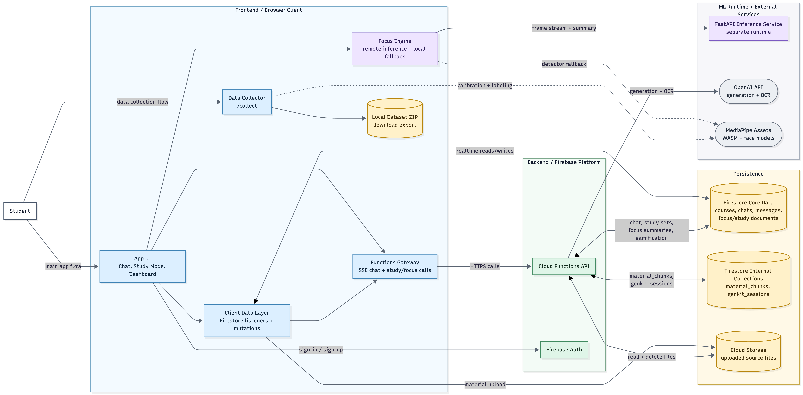

*Figure 1. Final full-system architecture after the project converged on a software-first, focus-aware study platform.*

Several implementation decisions became clearer during this evolution. Managed cloud services replaced more ambitious backend options because they reduced operational overhead. Retrieval was simplified because vector-search sophistication was less important than delivering a stable focus-aware study platform. The gaze subsystem was treated as a standalone engineering concern with its own data, training, validation, and inference lifecycle. The result is a system that is narrower than the original proposal but stronger in technical focus.

# 5. System Architecture

## 5.1 Architectural Overview

Echelon uses a layered architecture built around one primary subsystem: AI gaze tracking. The rest of the platform exists to contextualize, persist, and operationalize the focus signal produced by that subsystem. At a high level, the architecture consists of a client layer, an inference layer, an application-services layer, a persistence layer, and a model-development layer.

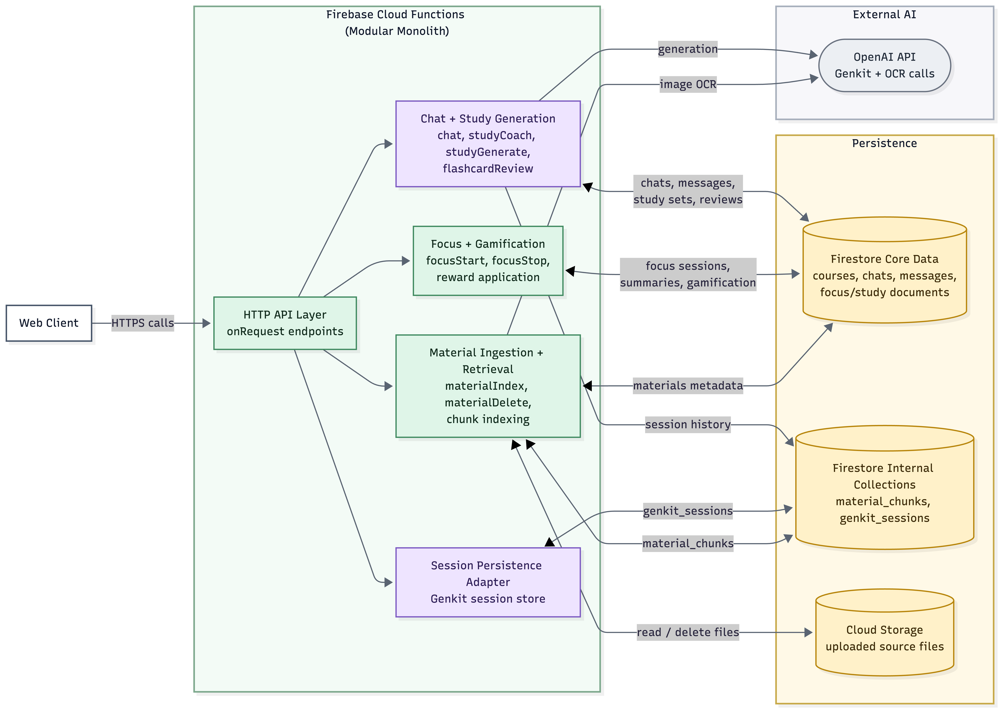

*Figure 2. Backend and application-services architecture supporting persistence, AI workflows, session management, and data coordination.*

The client layer is a web application responsible for authentication, study-session control, webcam access, chat interaction, material management, and dashboard rendering. This layer acts as the user-facing control surface for the entire system. During a focus-aware study session, it initializes the session lifecycle, captures visual input, coordinates inference requests, and later renders the resulting focus summaries alongside study content and engagement metrics.

## 5.2 Gaze-Tracking and Inference Layer

The inference layer is the architectural center of the project. Its purpose is to transform webcam-derived visual input into directional attention-state predictions. The implemented model does not reduce attention to a binary focused versus unfocused label. Instead, it predicts a structured set of gaze-related states such as looking at the screen or looking away in specific directions. This design is important because it preserves more information at the frame level and allows the system to reason about attention over time rather than collapsing behavior into an overly simplistic label too early in the pipeline.

Between raw predictions and user-facing output, the system applies temporal smoothing and state aggregation. This layer is necessary because frame-level predictions are inherently noisy. Small head movements, blinks, posture shifts, and momentary glances should not cause unstable focus-state transitions. The temporal component therefore acts as a stabilizing layer that converts short-term predictions into session-level behavioral summaries. Architecturally, this is what turns the model from an isolated classifier into a usable focus-monitoring subsystem.

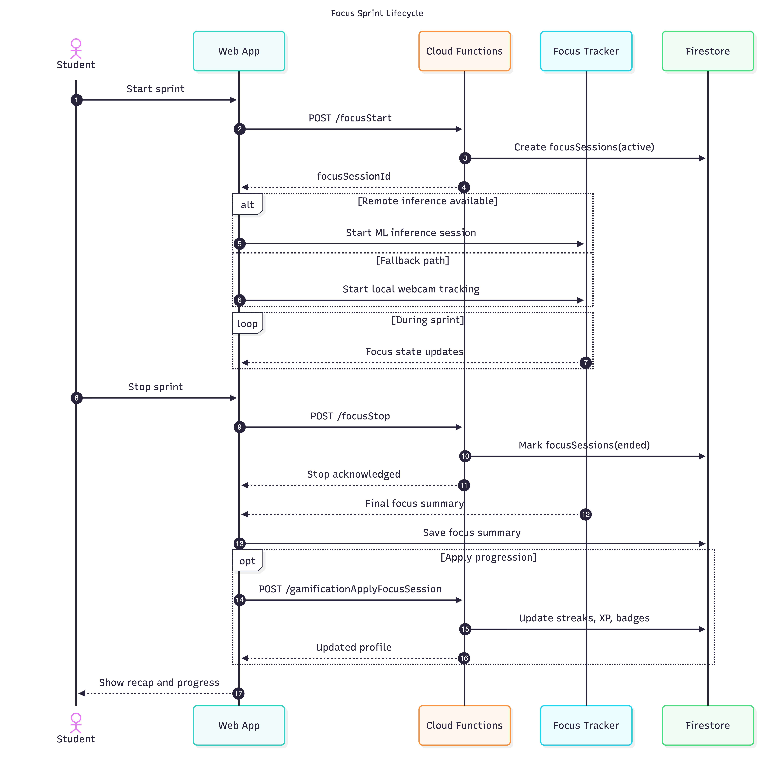

*Figure 3. Sequence view of the focus-session workflow from session start, through repeated inference, to session termination and summary persistence.*

## 5.3 Application and Persistence Layers

The application-services layer supports the broader study workflow. It handles AI chat, study-session lifecycle events, material ingestion, study-set generation, flashcard review updates, coaching prompts, and gamification state transitions. These services are not the main novelty of the project, but they are necessary to give the gaze-tracking subsystem a meaningful operational context. Focus metrics are more valuable when tied to the topic being studied, the materials consulted, and the user’s ongoing progress.

The persistence layer stores user accounts, course and session structure, study materials, chat records, generated study artifacts, focus summaries, and progress-tracking data. This persistence model is critical because attention analytics are most useful longitudinally. A single session-level focus summary has limited value in isolation. Repeated summaries tied to real study context make it possible to visualize trends, evaluate consistency, and support behavioral feedback.

## 5.4 Deployment Evolution

A key architectural evolution in the project was the move away from Raspberry Pi-based deployment. Earlier iterations explored embedded-device execution for portability and dedicated sensing. That direction was later abandoned because it introduced unfavorable tradeoffs in security, device management, and hardware cost for sufficiently performant inference. The final intended direction was cloud-hosted inference on rented infrastructure. The prototype still includes a local inference path because it was useful for rapid experimentation and integration, but the architectural trajectory moved away from embedded edge hardware toward a more controlled centralized execution model.

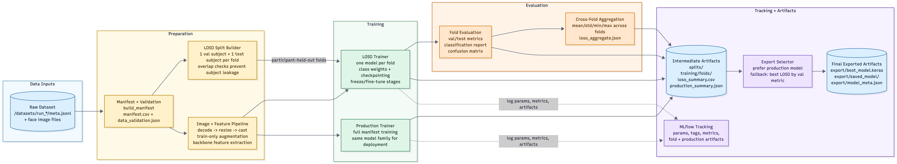

*Figure 4. Machine-learning pipeline overview covering data preparation, training, evaluation, and inference support.*

This final architecture is narrower than the original proposal but more coherent. It deliberately concentrates complexity in the gaze-tracking pipeline while simplifying surrounding infrastructure wherever possible.

# 6. Technology Stack and Design Rationale

## 6.1 Frontend and Platform Stack

The technology stack was selected to preserve engineering effort for the gaze-tracking problem while minimizing unnecessary complexity in the surrounding platform.

The frontend uses React, TypeScript, and Vite. This is a suitable combination for a system that depends on continuous interaction, browser camera access, live session control, streaming chat, and dashboard-style interfaces. The client had to behave more like a study workspace than a content site, so a lightweight single-page application architecture was the right choice. TypeScript was especially useful because the system crosses several boundaries: cloud APIs, persistent user data, generated study artifacts, and focus-summary structures.

The application backend uses managed cloud services. This choice is pragmatic. Authentication, storage, user-scoped persistence, and basic deployment all needed to be reliable without consuming a disproportionate amount of engineering effort. A managed backend platform allowed the project to avoid spending time on commodity infrastructure and instead focus on the computer-vision and attention-analysis components. A document-oriented persistence model is also a reasonable fit for chats, sessions, summaries, materials, and generated study artifacts.

## 6.2 Application Services and AI Tooling

Serverless application functions were used for workflows such as chat orchestration, material indexing, study-set generation, flashcard review updates, session handling, and gamification. This reduced operational overhead and kept supporting services close to the persistence layer. The tradeoff is reduced modularity compared with a more formally layered service architecture, but that tradeoff is acceptable in a capstone context where the primary engineering differentiation lies elsewhere.

For generative AI, the final implementation uses a unified orchestration layer with OpenAI-compatible models. This appears to have been driven by integration practicality. The system required a generative layer that could support streaming study chat, grounded content generation, and OCR-assisted ingestion. A unified provider path reduced integration friction.

## 6.3 Machine-Learning Stack

The gaze-tracking subsystem uses a separate Python ML stack. This separation is one of the strongest design decisions in the project. The application platform and the vision pipeline solve different problems and benefit from different tooling ecosystems. Python provides better support for model training, computer vision, and experiment management than the surrounding web stack would. Keeping the ML pipeline separate prevented the application architecture from constraining the model-development workflow.

Within the ML stack, TensorFlow was used for training and export, FastAPI for inference serving, MediaPipe for face-related preprocessing support, and MLflow plus containerized tooling for experiment management and reproducibility. These choices fit the problem well. The project required more than a one-off classifier. It required data collection, participant-aware validation, iterative training, export, and session-oriented inference.

## 6.4 Tuning and Tradeoffs

The late-stage experiment configuration also reflects deliberate tuning rather than arbitrary trial-and-error. Stronger results were obtained after increasing image resolution, introducing phased fine-tuning, lowering learning rates during fine-tuning, adding dropout and label smoothing, and applying controlled augmentation. These are consistent decisions for improving generalization in a participant-variable gaze-classification task.

**Table 3. Core technology stack and design rationale**

| Logo | Technology | Role in Echelon | Why it was used |
| --- | --- | --- | --- |
| 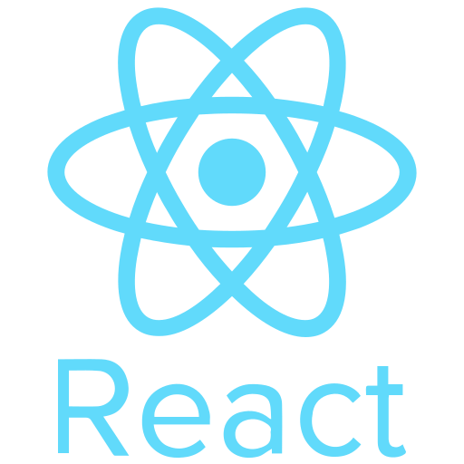 | React | Frontend framework for the study workspace, dashboards, chat interface, and focus-session interaction. | Well suited to interactive single-page interfaces and continuous study-session workflows. |
|  | TypeScript | Type-safe frontend and backend application logic. | Improved maintainability across UI state, cloud APIs, and structured study data. |
| 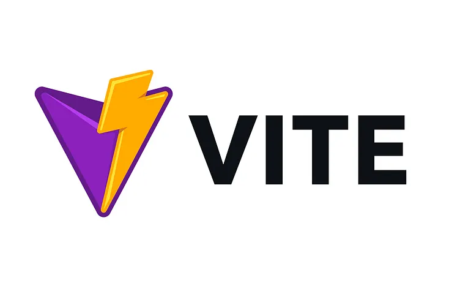 | Vite | Frontend build and development tooling. | Lightweight and fast, which supported rapid iteration on the study interface. |
| 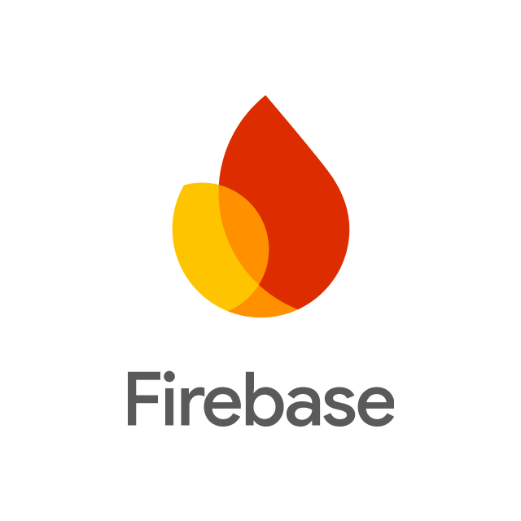 | Firebase | Authentication, persistence, storage, hosting, and serverless application services. | Reduced infrastructure overhead so the project could focus on gaze tracking and study workflows. |
| 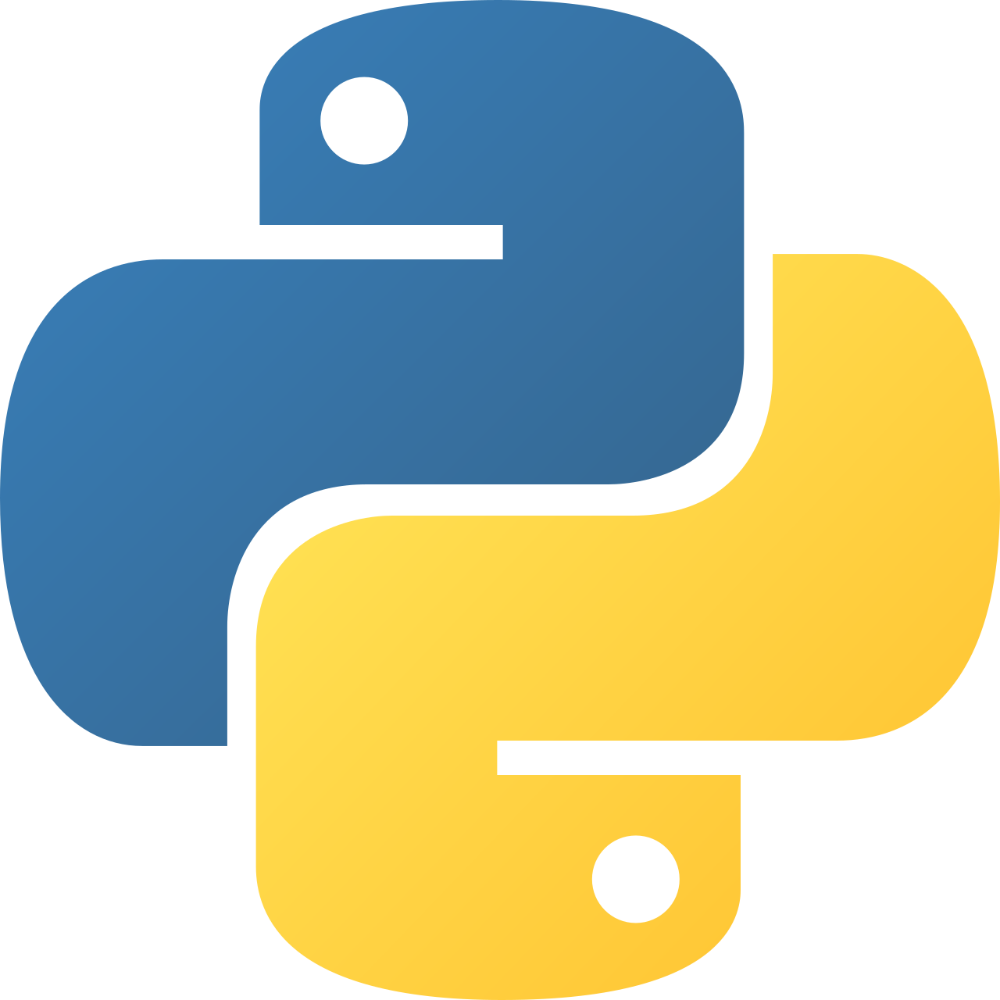 | Python | Core language for the machine-learning pipeline and inference service. | Better suited than the web stack for training, computer vision, and experiment management. |
| 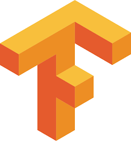 | TensorFlow | Model training, fine-tuning, and export for the gaze-classification subsystem. | Provided a practical deep-learning framework for transfer learning and deployment-oriented model artifacts. |
|  | MLflow | Experiment tracking and ML workflow reproducibility. | Supported structured comparison of runs rather than ad hoc model iteration. |
| 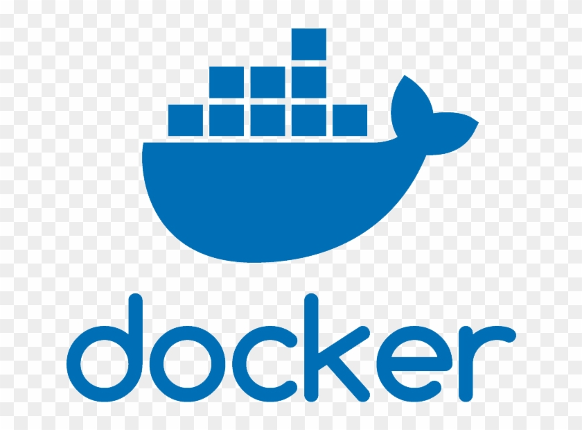 | Docker | Reproducible ML environment and containerized workflow support. | Helped isolate the ML toolchain and reduce environment drift. |
| 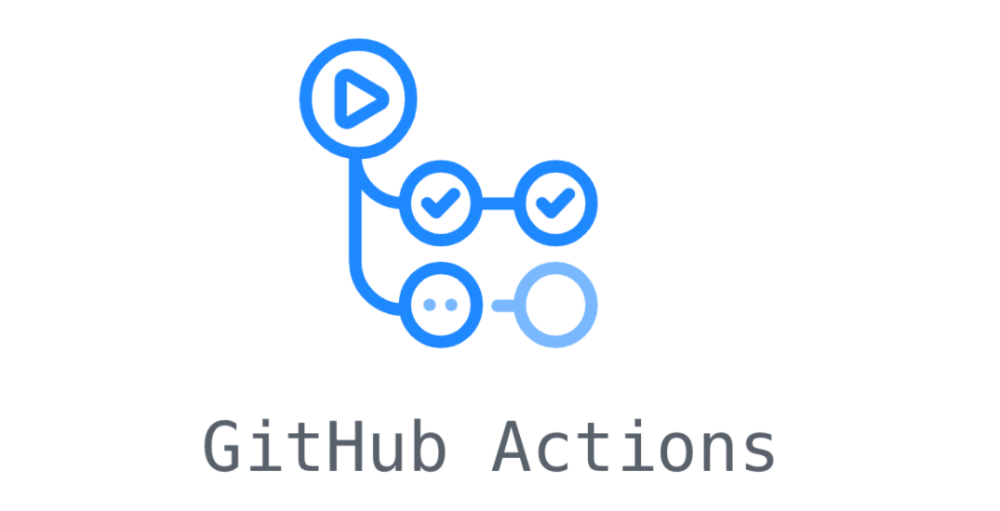 | GitHub Actions | Automated frontend build and deployment workflow. | Provided lightweight CI/CD support for the hosted application layer. |

Overall, the stack is coherent because it separates concerns cleanly. The web stack handles interaction and platform workflows. Managed cloud services handle persistence and lightweight application logic. The Python ML stack handles gaze-model lifecycle and inference.

# 7. Detailed Implementation

## 7.1 Gaze Data Collection and Model Training

The implementation can be understood as four connected subsystems: gaze data collection and modeling, runtime focus inference, application workflows, and user-facing feedback.

The first subsystem is gaze data collection and model development. This project did not treat the model as an external black box. Instead, it implemented a complete training path built around labeled directional attention data. The validated dataset contains 10,260 usable labeled samples from eight participants across five classes: `screen`, `away_left`, `away_right`, `away_up`, and `away_down`. The class distribution is relatively balanced, which is important because a multi-class gaze model can become misleading if one label dominates the dataset. Data validation also reported zero malformed rows and zero invalid labels, indicating that the data pipeline was handled with reasonable care.

The training methodology is a major strength. The model was evaluated using leave-one-subject-out validation, which is the correct strategy for this type of task. Random splitting would have overstated performance by allowing the same participant’s visual characteristics to appear in both training and evaluation sets. Subject-wise separation produces a more honest measure of generalization. The final aggregate results are strong enough to support the main technical claim of the project: mean held-out test accuracy of 76.73%, mean test macro F1 of 74.04%, mean macro precision of 80.30%, and mean balanced accuracy of 76.61% across eight held-out folds.

The experiment history also matters. Early runs were materially weaker, with mean test macro F1 in the low 0.40 range. Later runs improved into the high 0.50 and low 0.60 range, and the stronger February 13 experiments moved into the low 0.70 range. This progression suggests that performance gains came from iterative refinement rather than isolated luck. Better data quality, more participants, stronger regularization, phased fine-tuning, and improved augmentation likely all contributed.

<!-- FIGURE 5: Gaze-class examples or data-collection screenshots.
Place after Section 7.1.
Show: Representative examples of screen / away_left / away_right / away_up / away_down, or screenshots from the collection/calibration workflow.
-->

**Table 4. Final gaze dataset summary**

| Dataset attribute | Value | Notes |
| --- | --- | --- |
| Total rows seen | 10,640 | Total metadata rows reviewed during validation. |
| Usable rows kept | 10,260 | Final rows retained for training and evaluation. |
| Retention rate | 96.4% | Based on 10,260 retained rows out of 10,640 total rows. |
| Participants | 8 | Subject-wise evaluation was performed across eight participants. |
| Gaze classes | 5 | `screen`, `away_left`, `away_right`, `away_up`, `away_down`. |
| Missing-image rows removed | 380 | Rows excluded because the referenced image file was missing. |
| Malformed rows | 0 | No malformed metadata rows were reported. |
| Invalid labels | 0 | No invalid class labels were reported. |
| Class-count range | 1,988 to 2,121 | Indicates relatively balanced class support across the five gaze states. |
| Participant-count range | 1,030 to 1,537 | Shows moderate variation in sample count per participant. |

## 7.2 Runtime Inference and Temporal Logic

The second subsystem is runtime inference. During an active study session, the system captures webcam input and routes it through the gaze-inference path. The raw predictions are not surfaced directly. Instead, they are passed through temporal smoothing and state-transition logic so that brief visual noise does not dominate the output. This step is essential. A focus-aware study system cannot respond to every frame as if it were independently meaningful. The implementation therefore treats gaze estimation as a temporal process, not just as frame classification.

This temporal layer is what makes the project operationally credible. In practice, attention monitoring is useful only if it produces stable summaries over the duration of a study session. The implementation accumulates directional predictions, applies smoothing and hysteresis, and produces session-level statistics that can later be stored, visualized, and used for behavioral feedback.

The runtime design also includes fallback behavior. If the preferred inference path is unavailable, the system can still preserve core session functionality using a simpler heuristic tracker. That fallback is important because it prevents the entire study-session flow from failing when the full ML path is unavailable.

## 7.3 Study Platform Workflows

The third subsystem is the supporting study platform. The application supports authenticated users, persistent courses and sessions, AI chat, uploaded study materials, content-grounded assistance, study-set generation, flashcard review updates, and study-mode interaction. These features matter because gaze summaries are not useful in a vacuum. The project needed a real study context in which focus signals could be attached to tasks, documents, and learning artifacts.

Material ingestion is particularly important. The system accepts uploaded course content, extracts and chunks it, and uses it to ground later chat and study-artifact generation. This gives the platform domain-specific context rather than relying entirely on generic model responses. The retrieval path appears intentionally simplified relative to more advanced semantic-search architectures, but that was a reasonable decision. The value of the project depends more on the quality of the gaze-tracking pipeline than on maximizing retrieval sophistication.

## 7.4 Feedback and System Integration

The fourth subsystem is focus-aware feedback. Session summaries are persisted and later surfaced through dashboards, study-mode flows, and gamified progress indicators. This is what connects the machine-learning component to user behavior. Without these outputs, the gaze model would remain a technical artifact. With them, it becomes part of an intervention loop: the system senses behavior, summarizes it, stores it, and presents it back in a form that can influence future study habits.

<!-- FIGURE 6: Final product screenshots.
Place after Section 7.4 or Section 11.3.
Suggested set: dashboard view, study session view, chat/materials view.
-->

The project therefore does more than train a gaze model. It connects data collection, training, inference, temporal stabilization, persistence, visualization, and study support into a single system.

# 8. Software Engineering Process

## 8.1 Development Model

The development process appears to have followed a risk-driven iterative model rather than a rigid fixed-scope plan. The proposal defined a broad intelligent study platform, the progress report narrowed that vision into a concrete prototype, and the final implementation further concentrated effort on the gaze-tracking subsystem. This progression suggests that planning was revised in response to technical evidence rather than being treated as static.

## 8.2 Milestones and Workstreams

A likely early milestone was establishing the application shell: authentication, persistent user state, course and session structure, and a basic study workspace. Without that foundation, the focus-tracking subsystem would have had no durable context in which to operate. A second milestone was likely the integration of AI-assisted study workflows such as chat, content grounding, and study artifact generation. The third and most technically significant milestone was the maturation of the gaze-tracking pipeline itself, including data collection, subject-aware evaluation, inference integration, and session-level summary generation.

The project also appears to have been developed in parallel technical streams. One stream centered on the web platform and user workflow. A second centered on application services and cloud persistence. A third centered on machine-learning experimentation, data validation, and inference. This division is consistent with the structure of the problem: gaze tracking required iterative experimentation, while the rest of the platform required incremental feature integration.

<!-- FIGURE 7: Development milestones or iteration timeline.
Place after Section 8.2.
Show: major milestones, pivots, and late-stage ML improvement.
-->

## 8.3 Scope Control and Change Management

The strongest process decision was the repeated narrowing of scope around the most defensible technical contribution. The Raspberry Pi direction was explored and then dropped once its security and cost implications became unfavorable. Retrieval infrastructure was simplified rather than expanded into a more complex semantic-search stack. Supporting features were retained only insofar as they strengthened the focus-aware study experience. These choices indicate active scope control rather than uncontrolled drift.

There is also evidence of feature-level planning and architectural documentation, which suggests a degree of internal engineering discipline. However, the visible process evidence is still limited. There is no strong public record of sprint planning, issue tracking, formal code-review policy, or release management. The most accurate characterization is that the project demonstrates structured iteration and effective technical reprioritization, but not a fully formalized industrial development process.

# 9. Testing and Validation

## 9.1 Machine-Learning Validation

Testing and validation in Echelon operate at two levels: conventional software validation for the application platform and experimental validation for the gaze-tracking model. The second of these is more critical because the project’s main claim depends on whether directional gaze estimation works beyond a single participant or controlled demo.

The ML validation is the strongest part of the testing story. After data validation, the final dataset contained 10,260 usable labeled samples from eight participants across five gaze-related classes. The dataset was reasonably balanced, and the validation report recorded no malformed rows and no invalid labels. More importantly, evaluation was performed using leave-one-subject-out validation rather than random splitting. That is the correct methodology for this problem because it measures cross-subject generalization instead of allowing the model to benefit from participant leakage.

The final aggregate LOSO results are meaningful for a capstone-scale multi-class gaze model. Mean held-out test accuracy was 76.73%, mean test macro F1 was 74.04%, mean macro precision was 80.30%, and mean balanced accuracy was 76.61%. The validation metrics were higher, with 80.42% mean validation accuracy and 79.89% mean validation macro F1. These numbers support the claim that the model learned generalizable directional gaze behavior rather than only fitting the training set. The experiment history also shows steady improvement over time, with early runs in the low 0.40 macro F1 range and later runs moving into the low 0.70 range. That progression indicates genuine experimental refinement.

**Table 5. Final aggregate LOSO metrics**

| Metric | Mean | Std. dev. | Min | Max |
| --- | --- | --- | --- | --- |
| Validation accuracy | 80.42% | 9.71% | 61.60% | 90.05% |
| Validation macro F1 | 79.89% | 10.35% | 59.64% | 90.13% |
| Validation macro precision | 84.18% | 7.36% | 68.66% | 91.40% |
| Validation macro recall | 80.34% | 10.46% | 59.26% | 90.76% |
| Validation balanced accuracy | 80.34% | 10.46% | 59.26% | 90.76% |
| Test accuracy | 76.73% | 7.53% | 63.50% | 86.50% |
| Test macro F1 | 74.04% | 8.75% | 58.86% | 86.10% |
| Test macro precision | 80.30% | 7.13% | 68.20% | 90.03% |
| Test macro recall | 76.61% | 7.54% | 63.63% | 86.50% |
| Test balanced accuracy | 76.61% | 7.54% | 63.63% | 86.50% |
| Number of LOSO folds | 8 | — | — | — |

Across the archived experiment reports, the strongest overall run was the February 13 run `20260213-160744`, selected here as the representative best experiment because it achieved the highest mean LOSO test macro F1 (`0.7227`) and the highest mean test accuracy (`0.7510`) among the run-specific capstone reports. Other runs achieved higher single-fold scores, but not stronger fold-averaged performance. The following figures therefore use this run to illustrate fold-level variation, convergence behavior, and class-level error patterns.

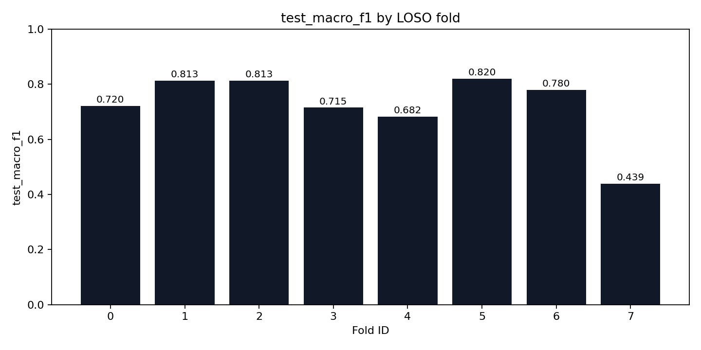

*Figure 8. Fold-wise test macro F1 for a strong late-stage LOSO run, showing the degree of variation across held-out participants.*

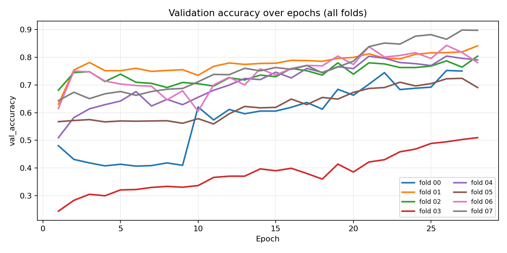

*Figure 9. Validation accuracy across training epochs for the selected late-stage run.*

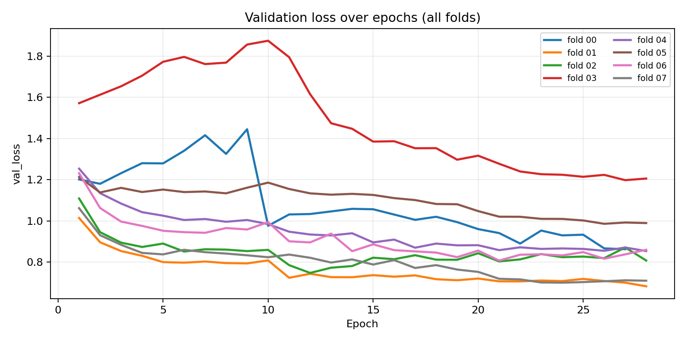

*Figure 10. Validation loss across training epochs for the selected late-stage run.*

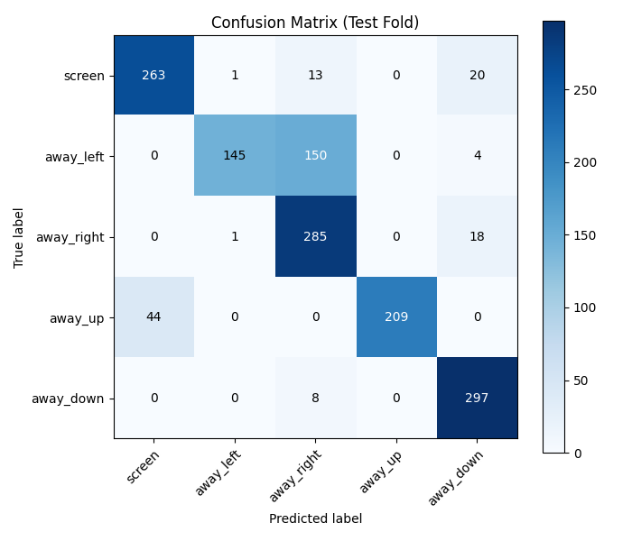

*Figure 11. Confusion matrix for the best-performing fold in the selected late-stage run.*

**Table 6. Comparison of representative archived LOSO runs**

| Run ID | Mean test macro F1 | Mean test accuracy | Supporting observation | Interpretation |
| --- | --- | --- | --- | --- |
| 20260210-220926 | 0.3996 | 0.4474 | Early baseline run with 6 validated participant datasets. | Establishes the starting point before major tuning and dataset growth. |
| 20260211-014345 | 0.5815 | 0.6307 | Clear jump over the February 10 runs. | Marks the first major improvement in generalization. |
| 20260212-011321 | 0.5972 | 0.6239 | Stronger than the February 11 baseline and evaluated with 7 validated participant datasets. | Shows improved stability as the dataset expanded. |
| 20260213-030358 | 0.6830 | 0.7078 | Second-best mean macro F1 among archived runs. | Demonstrates that late-stage tuning substantially improved overall performance. |
| 20260213-145050 | 0.6596 | 0.7053 | Highest single-fold macro F1 (`0.8619`) but also high fold-to-fold variance (`std = 0.2152`). | Strong peak performance, but not the best overall run because stability was weaker. |
| 20260213-160744 | 0.7227 | 0.7510 | Highest mean macro F1 and highest mean accuracy across all archived run reports. | Selected as the best archived experiment because it gives the strongest fold-averaged performance. |

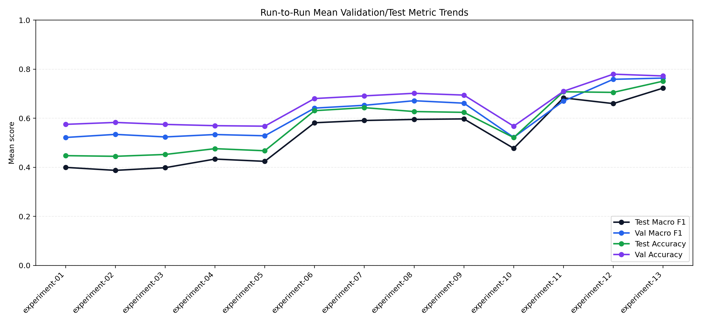

*Figure 12. Cross-run trend of mean validation and mean test metrics across archived experiments (experiment labels map to run IDs in `ml/artifacts/reports/presentation/training_progress/experiment_label_mapping.csv`).*

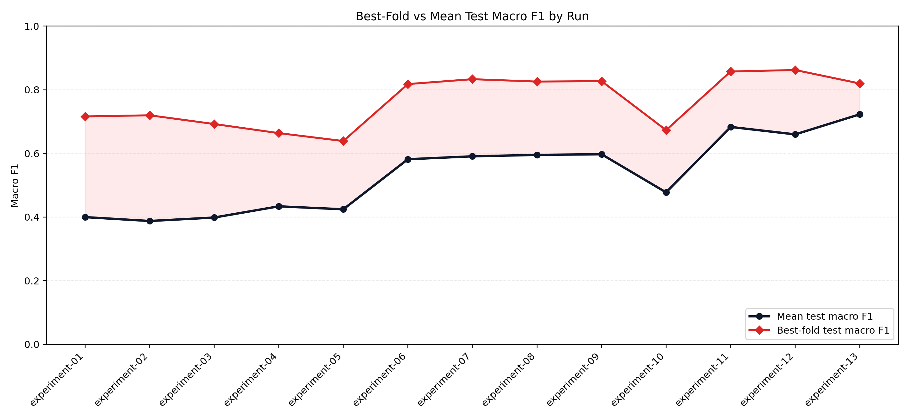

*Figure 13. Difference between peak fold performance and fold-averaged test macro F1, highlighting why run selection should prioritize stable mean performance.*

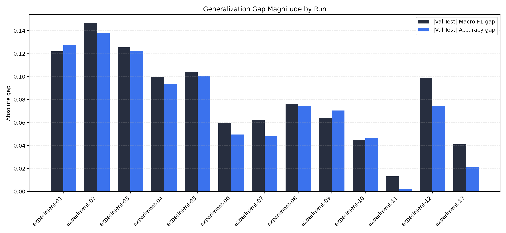

*Figure 14. Absolute validation-test gap magnitude across runs; smaller values indicate tighter alignment between validation and held-out test behavior.*

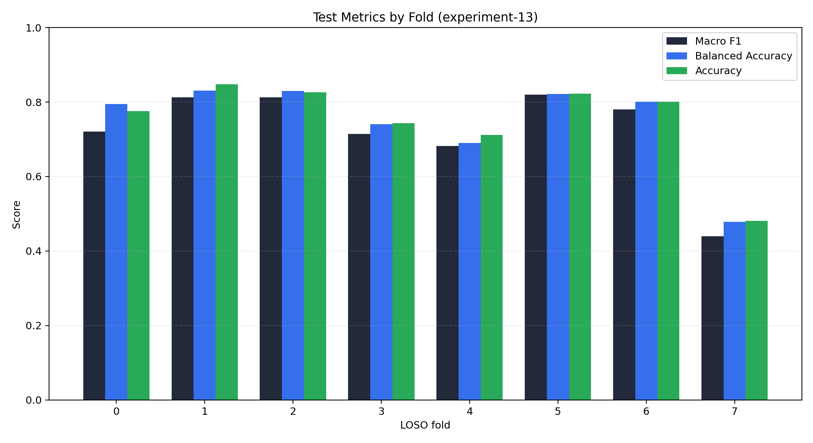

*Figure 15. Fold-wise test macro F1, balanced accuracy, and accuracy for the selected best run, illustrating residual participant-level variability.*

The remaining ML limitation is fold-level variability. Performance is credible overall, but not uniform across all held-out participants. That is expected in gaze-related problems, where lighting, posture, face geometry, camera position, and calibration behavior can vary substantially. This is also why the runtime system depends on temporal smoothing and session-level aggregation rather than exposing frame-level predictions directly.

## 9.2 Software Validation

Software testing is more limited. The application can be built and linted, and there is meaningful automated validation for at least one logic-heavy backend subsystem. That is useful because it increases confidence in stateful behaviors such as streaks, progress updates, and idempotent session handling. However, there is limited evidence of frontend unit tests, broad backend integration tests, or end-to-end browser tests covering complete study workflows. As a result, the project has stronger validation for its ML subsystem and selected backend logic than for the full application surface.

## 9.3 Confidence Level

Overall confidence is therefore mixed but acceptable for a capstone prototype. Confidence in the feasibility of the gaze-tracking subsystem is relatively strong because it is backed by structured dataset validation and subject-wise evaluation. Confidence in full-system regression resistance is lower because the broader software stack is not comprehensively automated under test.

# 10. Security, Privacy, and Reliability Considerations

## 10.1 Security

Security and privacy are central concerns in Echelon because the system handles user accounts, educational content, AI service calls, and webcam-derived behavioral signals. Once gaze tracking becomes part of the product, the sensitivity of the system increases significantly.

At the data layer, the security posture is reasonably sound. User data is partitioned by ownership, and the application architecture clearly assumes authenticated, user-scoped access to sessions, materials, chat history, and focus summaries. Secret management is also handled in a conventional way through environment and backend configuration rather than by embedding sensitive values directly in client code.

The weaker area is the service layer. Some backend workflows appear to rely more heavily than ideal on caller-supplied identity context and ownership checks against stored records. That is workable in a prototype with strong datastore controls, but it is not the most robust API-layer security model. A stronger design would consistently verify authenticated user identity at the request boundary and propagate that identity through service execution rather than trusting request-body fields.

## 10.2 Privacy

Privacy is the most sensitive issue because gaze tracking depends on webcam input. One positive architectural decision is that the system is oriented around persisting focus summaries rather than long-lived raw video archives. That reflects a useful data-minimization principle: retain the behavioral signal needed by the product, not the full visual stream unless it is operationally necessary. The shift away from Raspberry Pi hardware was also partly a privacy and security improvement, since portable embedded devices introduce a wider attack surface and more difficult device-management concerns.

However, the move toward cloud-hosted inference also creates new privacy obligations. If gaze-related input is processed remotely, the system must define how frames are transmitted, how long they are retained, what is logged, and what guarantees exist around deletion and access control. The current project establishes a sensible architectural direction, but a production version would need far more explicit privacy governance around inference traffic and visual data handling.

## 10.3 Reliability

Reliability is strongest where the design anticipates instability. Temporal smoothing improves behavioral stability by preventing raw prediction noise from becoming user-visible state changes. The focus pipeline also includes fallback behavior, which reduces the risk of total failure when the preferred inference path is unavailable. Managed cloud persistence further improves reliability by avoiding custom low-level state infrastructure.

The main reliability gaps are operational. The system does not yet show strong evidence of comprehensive observability, rate limiting, asynchronous task handling for expensive workloads, or broad automated recovery behavior. Large content-processing tasks and AI-dependent services are therefore likely more fragile than they would be in a hardened production environment. The reliability of the focus subsystem is also bounded by model variability across participants, which means that prediction quality may still degrade in more difficult real-world conditions.

<!-- TABLE 7: Security, privacy, and reliability risks with mitigations.
Place after Section 10.3.
Columns: Risk area, Current mitigation, Remaining gap, Future action.
-->

Taken together, Echelon is best described as privacy-aware and reasonably well structured at the prototype level, but not fully hardened.

# 11. Results and Project Outcome

## 11.1 Delivered System

Echelon delivered a full-stack prototype centered on AI gaze tracking for study-session focus analysis. The final system supports user authentication, persistent study sessions, AI-assisted chat, course-material upload and grounding, study artifact generation, flashcard review, focus-session summaries, dashboard visualization, and gamified progress tracking. These features are integrated rather than isolated, which allows focus analysis to be tied to real study activity instead of existing as a stand-alone technical demo.

## 11.2 Gaze-Tracking Results

The primary result is the successful implementation of a complete gaze-tracking pipeline. The system supports labeled data collection, model training, leave-one-subject-out evaluation, runtime inference, temporal smoothing, and session-level summary generation. Quantitatively, the final aggregate evaluation reached 76.73% mean held-out test accuracy and 74.04% mean test macro F1 across eight subject-held-out folds. For a multi-class directional gaze model evaluated under subject separation, these are meaningful results.

The experimental progression is also an important outcome. Early runs were significantly weaker, while later runs improved as dataset quality, participant coverage, regularization, and fine-tuning strategy were refined. This indicates that the project did not arrive at its final ML results by chance. The final metrics are the result of iterative engineering and controlled experimentation.

## 11.3 Overall Project Outcome

A second major outcome is that the focus signal was successfully embedded into a usable study platform. Gaze tracking is connected to session management, material context, dashboards, and reinforcement mechanisms. This gives the attention signal practical value. Instead of only classifying head pose or gaze direction, the system stores session summaries, visualizes focus behavior, and ties that behavior to actual study workflows.

<!-- TABLE 8: Final project outcome summary.
Place after Section 11.3.
Columns: Area, Delivered outcome, Evidence type, Status.
-->

<!-- FIGURE 16: Final dashboard or end-to-end workflow screenshot.
Place after Table 8 in Section 11.3.
-->

Not every original concept was delivered in its original form. The Raspberry Pi path was dropped, and the final system is software-first rather than hardware-centered. That should not be treated as a failure of implementation. It reflects a project decision to prioritize the most technically defensible component and adopt a more realistic deployment direction.

# 12. Critical Evaluation

## 12.1 Strengths

The strongest aspect of Echelon is its clear technical center. The project is not defined by generic feature accumulation. Its main contribution is a non-trivial applied ML subsystem for gaze-based focus estimation, and the surrounding platform is structured around that contribution. This gives the project coherence and makes the supporting features easier to justify from a software engineering perspective.

A second strength is the level of integration across domains. The project combines machine learning, cloud-backed persistence, AI-assisted study workflows, and user-facing behavioral feedback in a single platform. The gaze-tracking subsystem is not isolated from the rest of the product. It is connected to the session lifecycle, summary persistence, dashboards, and engagement mechanisms. That level of end-to-end integration is difficult to achieve in a capstone project and is one of the main reasons the system feels substantial.

The ML evaluation evidence is also a major strength. The use of leave-one-subject-out validation is methodologically appropriate, and the reported aggregate metrics are strong enough to support the project’s central claim. The improvement across experiment history further supports the credibility of the work.

## 12.2 Weaknesses

The main weaknesses are architectural and operational rather than conceptual. The service layer is more centralized than ideal, which will make future maintenance and testing harder. Testing breadth outside the ML subsystem is limited. The deployment story remains transitional because the final intended cloud-inference direction is only partially reflected in the current prototype artifacts. Security at the API layer also needs strengthening.

Another weakness is narrative alignment across project stages. The proposal, progress report, and final implementation do not describe exactly the same system. That divergence is explainable and technically reasonable, but it still requires careful reporting.

## 12.3 Overall Assessment

Overall, the project is technically strong as a capstone prototype. It shows clear engineering judgment, especially in how scope was narrowed around the most important subsystem.

# 13. Limitations

## 13.1 Model and Evaluation Limits

The main limitation is that the gaze model, while strong for a capstone-scale prototype, still shows variation across held-out participants. The aggregate results are credible, but they do not imply uniformly stable performance under all user conditions. Lighting, camera position, posture, and individual visual differences likely still affect robustness.

A second limitation is that the reported metrics primarily validate sample-level classification performance. The actual product value depends on session-level focus summaries after temporal smoothing and aggregation. While the system implements this runtime logic, the evaluation evidence is stronger at the classification level than at the long-session behavioral-summary level.

## 13.2 Architectural and Testing Limits

The architecture is also still transitional. The final intended direction is cloud-hosted inference, but the prototype artifacts still reflect a local inference workflow used during development. This creates some mismatch between implementation evidence and final deployment intent.

Software testing is another limitation. The project has meaningful ML evaluation and selected backend validation, but it lacks broad automated coverage for complete user workflows. Frontend behavior, full end-to-end study sessions, and complex integration paths are therefore less formally validated than the core model.

## 13.3 Security and Scope Limits

There are also remaining security and privacy limitations. User-scoped data handling is reasonably structured, but API-layer identity enforcement should be stronger. For a future cloud-hosted inference deployment, more explicit visual-data handling guarantees would also be required.

Finally, some supporting subsystems were intentionally simplified to protect the project’s main focus. In particular, material retrieval and some backend architecture decisions reflect scope control rather than maximal technical depth.

# 14. Future Work

## 14.1 Gaze Model and Evaluation

The most important next step is to strengthen the gaze-tracking subsystem from a strong prototype into a more robust deployed service. This includes expanding the participant pool, increasing variation in capture conditions, and reducing fold-level performance variability. The goal is no longer just to prove feasibility, but to improve stability across users and environments.

A second priority is session-level evaluation. The current metrics validate the classifier well, but future work should assess how accurately the full runtime system summarizes real study behavior over time. That would require comparing automated session summaries against manual annotations, controlled distraction intervals, or user-reported engagement.

## 14.2 Deployment, Security, and Testing

A third priority is completing the cloud-inference architecture. Since the Raspberry Pi direction has already been abandoned, the next step is to operationalize the intended rented-server deployment model. That requires secure model serving, explicit transport and retention policies for gaze-related input, versioned model deployment, monitoring, and cost-aware scaling.

The software platform would also benefit from refactoring and stronger testing. Service logic should be decomposed into clearer modules, and critical workflows should receive frontend, backend, and end-to-end automated tests. This would improve maintainability and reduce regression risk as the platform evolves.

## 14.3 Platform Extensions

Further improvements to the educational side of the system are also possible. The focus signal could drive more adaptive interventions, such as dynamic coaching, session pacing adjustments, or personalized review recommendations based on repeated distraction patterns. Similarly, the content-grounding pipeline could be strengthened with more advanced retrieval methods once the core gaze subsystem is operationally stable.

<!-- TABLE 9: Future work roadmap.
Place after Section 14.3.
Columns: Priority, Work item, Rationale, Expected impact.
-->

# 15. Conclusion

## 15.1 Final Assessment

Echelon is a technically credible capstone project centered on AI gaze tracking for focus-aware studying. Its main contribution is not simply that it includes machine learning, but that it integrates a gaze-based attention-estimation pipeline into a complete study platform with persistence, AI-assisted support, behavioral summaries, and feedback mechanisms.

The project evolved substantially from its original proposal. Hardware-oriented deployment was dropped, the architecture became more software-first, and several supporting systems were simplified. Those changes improved the coherence of the final system rather than weakening it. The final implementation is more focused, better aligned with the core problem, and more defensible from an engineering standpoint.

The evaluation results strengthen this conclusion. The final LOSO metrics show that the gaze model generalizes beyond single-user conditions, and the broader platform demonstrates that the focus signal can be embedded into real study workflows. At the same time, the project remains a prototype rather than a production-ready system. Stronger testing, tighter service architecture, explicit cloud-inference privacy controls, and more complete deployment hardening are still needed.

Even with those limitations, the project is successful as a software engineering capstone. It solves a difficult problem with a clear technical strategy, shows real experimental and architectural iteration, and delivers an integrated system whose central contribution is both distinctive and technically meaningful.

# SECTION C — GAPS / QUESTIONS / ASSUMPTIONS

- The final intended inference deployment was clarified as rented cloud infrastructure, but the submitted prototype still reflects a local inference workflow. The report therefore distinguishes final architectural direction from directly visible prototype operation.
- The project history contains naming drift between `AI Study Buddy` and `Echelon`. This report treats `Echelon` as the final product name and the earlier name as legacy project naming.
- The report assumes that the aggregate LOSO evaluation and dataset-validation reports represent the final machine-learning evidence that should be cited in the capstone submission.
- There is limited evidence of a formal user study or educational-impact evaluation beyond the technical and workflow validation already discussed.
- There is limited evidence of comprehensive end-to-end automated testing across the full platform.
- The report assumes that the simplification of retrieval and the abandonment of Raspberry Pi deployment were intentional scope-control decisions rather than incomplete unfinished work.
