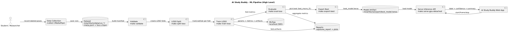

# AI Study Buddy

AI Study Buddy is a web app that combines AI chat help with webcam-based focus tracking for study sessions.

## Problem Statement

Students often lose focus while studying and do not have a simple way to measure attention and get contextual academic help in one place.

## Solution Statement

This app provides:
- AI chat support for study questions
- Real-time focus tracking from webcam head-pose signals
- Focus session summaries and dashboard analytics
- Course/session-based organization of study chats

## Technology Used

- Frontend: React, TypeScript, Vite
- Backend: Firebase Cloud Functions (Node.js, TypeScript), Genkit, OpenAI
- Platform: Firebase Auth, Firestore, Storage
- Vision + Focus: MediaPipe (browser) + local FastAPI inference service
- ML Pipeline: Python, scikit-learn/pandas/numpy, MLflow, Docker Compose, Makefile

## Architecture Diagrams

### High-Level System Design


### ML Pipeline Design



## Start Frontend Web App

From the repo root:

```bash
cp .env.example .env
npm install
npm run dev
```

Open the local URL shown by Vite (usually `http://localhost:5173`).

## Frontend

The frontend is a React + TypeScript SPA built with Vite. It has two runtime modes:

- Main app mode (`/`): chat, focus tracking, and dashboard
- Data collection mode (`/collect`): guided capture of labeled webcam samples for model training

### Main frontend responsibilities

- Authentication and session state
  - Uses Firebase Auth for sign-in/sign-up and signed-in app state.
- Structured study organization
  - Organizes data as Course -> Session -> Chat and stores all entities in Firestore.
- Streaming AI chat UX
  - Sends user prompts to backend chat endpoint and renders chunked SSE responses live.
- Focus tracking UX
  - Starts with a webcam calibration step.
  - Sends webcam frames to local inference API for focus predictions.
  - Falls back to a local laptop webcam heuristic tracker if inference API is unavailable.
- Focus analytics dashboard
  - Reads saved focus summaries and renders trends and session-level metrics.

### Core frontend modules

- `src/components/Chat.tsx`: top-level app shell and chat/focus orchestration
- `src/components/chat/useChatCollections.ts`: Firestore listeners for courses/sessions/chats/messages
- `src/components/chat/useChatMutations.ts`: create/update/delete and send-message logic
- `src/components/chat/useFocusTracking.ts`: focus lifecycle, calibration handoff, tracker fallback
- `src/services/genkit-service.ts`: SSE chat stream client
- `src/services/inference-focus-tracker.ts`: frame capture + upload + prediction handling
- `src/services/laptop-focus-tracker.ts`: local fallback focus classification
- `src/components/DataCollector.tsx`: dataset collection workflow

## Backend

The backend uses Firebase Cloud Functions (HTTP functions) for chat and focus session lifecycle.

### Cloud Functions endpoints

- `POST /chat`
  - Input: `sessionId`, `message`, `userId`
  - Output: streamed SSE chunks + final message metadata
- `POST /focusStart`
  - Input: `userId`, optional `courseId`, optional `sessionId`
  - Output: `{ ok, focusSessionId }`
- `POST /focusStop`
  - Input: `userId`, `focusSessionId`
  - Output: `{ ok }`

### Chat backend behavior

- Uses Genkit + OpenAI to generate answers with a teaching-oriented system prompt.
- Streams response chunks over SSE so the frontend can render text progressively.
- Persists chat context in Firestore (`genkit_sessions`) through a custom session store.
- Auto-generates a chat title for newly created chats still named `New Chat`.

### Focus backend behavior

- `focusStart` creates active records in `focusSessions`.
- `focusStop` validates ownership and marks the session as ended.
- Frontend stores final tracking summaries in `focusSummaries` after tracker stop.

### Backend + platform dependencies

- Functions runtime: Node.js 20, TypeScript
- Platform services: Firestore, Firebase Auth
- Required secret: `OPENAI_API_KEY`
- Optional model override: `OPENAI_MODEL` (defaults to `gpt-4o-mini`)

## ML Pipeline

The ML subsystem has three parts: data collection, training/evaluation, and realtime inference.

### 1) Data collection

- Data is collected from `/collect` in the frontend.
- MediaPipe face detection/landmarking guides pose calibration and quality checks.
- The collector exports run zips containing:
  - face crops (labeled by attention direction)
  - `meta.jsonl` with metadata for each frame sample

### 2) Training + evaluation

- Training is orchestrated with Make targets and Docker Compose.
- Pipeline steps:
  - validate raw dataset and build a manifest
  - generate LOSO (leave-one-subject-out) folds
  - train each fold with configurable experiments
  - evaluate metrics and aggregate fold results
  - export the best model artifact
- MLflow tracks run metrics and artifacts.

### 3) Inference serving + app integration

- A local FastAPI service loads the exported model and serves prediction endpoints.
- Frontend creates a focus session, uploads frames, receives temporal predictions, and stops the session to get summary stats.
- Predictions drive live focus/distracted notifications in the UI and are saved to Firestore summaries.

### 4) Artifacts and outputs

- Training outputs: `ml/artifacts/training/`
- Best export: `ml/artifacts/export/best_model.keras`
- Reports: `ml/artifacts/reports/` and timestamped run reports
- MLflow history: `ml/artifacts/mlflow/`

## Entire ML Pipeline (End-to-End Commands)

Prerequisites: Docker, Docker Compose, GNU Make.

### 0) Optional fresh start

```bash
make ml-clean
```

If cleanup permissions fail:

```bash
make fix-artifact-perms
```

Convenience commands:

```bash
make ml-fresh-pipeline   # ml-clean + ml-pipeline
make ml-fresh-run        # ml-clean + ml-run
make ml-clean-all        # remove all ML artifacts/history
```

### 1) Train + evaluate + export best model

```bash
make mlflow-up
make validate
make split-loso
make train-loso
make eval-loso
make export-best
```

One-command alternatives:

```bash
make ml-pipeline
make ml-run
```

### 2) Preset experiment runs

```bash
make ml-exp-stability-v1
make ml-exp-regularized-v2
make ml-exp-hires-v3
make ml-exp-v4
```

### 3) Generate timestamped report

```bash
make capstone-report
```

Artifacts are saved under:
- `ml/artifacts/reports/runs/<YYYYMMDD-HHMMSS>/capstone_report.md`
- `ml/artifacts/reports/runs/<YYYYMMDD-HHMMSS>/plots/`

### 4) Run local inference and use it in the web app

```bash
make serve-gpu-detached
make smoke-inference
npm run dev
```

In the app, start a focus session to see live pose label/confidence and focus events.

### 5) Run pipeline with a specific config

```bash
make ml-fresh-pipeline ML_CONFIG=/app/configs/exp_stability_v1.yaml
make capstone-report ML_CONFIG=/app/configs/exp_stability_v1.yaml
```