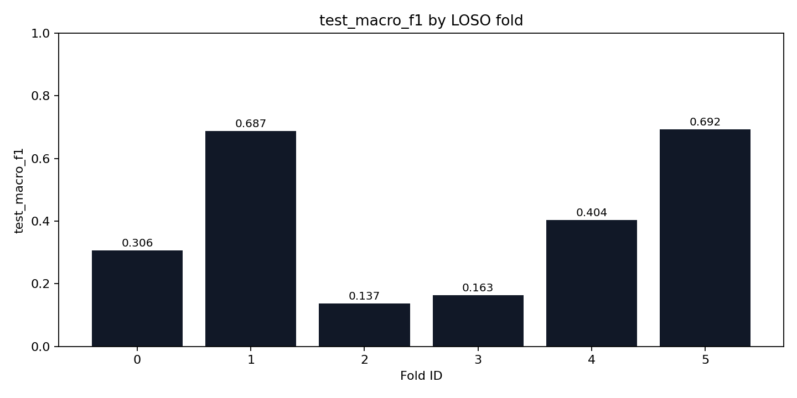
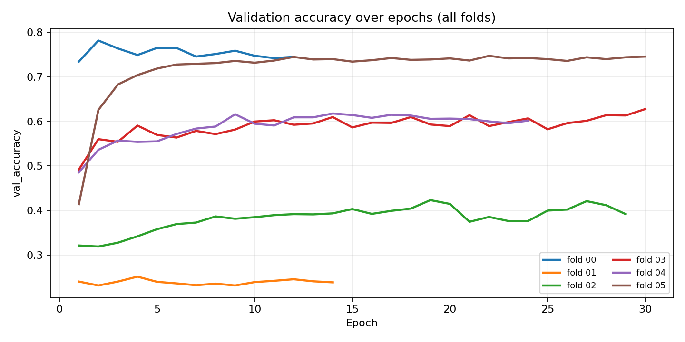
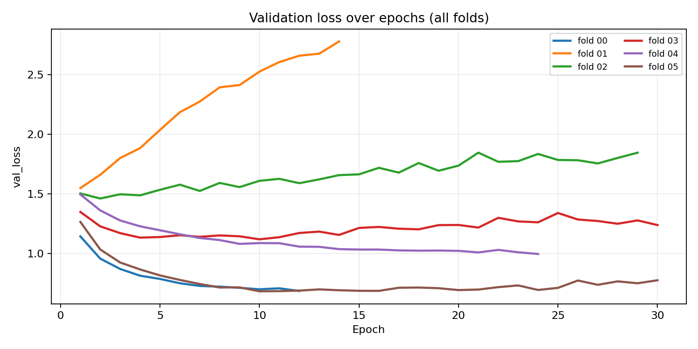
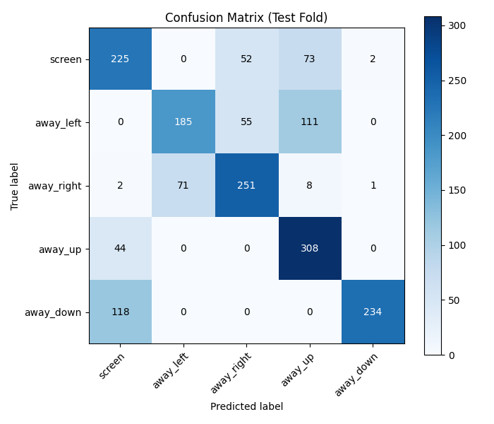

# StudyBuddy Head-Pose Model (LOSO) — Capstone Report

- **Generated at (UTC)**: 2026-02-11 04:41:08Z
- **Summary CSV**: `/app/artifacts/training/loso_summary.csv`
- **Folds dir**: `/app/artifacts/training/folds`
- **Selection criterion**: `test_macro_f1`
- **Best fold**: `05` (test_macro_f1=0.6922)

## Key plots

- `test_macro_f1_by_fold.png`
- `val_accuracy_by_epoch.png`
- `val_loss_by_epoch.png`
- `best_fold_confusion_matrix.png`



## Aggregate metrics (mean ± std across folds)

- **test_macro_f1**: mean=0.3983 std=0.2242 (min=0.1373, max=0.6922)
- **test_balanced_accuracy**: mean=0.4508 std=0.1856 (min=0.2218, max=0.6920)
- **test_accuracy**: mean=0.4522 std=0.1843 (min=0.2272, max=0.6914)
- **val_macro_f1**: mean=0.5237 std=0.2148 (min=0.1446, max=0.7811)
- **val_accuracy**: mean=0.5748 std=0.1848 (min=0.2512, max=0.7816)

## Per-fold results

| fold_id | val_participants | test_participants | test_macro_f1 | test_balanced_accuracy | test_accuracy |
| --- | --- | --- | --- | --- | --- |
| 0 | jaydon | can_meto | 0.3059 | 0.4077 | 0.4108 |
| 1 | johnny | jaydon | 0.6871 | 0.6908 | 0.6910 |
| 2 | kareem_mourad | johnny | 0.1373 | 0.2218 | 0.2272 |
| 3 | mais | kareem_mourad | 0.1634 | 0.2604 | 0.2604 |
| 4 | yara | mais | 0.4040 | 0.4324 | 0.4327 |
| 5 | can_meto | yara | 0.6922 | 0.6920 | 0.6914 |

## Learning curves (validation)





## Best fold confusion matrix



## Training configuration snapshot

```yaml
experiment_name: studybuddy-headpose-loso-regularized-v2
seed: 42
image_size: 224
backbone: efficientnetv2b0
batch_size: 16
epochs: 30
learning_rate: 0.0002
dropout: 0.4
early_stopping_patience: 10
label_column: label
participant_column: participant_id
path_column: image_path
```

## Data validation snapshot

```json
{
  "dataset_root": "/datasets",
  "meta_files_found": 6,
  "rows_seen": 9899,
  "rows_kept": 9847,
  "rows_malformed": 0,
  "rows_invalid_label": 0,
  "rows_missing_image": 52,
  "participants": [
    "can_meto",
    "jaydon",
    "johnny",
    "kareem_mourad",
    "mais",
    "yara"
  ],
  "class_counts": {
    "away_down": 1978,
    "away_left": 1991,
    "away_right": 1933,
    "away_up": 1964,
    "screen": 1981
  },
  "participant_counts": {
    "can_meto": 1227,
    "jaydon": 1754,
    "johnny": 1708,
    "kareem_mourad": 1747,
    "mais": 1671,
    "yara": 1740
  },
  "per_participant_class_counts": [
    {
      "participant_id": "can_meto",
      "label": "away_down",
      "count": 239
    },
    {
      "participant_id": "can_meto",
      "label": "away_left",
      "count": 257
    },
    {
      "participant_id": "can_meto",
      "label": "away_right",
      "count": 234
    },
    {
      "participant_id": "can_meto",
      "label": "away_up",
      "count": 240
    },
    {
      "participant_id": "can_meto",
      "label": "screen",
      "count": 257
    },
    {
      "participant_id": "jaydon",
      "label": "away_down",
      "count": 351
    },
    {
      "participant_id": "jaydon",
      "label": "away_left",
      "count": 351
    },
    {
      "participant_id": "jaydon",
      "label": "away_right",
      "count": 351
    },
    {
      "participant_id": "jaydon",
      "label": "away_up",
      "count": 351
    },
    {
      "participant_id": "jaydon",
      "label": "screen",
      "count": 350
    },
    {
      "participant_id": "johnny",
      "label": "away_down",
      "count": 350
    },
    {
      "participant_id": "johnny",
      "label": "away_left",
      "count": 351
    },
    {
      "participant_id": "johnny",
      "label": "away_right",
      "count": 333
    },
    {
      "participant_id": "johnny",
      "label": "away_up",
      "count": 335
    },
    {
      "participant_id": "johnny",
      "label": "screen",
      "count": 339
    },
    {
      "participant_id": "kareem_mourad",
      "label": "away_down",
      "count": 351
    },
    {
      "participant_id": "kareem_mourad",
      "label": "away_left",
      "count": 348
    },
    {
      "participant_id": "kareem_mourad",
      "label": "away_right",
      "count": 348
    },
    {
      "participant_id": "kareem_mourad",
      "label": "away_up",
      "count": 351
    },
    {
      "participant_id": "kareem_mourad",
      "label": "screen",
      "count": 349
    },
    {
      "participant_id": "mais",
      "label": "away_down",
      "count": 335
    },
    {
      "participant_id": "mais",
      "label": "away_left",
      "count": 333
    },
    {
      "participant_id": "mais",
      "label": "away_right",
      "count": 334
    },
    {
      "participant_id": "mais",
      "label": "away_up",
      "count": 335
    },
    {
      "participant_id": "mais",
      "label": "screen",
      "count": 334
    },
    {
      "participant_id": "yara",
      "label": "away_down",
      "count": 352
    },
    {
      "participant_id": "yara",
      "label": "away_left",
      "count": 351
    },
    {
      "participant_id": "yara",
      "label": "away_right",
      "count": 333
    },
    {
      "participant_id": "yara",
      "label": "away_up",
      "count": 352
    },
    {
      "participant_id": "yara",
      "label": "screen",
      "count": 352
    }
  ]
}
```
