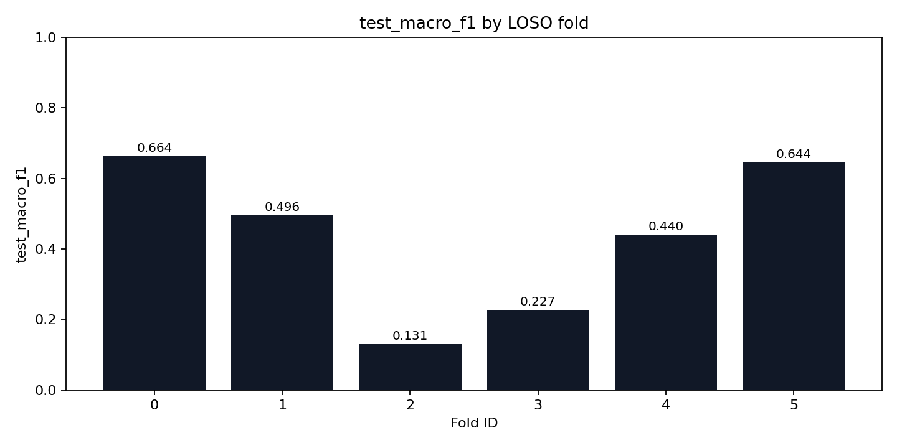
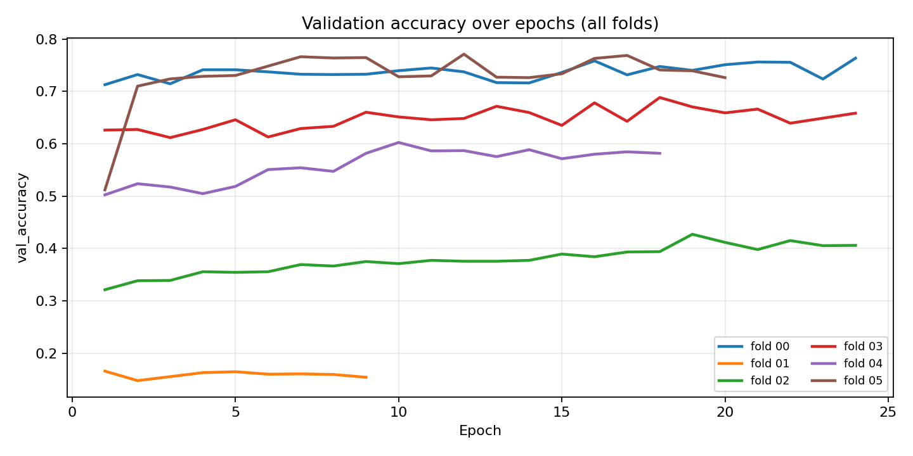
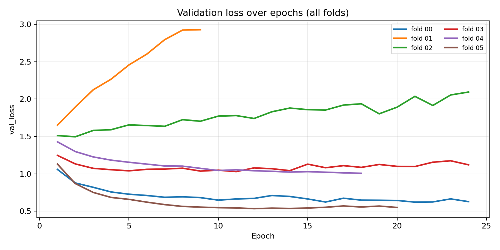
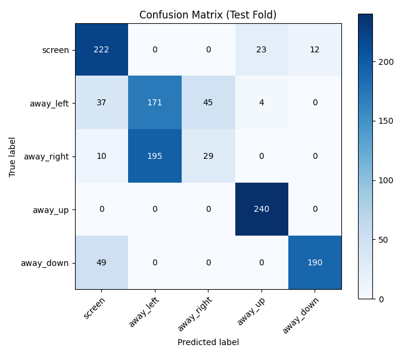

# StudyBuddy Head-Pose Model (LOSO) — Capstone Report

- **Generated at (UTC)**: 2026-02-11 05:00:58Z
- **Summary CSV**: `/app/artifacts/training/loso_summary.csv`
- **Folds dir**: `/app/artifacts/training/folds`
- **Selection criterion**: `test_macro_f1`
- **Best fold**: `00` (test_macro_f1=0.6636)

## Key plots

- `test_macro_f1_by_fold.png`
- `val_accuracy_by_epoch.png`
- `val_loss_by_epoch.png`
- `best_fold_confusion_matrix.png`



## Aggregate metrics (mean ± std across folds)

- **test_macro_f1**: mean=0.4335 std=0.1982 (min=0.1307, max=0.6636)
- **test_balanced_accuracy**: mean=0.4741 std=0.1782 (min=0.2008, max=0.6896)
- **test_accuracy**: mean=0.4759 std=0.1785 (min=0.2043, max=0.6944)
- **val_macro_f1**: mean=0.5335 std=0.2409 (min=0.0929, max=0.7674)
- **val_accuracy**: mean=0.5696 std=0.2148 (min=0.1657, max=0.7710)

## Per-fold results

| fold_id | val_participants | test_participants | test_macro_f1 | test_balanced_accuracy | test_accuracy |
| --- | --- | --- | --- | --- | --- |
| 0 | jaydon | can_meto | 0.6636 | 0.6896 | 0.6944 |
| 1 | johnny | jaydon | 0.4956 | 0.5471 | 0.5473 |
| 2 | kareem_mourad | johnny | 0.1307 | 0.2008 | 0.2043 |
| 3 | mais | kareem_mourad | 0.2270 | 0.2969 | 0.2971 |
| 4 | yara | mais | 0.4399 | 0.4563 | 0.4566 |
| 5 | can_meto | yara | 0.6445 | 0.6542 | 0.6557 |

## Learning curves (validation)





## Best fold confusion matrix



## Training configuration snapshot

```yaml
experiment_name: studybuddy-headpose-loso-hires-v3
seed: 42
image_size: 256
backbone: efficientnetv2b0
batch_size: 12
epochs: 24
learning_rate: 0.00025
dropout: 0.3
early_stopping_patience: 8
label_column: label
participant_column: participant_id
path_column: image_path
```

## Data validation snapshot

```json
{
  "dataset_root": "/datasets",
  "meta_files_found": 6,
  "rows_seen": 9899,
  "rows_kept": 9847,
  "rows_malformed": 0,
  "rows_invalid_label": 0,
  "rows_missing_image": 52,
  "participants": [
    "can_meto",
    "jaydon",
    "johnny",
    "kareem_mourad",
    "mais",
    "yara"
  ],
  "class_counts": {
    "away_down": 1978,
    "away_left": 1991,
    "away_right": 1933,
    "away_up": 1964,
    "screen": 1981
  },
  "participant_counts": {
    "can_meto": 1227,
    "jaydon": 1754,
    "johnny": 1708,
    "kareem_mourad": 1747,
    "mais": 1671,
    "yara": 1740
  },
  "per_participant_class_counts": [
    {
      "participant_id": "can_meto",
      "label": "away_down",
      "count": 239
    },
    {
      "participant_id": "can_meto",
      "label": "away_left",
      "count": 257
    },
    {
      "participant_id": "can_meto",
      "label": "away_right",
      "count": 234
    },
    {
      "participant_id": "can_meto",
      "label": "away_up",
      "count": 240
    },
    {
      "participant_id": "can_meto",
      "label": "screen",
      "count": 257
    },
    {
      "participant_id": "jaydon",
      "label": "away_down",
      "count": 351
    },
    {
      "participant_id": "jaydon",
      "label": "away_left",
      "count": 351
    },
    {
      "participant_id": "jaydon",
      "label": "away_right",
      "count": 351
    },
    {
      "participant_id": "jaydon",
      "label": "away_up",
      "count": 351
    },
    {
      "participant_id": "jaydon",
      "label": "screen",
      "count": 350
    },
    {
      "participant_id": "johnny",
      "label": "away_down",
      "count": 350
    },
    {
      "participant_id": "johnny",
      "label": "away_left",
      "count": 351
    },
    {
      "participant_id": "johnny",
      "label": "away_right",
      "count": 333
    },
    {
      "participant_id": "johnny",
      "label": "away_up",
      "count": 335
    },
    {
      "participant_id": "johnny",
      "label": "screen",
      "count": 339
    },
    {
      "participant_id": "kareem_mourad",
      "label": "away_down",
      "count": 351
    },
    {
      "participant_id": "kareem_mourad",
      "label": "away_left",
      "count": 348
    },
    {
      "participant_id": "kareem_mourad",
      "label": "away_right",
      "count": 348
    },
    {
      "participant_id": "kareem_mourad",
      "label": "away_up",
      "count": 351
    },
    {
      "participant_id": "kareem_mourad",
      "label": "screen",
      "count": 349
    },
    {
      "participant_id": "mais",
      "label": "away_down",
      "count": 335
    },
    {
      "participant_id": "mais",
      "label": "away_left",
      "count": 333
    },
    {
      "participant_id": "mais",
      "label": "away_right",
      "count": 334
    },
    {
      "participant_id": "mais",
      "label": "away_up",
      "count": 335
    },
    {
      "participant_id": "mais",
      "label": "screen",
      "count": 334
    },
    {
      "participant_id": "yara",
      "label": "away_down",
      "count": 352
    },
    {
      "participant_id": "yara",
      "label": "away_left",
      "count": 351
    },
    {
      "participant_id": "yara",
      "label": "away_right",
      "count": 333
    },
    {
      "participant_id": "yara",
      "label": "away_up",
      "count": 352
    },
    {
      "participant_id": "yara",
      "label": "screen",
      "count": 352
    }
  ]
}
```
