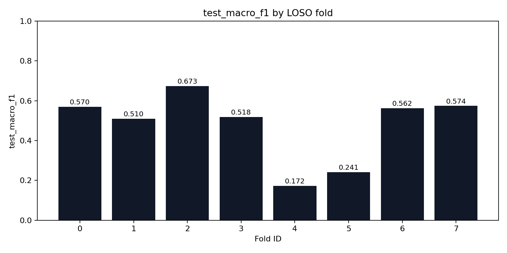
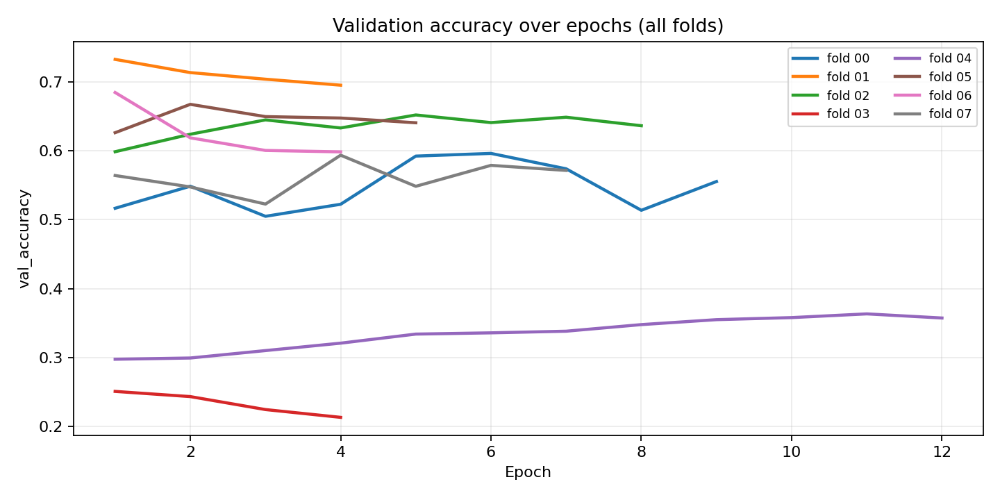
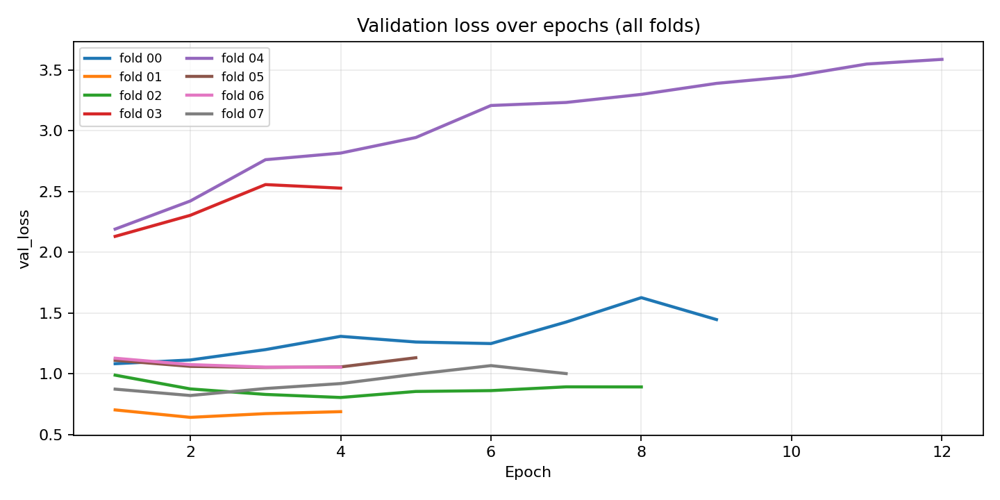
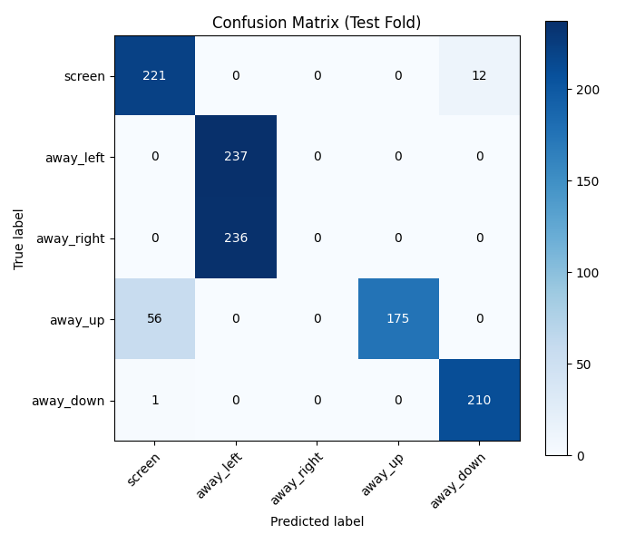

# StudyBuddy Head-Pose Model (LOSO) — Capstone Report

- **Generated at (UTC)**: 2026-02-13 07:00:13Z
- **Summary CSV**: `/app/artifacts/training/loso_summary.csv`
- **Folds dir**: `/app/artifacts/training/folds`
- **Selection criterion**: `test_macro_f1`
- **Best fold**: `02` (test_macro_f1=0.6729)

## Key plots

- `test_macro_f1_by_fold.png`
- `val_accuracy_by_epoch.png`
- `val_loss_by_epoch.png`
- `best_fold_confusion_matrix.png`



## Aggregate metrics (mean ± std across folds)

- **test_macro_f1**: mean=0.4773 std=0.1639 (min=0.1722, max=0.6729)
- **test_balanced_accuracy**: mean=0.5239 std=0.1599 (min=0.2234, max=0.7403)
- **test_accuracy**: mean=0.5210 std=0.1537 (min=0.2447, max=0.7343)
- **val_macro_f1**: mean=0.5219 std=0.2001 (min=0.1170, max=0.7311)
- **val_accuracy**: mean=0.5675 std=0.1587 (min=0.2508, max=0.7326)

## Per-fold results

| fold_id | val_participants | test_participants | test_macro_f1 | test_balanced_accuracy | test_accuracy |
| --- | --- | --- | --- | --- | --- |
| 0 | daniel_esenwa | can_meto | 0.5697 | 0.6024 | 0.5806 |
| 1 | isaiah_hunte | daniel_esenwa | 0.5097 | 0.5284 | 0.5388 |
| 2 | jaydon | isaiah_hunte | 0.6729 | 0.7403 | 0.7343 |
| 3 | johnny | jaydon | 0.5176 | 0.5590 | 0.5615 |
| 4 | kareem_mourad | johnny | 0.1722 | 0.2234 | 0.2447 |
| 5 | mais | kareem_mourad | 0.2407 | 0.3131 | 0.3016 |
| 6 | yara | mais | 0.5620 | 0.6174 | 0.6056 |
| 7 | can_meto | yara | 0.5736 | 0.6069 | 0.6004 |

## Learning curves (validation)





## Best fold confusion matrix



## Training configuration snapshot

```yaml
experiment_name: studybuddy-headpose-loso
seed: 42
image_size: 224
backbone: efficientnetv2b0
batch_size: 32
epochs: 12
learning_rate: 0.001
dropout: 0.2
early_stopping_patience: 3
label_column: label
participant_column: participant_id
path_column: image_path
```

## Data validation snapshot

```json
{
  "dataset_root": "/datasets",
  "meta_files_found": 8,
  "rows_seen": 10731,
  "rows_kept": 10731,
  "rows_malformed": 0,
  "rows_invalid_label": 0,
  "rows_missing_image": 0,
  "participants": [
    "can_meto",
    "daniel_esenwa",
    "isaiah_hunte",
    "jaydon",
    "johnny",
    "kareem_mourad",
    "mais",
    "yara"
  ],
  "class_counts": {
    "away_down": 2111,
    "away_left": 2229,
    "away_right": 2206,
    "away_up": 2044,
    "screen": 2141
  },
  "participant_counts": {
    "can_meto": 1085,
    "daniel_esenwa": 1030,
    "isaiah_hunte": 1148,
    "jaydon": 1537,
    "johnny": 1328,
    "kareem_mourad": 1671,
    "mais": 1458,
    "yara": 1474
  },
  "per_participant_class_counts": [
    {
      "participant_id": "can_meto",
      "label": "away_down",
      "count": 187
    },
    {
      "participant_id": "can_meto",
      "label": "away_left",
      "count": 237
    },
    {
      "participant_id": "can_meto",
      "label": "away_right",
      "count": 221
    },
    {
      "participant_id": "can_meto",
      "label": "away_up",
      "count": 205
    },
    {
      "participant_id": "can_meto",
      "label": "screen",
      "count": 235
    },
    {
      "participant_id": "daniel_esenwa",
      "label": "away_down",
      "count": 182
    },
    {
      "participant_id": "daniel_esenwa",
      "label": "away_left",
      "count": 232
    },
    {
      "participant_id": "daniel_esenwa",
      "label": "away_right",
      "count": 215
    },
    {
      "participant_id": "daniel_esenwa",
      "label": "away_up",
      "count": 223
    },
    {
      "participant_id": "daniel_esenwa",
      "label": "screen",
      "count": 178
    },
    {
      "participant_id": "isaiah_hunte",
      "label": "away_down",
      "count": 211
    },
    {
      "participant_id": "isaiah_hunte",
      "label": "away_left",
      "count": 237
    },
    {
      "participant_id": "isaiah_hunte",
      "label": "away_right",
      "count": 236
    },
    {
      "participant_id": "isaiah_hunte",
      "label": "away_up",
      "count": 231
    },
    {
      "participant_id": "isaiah_hunte",
      "label": "screen",
      "count": 233
    },
    {
      "participant_id": "jaydon",
      "label": "away_down",
      "count": 300
    },
    {
      "participant_id": "jaydon",
      "label": "away_left",
      "count": 320
    },
    {
      "participant_id": "jaydon",
      "label": "away_right",
      "count": 294
    },
    {
      "participant_id": "jaydon",
      "label": "away_up",
      "count": 308
    },
    {
      "participant_id": "jaydon",
      "label": "screen",
      "count": 315
    },
    {
      "participant_id": "johnny",
      "label": "away_down",
      "count": 298
    },
    {
      "participant_id": "johnny",
      "label": "away_left",
      "count": 244
    },
    {
      "participant_id": "johnny",
      "label": "away_right",
      "count": 301
    },
    {
      "participant_id": "johnny",
      "label": "away_up",
      "count": 242
    },
    {
      "participant_id": "johnny",
      "label": "screen",
      "count": 243
    },
    {
      "participant_id": "kareem_mourad",
      "label": "away_down",
      "count": 344
    },
    {
      "participant_id": "kareem_mourad",
      "label": "away_left",
      "count": 348
    },
    {
      "participant_id": "kareem_mourad",
      "label": "away_right",
      "count": 347
    },
    {
      "participant_id": "kareem_mourad",
      "label": "away_up",
      "count": 296
    },
    {
      "participant_id": "kareem_mourad",
      "label": "screen",
      "count": 336
    },
    {
      "participant_id": "mais",
      "label": "away_down",
      "count": 305
    },
    {
      "participant_id": "mais",
      "label": "away_left",
      "count": 299
    },
    {
      "participant_id": "mais",
      "label": "away_right",
      "count": 304
    },
    {
      "participant_id": "mais",
      "label": "away_up",
      "count": 253
    },
    {
      "participant_id": "mais",
      "label": "screen",
      "count": 297
    },
    {
      "participant_id": "yara",
      "label": "away_down",
      "count": 284
    },
    {
      "participant_id": "yara",
      "label": "away_left",
      "count": 312
    },
    {
      "participant_id": "yara",
      "label": "away_right",
      "count": 288
    },
    {
      "participant_id": "yara",
      "label": "away_up",
      "count": 286
    },
    {
      "participant_id": "yara",
      "label": "screen",
      "count": 304
    }
  ]
}
```
