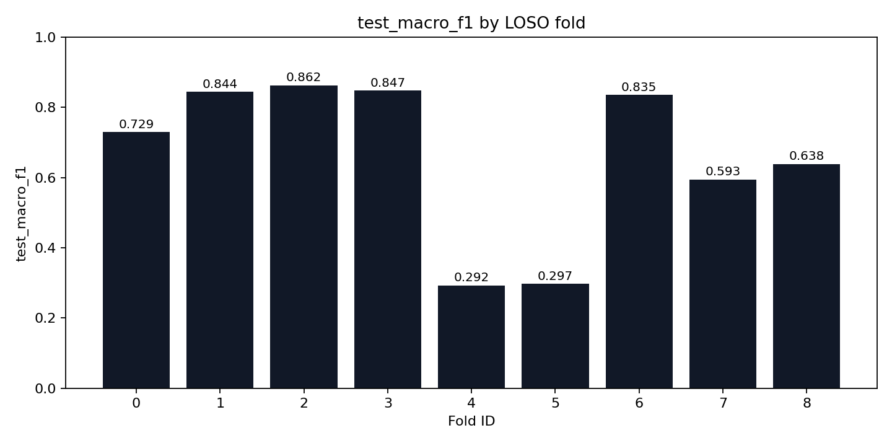
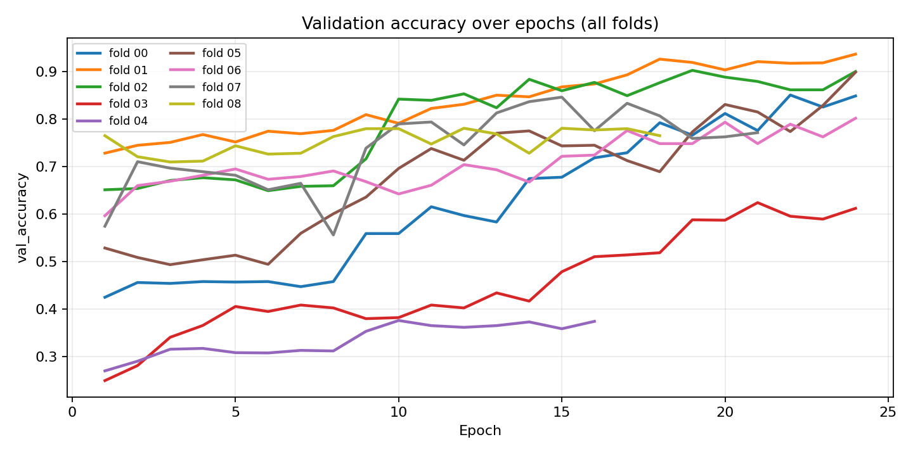
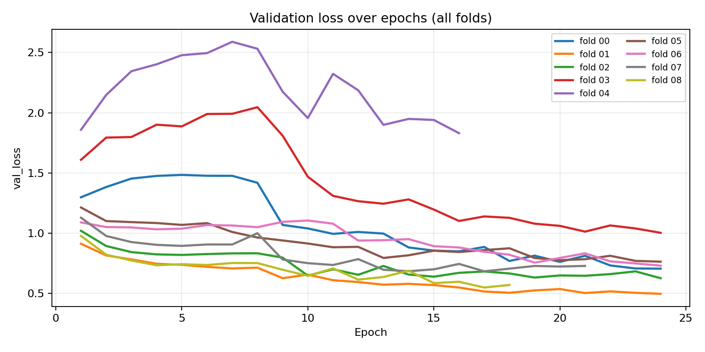
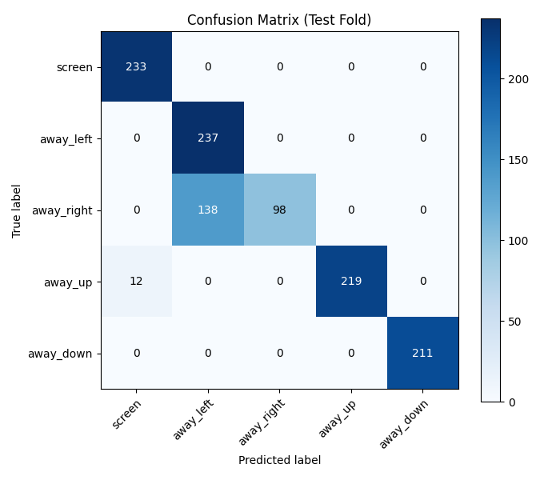

# StudyBuddy Head-Pose Model (LOSO) — Capstone Report

- **Generated at (UTC)**: 2026-02-13 19:50:54Z
- **Summary CSV**: `/app/artifacts/training/loso_summary.csv`
- **Folds dir**: `/app/artifacts/training/folds`
- **Selection criterion**: `test_macro_f1`
- **Best fold**: `02` (test_macro_f1=0.8619)

## Key plots

- `test_macro_f1_by_fold.png`
- `val_accuracy_by_epoch.png`
- `val_loss_by_epoch.png`
- `best_fold_confusion_matrix.png`



## Aggregate metrics (mean ± std across folds)

- **test_macro_f1**: mean=0.6596 std=0.2152 (min=0.2921, max=0.8619)
- **test_balanced_accuracy**: mean=0.7036 std=0.1835 (min=0.3834, max=0.8727)
- **test_accuracy**: mean=0.7053 std=0.1788 (min=0.3662, max=0.8693)
- **val_macro_f1**: mean=0.7586 std=0.1895 (min=0.2986, max=0.9376)
- **val_accuracy**: mean=0.7796 std=0.1668 (min=0.3764, max=0.9364)

## Per-fold results

| fold_id | val_participants | test_participants | test_macro_f1 | test_balanced_accuracy | test_accuracy |
| --- | --- | --- | --- | --- | --- |
| 0 | daniel_esenwa | can_meto | 0.7289 | 0.7991 | 0.7806 |
| 1 | isaiah_hunte | daniel_esenwa | 0.8437 | 0.8537 | 0.8660 |
| 2 | jaydon | isaiah_hunte | 0.8619 | 0.8727 | 0.8693 |
| 3 | johnny | jaydon | 0.8471 | 0.8508 | 0.8504 |
| 4 | kareem_mourad | johnny | 0.2921 | 0.3891 | 0.4352 |
| 5 | mais | kareem_mourad | 0.2969 | 0.3834 | 0.3662 |
| 6 | phoenix_bastien | mais | 0.8347 | 0.8376 | 0.8395 |
| 7 | yara | phoenix_bastien | 0.5934 | 0.6733 | 0.6733 |
| 8 | can_meto | yara | 0.6380 | 0.6729 | 0.6669 |

## Learning curves (validation)





## Best fold confusion matrix



## Training configuration snapshot

```yaml
experiment_name: studybuddy-headpose-loso-v4-finetune
seed: 42
image_size: 256
backbone: efficientnetv2b0
batch_size: 12
epochs: 24
freeze_epochs: 8
fine_tune_epochs: 16
learning_rate: 0.0003
fine_tune_learning_rate: 0.00005
fine_tune_trainable_layers: 40
dropout: 0.3
label_smoothing: 0.05
early_stopping_patience: 6
aug_brightness_delta: 0.18
aug_contrast_lower: 0.8
aug_contrast_upper: 1.25
aug_saturation_lower: 0.8
aug_saturation_upper: 1.25
aug_gaussian_noise_stddev: 4.0
label_column: label
participant_column: participant_id
path_column: image_path
```

## Data validation snapshot

```json
{
  "dataset_root": "/datasets",
  "meta_files_found": 9,
  "rows_seen": 12387,
  "rows_kept": 11931,
  "rows_malformed": 0,
  "rows_invalid_label": 0,
  "rows_missing_image": 456,
  "participants": [
    "can_meto",
    "daniel_esenwa",
    "isaiah_hunte",
    "jaydon",
    "johnny",
    "kareem_mourad",
    "mais",
    "phoenix_bastien",
    "yara"
  ],
  "class_counts": {
    "away_down": 2351,
    "away_left": 2469,
    "away_right": 2446,
    "away_up": 2284,
    "screen": 2381
  },
  "participant_counts": {
    "can_meto": 1085,
    "daniel_esenwa": 1030,
    "isaiah_hunte": 1148,
    "jaydon": 1537,
    "johnny": 1328,
    "kareem_mourad": 1671,
    "mais": 1458,
    "phoenix_bastien": 1200,
    "yara": 1474
  },
  "per_participant_class_counts": [
    {
      "participant_id": "can_meto",
      "label": "away_down",
      "count": 187
    },
    {
      "participant_id": "can_meto",
      "label": "away_left",
      "count": 237
    },
    {
      "participant_id": "can_meto",
      "label": "away_right",
      "count": 221
    },
    {
      "participant_id": "can_meto",
      "label": "away_up",
      "count": 205
    },
    {
      "participant_id": "can_meto",
      "label": "screen",
      "count": 235
    },
    {
      "participant_id": "daniel_esenwa",
      "label": "away_down",
      "count": 182
    },
    {
      "participant_id": "daniel_esenwa",
      "label": "away_left",
      "count": 232
    },
    {
      "participant_id": "daniel_esenwa",
      "label": "away_right",
      "count": 215
    },
    {
      "participant_id": "daniel_esenwa",
      "label": "away_up",
      "count": 223
    },
    {
      "participant_id": "daniel_esenwa",
      "label": "screen",
      "count": 178
    },
    {
      "participant_id": "isaiah_hunte",
      "label": "away_down",
      "count": 211
    },
    {
      "participant_id": "isaiah_hunte",
      "label": "away_left",
      "count": 237
    },
    {
      "participant_id": "isaiah_hunte",
      "label": "away_right",
      "count": 236
    },
    {
      "participant_id": "isaiah_hunte",
      "label": "away_up",
      "count": 231
    },
    {
      "participant_id": "isaiah_hunte",
      "label": "screen",
      "count": 233
    },
    {
      "participant_id": "jaydon",
      "label": "away_down",
      "count": 300
    },
    {
      "participant_id": "jaydon",
      "label": "away_left",
      "count": 320
    },
    {
      "participant_id": "jaydon",
      "label": "away_right",
      "count": 294
    },
    {
      "participant_id": "jaydon",
      "label": "away_up",
      "count": 308
    },
    {
      "participant_id": "jaydon",
      "label": "screen",
      "count": 315
    },
    {
      "participant_id": "johnny",
      "label": "away_down",
      "count": 298
    },
    {
      "participant_id": "johnny",
      "label": "away_left",
      "count": 244
    },
    {
      "participant_id": "johnny",
      "label": "away_right",
      "count": 301
    },
    {
      "participant_id": "johnny",
      "label": "away_up",
      "count": 242
    },
    {
      "participant_id": "johnny",
      "label": "screen",
      "count": 243
    },
    {
      "participant_id": "kareem_mourad",
      "label": "away_down",
      "count": 344
    },
    {
      "participant_id": "kareem_mourad",
      "label": "away_left",
      "count": 348
    },
    {
      "participant_id": "kareem_mourad",
      "label": "away_right",
      "count": 347
    },
    {
      "participant_id": "kareem_mourad",
      "label": "away_up",
      "count": 296
    },
    {
      "participant_id": "kareem_mourad",
      "label": "screen",
      "count": 336
    },
    {
      "participant_id": "mais",
      "label": "away_down",
      "count": 305
    },
    {
      "participant_id": "mais",
      "label": "away_left",
      "count": 299
    },
    {
      "participant_id": "mais",
      "label": "away_right",
      "count": 304
    },
    {
      "participant_id": "mais",
      "label": "away_up",
      "count": 253
    },
    {
      "participant_id": "mais",
      "label": "screen",
      "count": 297
    },
    {
      "participant_id": "phoenix_bastien",
      "label": "away_down",
      "count": 240
    },
    {
      "participant_id": "phoenix_bastien",
      "label": "away_left",
      "count": 240
    },
    {
      "participant_id": "phoenix_bastien",
      "label": "away_right",
      "count": 240
    },
    {
      "participant_id": "phoenix_bastien",
      "label": "away_up",
      "count": 240
    },
    {
      "participant_id": "phoenix_bastien",
      "label": "screen",
      "count": 240
    },
    {
      "participant_id": "yara",
      "label": "away_down",
      "count": 284
    },
    {
      "participant_id": "yara",
      "label": "away_left",
      "count": 312
    },
    {
      "participant_id": "yara",
      "label": "away_right",
      "count": 288
    },
    {
      "participant_id": "yara",
      "label": "away_up",
      "count": 286
    },
    {
      "participant_id": "yara",
      "label": "screen",
      "count": 304
    }
  ]
}
```
